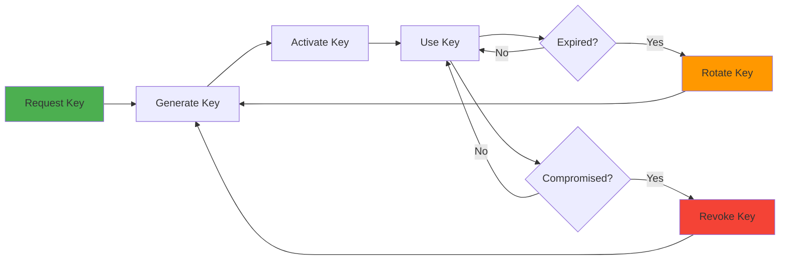

# Authentication Guide

## Overview

The GSID Service API uses API key-based authentication to secure all endpoints. API keys are passed via HTTP headers and provide access control and rate limiting.

## Authentication Methods

### API Key Authentication

All API requests (except `/health`) require a valid API key in the request header:

```http
X-API-Key: your-api-key-here
```

**Example Request**:

```bash
curl https://api.idhub.ibdgc.org/subjects \
  -H "X-API-Key: your-api-key-here"
```

---

## Obtaining API Keys

### For Administrators

API keys are generated and managed by system administrators through the database or admin interface.

#### Generate API Key (Database)

```sql
-- Generate a new API key
INSERT INTO api_keys (
    key_name,
    api_key,
    description,
    created_by,
    expires_at,
    is_active
) VALUES (
    'redcap-pipeline',
    'gsid_live_1234567890abcdef1234567890abcdef',  -- 32+ character random string
    'API key for REDCap data pipeline',
    'admin@ibdgc.org',
    '2025-12-31 23:59:59',
    true
);
```

#### Generate Secure Random Key

```bash
# Generate a secure random API key (Linux/Mac)
openssl rand -hex 32

# Or using Python
python3 -c "import secrets; print('gsid_live_' + secrets.token_hex(32))"

# Or using Node.js
node -e "console.log('gsid_live_' + require('crypto').randomBytes(32).toString('hex'))"
```

**Key Format**:

- Prefix: `gsid_live_` (production) or `gsid_test_` (development)
- Length: Minimum 32 characters after prefix
- Characters: Alphanumeric (a-z, A-Z, 0-9)

---

### For Developers

Request an API key from your system administrator with the following information:

1. **Purpose**: What the key will be used for (e.g., "Fragment Validator Service")
2. **Scope**: Which operations you need access to
3. **Environment**: Production, QA, or Development
4. **Expiration**: How long the key should be valid

---

## API Key Management

### Key Metadata

Each API key includes:

| Field           | Description                               |
| --------------- | ----------------------------------------- |
| `key_name`      | Unique identifier for the key             |
| `api_key`       | The actual key value (hashed in database) |
| `description`   | Purpose and usage notes                   |
| `created_by`    | Who created the key                       |
| `created_at`    | When the key was created                  |
| `expires_at`    | Expiration date (optional)                |
| `is_active`     | Whether the key is currently active       |
| `last_used_at`  | Last time the key was used                |
| `request_count` | Total number of requests made             |

### List API Keys

```sql
-- View all API keys (admin only)
SELECT
    key_name,
    description,
    created_by,
    created_at,
    expires_at,
    is_active,
    last_used_at,
    request_count
FROM api_keys
ORDER BY created_at DESC;
```

### Revoke API Key

```sql
-- Deactivate an API key
UPDATE api_keys
SET is_active = false
WHERE key_name = 'old-pipeline-key';

-- Or delete permanently
DELETE FROM api_keys
WHERE key_name = 'old-pipeline-key';
```

### Rotate API Key

```sql
-- Update existing key with new value
UPDATE api_keys
SET
    api_key = 'gsid_live_new_key_value_here',
    updated_at = NOW()
WHERE key_name = 'redcap-pipeline';
```

---

## Using API Keys

### Python

```python
import requests
import os

# Store API key in environment variable
API_KEY = os.getenv("GSID_API_KEY")
BASE_URL = "https://api.idhub.ibdgc.org"

# Create session with API key
session = requests.Session()
session.headers.update({
    "X-API-Key": API_KEY,
    "Content-Type": "application/json"
})

# Make authenticated request
response = session.get(f"{BASE_URL}/subjects/01HQXYZ123ABC")

if response.status_code == 200:
    subject = response.json()
    print(f"Subject: {subject['global_subject_id']}")
elif response.status_code == 401:
    print("Authentication failed - check API key")
else:
    print(f"Error: {response.status_code}")
```

### JavaScript/Node.js

```javascript
const axios = require("axios");

// Store API key in environment variable
const API_KEY = process.env.GSID_API_KEY;
const BASE_URL = "https://api.idhub.ibdgc.org";

// Create axios instance with API key
const client = axios.create({
  baseURL: BASE_URL,
  headers: {
    "X-API-Key": API_KEY,
    "Content-Type": "application/json",
  },
});

// Make authenticated request
client
  .get("/subjects/01HQXYZ123ABC")
  .then((response) => {
    console.log("Subject:", response.data.global_subject_id);
  })
  .catch((error) => {
    if (error.response?.status === 401) {
      console.error("Authentication failed - check API key");
    } else {
      console.error("Error:", error.message);
    }
  });
```

### cURL

```bash
# Store API key in environment variable
export GSID_API_KEY="your-api-key-here"

# Make authenticated request
curl https://api.idhub.ibdgc.org/subjects/01HQXYZ123ABC \
  -H "X-API-Key: $GSID_API_KEY"

# POST request with data
curl -X POST https://api.idhub.ibdgc.org/subjects \
  -H "X-API-Key: $GSID_API_KEY" \
  -H "Content-Type: application/json" \
  -d '{
    "center_id": 1,
    "local_subject_id": "SUBJ001",
    "identifier_type": "mrn"
  }'
```

### R

```r
library(httr)

# Store API key in environment variable
api_key <- Sys.getenv("GSID_API_KEY")
base_url <- "https://api.idhub.ibdgc.org"

# Make authenticated request
response <- GET(
  paste0(base_url, "/subjects/01HQXYZ123ABC"),
  add_headers(`X-API-Key` = api_key)
)

if (status_code(response) == 200) {
  subject <- content(response, "parsed")
  print(paste("Subject:", subject$global_subject_id))
} else if (status_code(response) == 401) {
  print("Authentication failed - check API key")
} else {
  print(paste("Error:", status_code(response)))
}
```

---

## Environment Variables

### Storing API Keys Securely

**Never hardcode API keys in your code.** Always use environment variables or secure configuration management.

#### .env File (Development)

```bash:.env
# GSID Service Configuration
GSID_API_KEY=gsid_test_1234567890abcdef1234567890abcdef
GSID_SERVICE_URL=https://api.qa.idhub.ibdgc.org

# Database Configuration
DB_HOST=localhost
DB_NAME=idhub
DB_USER=idhub_user
DB_PASSWORD=secure_password
```

**Important**: Add `.env` to `.gitignore`:

```gitignore:.gitignore
# Environment variables
.env
.env.local
.env.*.local
```

#### Loading Environment Variables

**Python**:

```python
from dotenv import load_dotenv
import os

# Load .env file
load_dotenv()

# Access variables
API_KEY = os.getenv("GSID_API_KEY")
SERVICE_URL = os.getenv("GSID_SERVICE_URL")
```

**Node.js**:

```javascript
require("dotenv").config();

const API_KEY = process.env.GSID_API_KEY;
const SERVICE_URL = process.env.GSID_SERVICE_URL;
```

#### System Environment Variables (Production)

```bash
# Linux/Mac - Add to ~/.bashrc or ~/.zshrc
export GSID_API_KEY="gsid_live_production_key_here"
export GSID_SERVICE_URL="https://api.idhub.ibdgc.org"

# Or set for current session
export GSID_API_KEY="gsid_live_production_key_here"

# Windows (PowerShell)
$env:GSID_API_KEY="gsid_live_production_key_here"

# Windows (Command Prompt)
set GSID_API_KEY=gsid_live_production_key_here
```

#### Docker Secrets

```yaml:docker-compose.yml
services:
  redcap-pipeline:
    image: redcap-pipeline:latest
    environment:
      - GSID_API_KEY=${GSID_API_KEY}
      - GSID_SERVICE_URL=${GSID_SERVICE_URL}
    # Or use secrets
    secrets:
      - gsid_api_key

secrets:
  gsid_api_key:
    file: ./secrets/gsid_api_key.txt
```

#### GitHub Actions Secrets

```yaml:.github/workflows/pipeline.yml
name: REDCap Pipeline

on:
  workflow_dispatch:

jobs:
  run-pipeline:
    runs-on: ubuntu-latest
    steps:
      - name: Run pipeline
        env:
          GSID_API_KEY: ${{ secrets.GSID_API_KEY }}
          GSID_SERVICE_URL: ${{ secrets.GSID_SERVICE_URL }}
        run: |
          python main.py --project gap
```

---

## Authentication Errors

### 401 Unauthorized

**Cause**: Missing or invalid API key

**Response**:

```json
{
  "detail": "Invalid or missing API key"
}
```

**Solutions**:

1. **Check header name**: Must be `X-API-Key` (case-sensitive)
2. **Verify key value**: Ensure the key is correct and active
3. **Check expiration**: Key may have expired
4. **Verify environment**: Using production key in QA or vice versa

**Debug**:

```bash
# Test API key
curl -v https://api.idhub.ibdgc.org/subjects \
  -H "X-API-Key: your-api-key"

# Check response headers
# Look for: HTTP/1.1 401 Unauthorized
```

### 403 Forbidden

**Cause**: Valid API key but insufficient permissions

**Response**:

```json
{
  "detail": "Insufficient permissions for this operation"
}
```

**Solutions**:

1. Contact administrator to update key permissions
2. Use a different API key with appropriate scope

### 429 Rate Limit Exceeded

**Cause**: Too many requests in a short time period

**Response**:

```json
{
  "detail": "Rate limit exceeded",
  "retry_after": 45,
  "limit": 100,
  "window": "1 minute"
}
```

**Response Headers**:

```http
X-RateLimit-Limit: 100
X-RateLimit-Remaining: 0
X-RateLimit-Reset: 1705329600
Retry-After: 45
```

**Solutions**:

1. Implement exponential backoff
2. Reduce request frequency
3. Use batch endpoints for multiple operations
4. Contact administrator for higher rate limits

---

## Rate Limiting

### Default Limits

| Endpoint Type    | Requests per Minute | Burst Limit |
| ---------------- | ------------------- | ----------- |
| Standard API     | 100                 | 20          |
| Batch Operations | 10                  | 5           |
| Search/Query     | 50                  | 10          |
| Health Check     | Unlimited           | N/A         |

### Rate Limit Headers

Every API response includes rate limit information:

```http
X-RateLimit-Limit: 100
X-RateLimit-Remaining: 95
X-RateLimit-Reset: 1705329600
```

### Handling Rate Limits

#### Python with Retry Logic

```python
import requests
import time
from requests.adapters import HTTPAdapter
from requests.packages.urllib3.util.retry import Retry

def create_session_with_retries(api_key: str) -> requests.Session:
    """Create session with automatic retry on rate limit"""
    session = requests.Session()

    # Configure retry strategy
    retry_strategy = Retry(
        total=5,
        status_forcelist=[429, 500, 502, 503, 504],
        allowed_methods=["HEAD", "GET", "OPTIONS", "POST"],
        backoff_factor=1  # Wait 1, 2, 4, 8, 16 seconds
    )

    adapter = HTTPAdapter(max_retries=retry_strategy)
    session.mount("http://", adapter)
    session.mount("https://", adapter)

    session.headers.update({"X-API-Key": api_key})

    return session

# Usage
session = create_session_with_retries(os.getenv("GSID_API_KEY"))
response = session.get("https://api.idhub.ibdgc.org/subjects/01HQXYZ123ABC")
```

#### Manual Rate Limit Handling

```python
import time
import requests

def make_request_with_rate_limit(url: str, headers: dict, max_retries: int = 3):
    """Make request with rate limit handling"""
    for attempt in range(max_retries):
        response = requests.get(url, headers=headers)

        if response.status_code == 429:
            # Get retry-after header
            retry_after = int(response.headers.get('Retry-After', 60))
            print(f"Rate limited. Waiting {retry_after} seconds...")
            time.sleep(retry_after)
            continue

        return response

    raise Exception("Max retries exceeded")

# Usage
response = make_request_with_rate_limit(
    "https://api.idhub.ibdgc.org/subjects/01HQXYZ123ABC",
    headers={"X-API-Key": os.getenv("GSID_API_KEY")}
)
```

#### JavaScript with Exponential Backoff

```javascript
async function makeRequestWithRetry(url, options, maxRetries = 3) {
  for (let attempt = 0; attempt < maxRetries; attempt++) {
    try {
      const response = await fetch(url, options);

      if (response.status === 429) {
        const retryAfter = response.headers.get("Retry-After") || 60;
        console.log(`Rate limited. Waiting ${retryAfter} seconds...`);
        await new Promise((resolve) => setTimeout(resolve, retryAfter * 1000));
        continue;
      }

      return response;
    } catch (error) {
      if (attempt === maxRetries - 1) throw error;

      // Exponential backoff
      const delay = Math.pow(2, attempt) * 1000;
      await new Promise((resolve) => setTimeout(resolve, delay));
    }
  }
}

// Usage
const response = await makeRequestWithRetry(
  "https://api.idhub.ibdgc.org/subjects/01HQXYZ123ABC",
  {
    headers: {
      "X-API-Key": process.env.GSID_API_KEY,
    },
  },
);
```

---

## Security Best Practices

### 1. Never Expose API Keys

❌ **Don't**:

```python
# Hardcoded in code
API_KEY = "gsid_live_1234567890abcdef"

# Committed to Git
# config.py
GSID_API_KEY = "gsid_live_1234567890abcdef"

# In URLs
url = "https://api.idhub.ibdgc.org/subjects?api_key=gsid_live_1234567890abcdef"

# In client-side code
const apiKey = "gsid_live_1234567890abcdef";
```

✅ **Do**:

```python
# Use environment variables
import os
API_KEY = os.getenv("GSID_API_KEY")

# Use configuration files (not in Git)
from dotenv import load_dotenv
load_dotenv()

# Use secret management services
from azure.keyvault.secrets import SecretClient
secret = client.get_secret("gsid-api-key")
```

### 2. Use Different Keys for Different Environments

```bash
# Development
GSID_API_KEY=gsid_test_dev_key_here
GSID_SERVICE_URL=http://localhost:8000

# QA
GSID_API_KEY=gsid_test_qa_key_here
GSID_SERVICE_URL=https://api.qa.idhub.ibdgc.org

# Production
GSID_API_KEY=gsid_live_prod_key_here
GSID_SERVICE_URL=https://api.idhub.ibdgc.org
```

### 3. Rotate Keys Regularly

```sql
-- Create new key
INSERT INTO api_keys (key_name, api_key, description, created_by, expires_at)
VALUES (
    'redcap-pipeline-2024',
    'gsid_live_new_key_value',
    'Rotated API key for REDCap pipeline',
    'admin@ibdgc.org',
    '2025-12-31 23:59:59'
);

-- Deactivate old key after transition period
UPDATE api_keys
SET is_active = false
WHERE key_name = 'redcap-pipeline-2023';
```

### 4. Set Expiration Dates

```sql
-- Create key with 1-year expiration
INSERT INTO api_keys (key_name, api_key, expires_at)
VALUES (
    'temp-research-key',
    'gsid_live_temp_key',
    NOW() + INTERVAL '1 year'
);

-- Automatic cleanup of expired keys
DELETE FROM api_keys
WHERE expires_at < NOW() AND is_active = false;
```

### 5. Monitor API Key Usage

```sql
-- Check recent API key activity
SELECT
    key_name,
    last_used_at,
    request_count,
    CASE
        WHEN last_used_at < NOW() - INTERVAL '30 days' THEN 'Inactive'
        WHEN last_used_at < NOW() - INTERVAL '7 days' THEN 'Low Activity'
        ELSE 'Active'
    END as status
FROM api_keys
WHERE is_active = true
ORDER BY last_used_at DESC;

-- Alert on suspicious activity
SELECT
    key_name,
    request_count,
    last_used_at
FROM api_keys
WHERE
    request_count > 10000  -- Unusually high
    AND last_used_at > NOW() - INTERVAL '1 hour'
ORDER BY request_count DESC;
```

### 6. Use HTTPS Only

```python
# Enforce HTTPS
BASE_URL = "https://api.idhub.ibdgc.org"  # ✅
# BASE_URL = "http://api.idhub.ibdgc.org"  # ❌ Never use HTTP

# Verify SSL certificates
response = requests.get(url, headers=headers, verify=True)
```

### 7. Implement Least Privilege

```sql
-- Create read-only API key for reporting
INSERT INTO api_keys (key_name, api_key, permissions)
VALUES (
    'reporting-readonly',
    'gsid_live_readonly_key',
    '{"read": true, "write": false, "delete": false}'
);

-- Create limited-scope key for specific center
INSERT INTO api_keys (key_name, api_key, center_id)
VALUES (
    'csmc-pipeline',
    'gsid_live_csmc_key',
    1  -- Only access to center_id = 1
);
```

---

## Troubleshooting

### Test API Key

```bash
# Test if API key is valid
curl -I https://api.idhub.ibdgc.org/subjects \
  -H "X-API-Key: $GSID_API_KEY"

# Expected: HTTP/1.1 200 OK
# If 401: Invalid or missing API key
# If 403: Valid key but insufficient permissions
```

### Verify Environment Variables

```bash
# Check if variable is set
echo $GSID_API_KEY

# Python
python3 -c "import os; print(os.getenv('GSID_API_KEY'))"

# Node.js
node -e "console.log(process.env.GSID_API_KEY)"
```

### Debug Authentication Issues

```python
import requests
import os

API_KEY = os.getenv("GSID_API_KEY")
BASE_URL = "https://api.idhub.ibdgc.org"

# Test authentication
response = requests.get(
    f"{BASE_URL}/subjects",
    headers={"X-API-Key": API_KEY}
)

print(f"Status Code: {response.status_code}")
print(f"Headers: {dict(response.headers)}")
print(f"Response: {response.text}")

# Check rate limits
if 'X-RateLimit-Remaining' in response.headers:
    print(f"Rate Limit Remaining: {response.headers['X-RateLimit-Remaining']}")
```

---

## API Key Lifecycle



1. **Request**: Developer requests API key from administrator
2. **Generate**: Administrator creates key with appropriate permissions
3. **Activate**: Key is activated and provided to developer
4. **Use**: Developer uses key for API requests
5. **Monitor**: Usage is tracked and monitored
6. **Rotate**: Key is rotated periodically (recommended: annually)
7. **Revoke**: Key is revoked if compromised or no longer needed

---

## Support

For authentication issues or to request API keys:

- **Email**: support@ibdgc.org
- **Documentation**: https://docs.idhub.ibdgc.org
- **GitHub Issues**: https://github.com/ibdgc/idhub/issues
