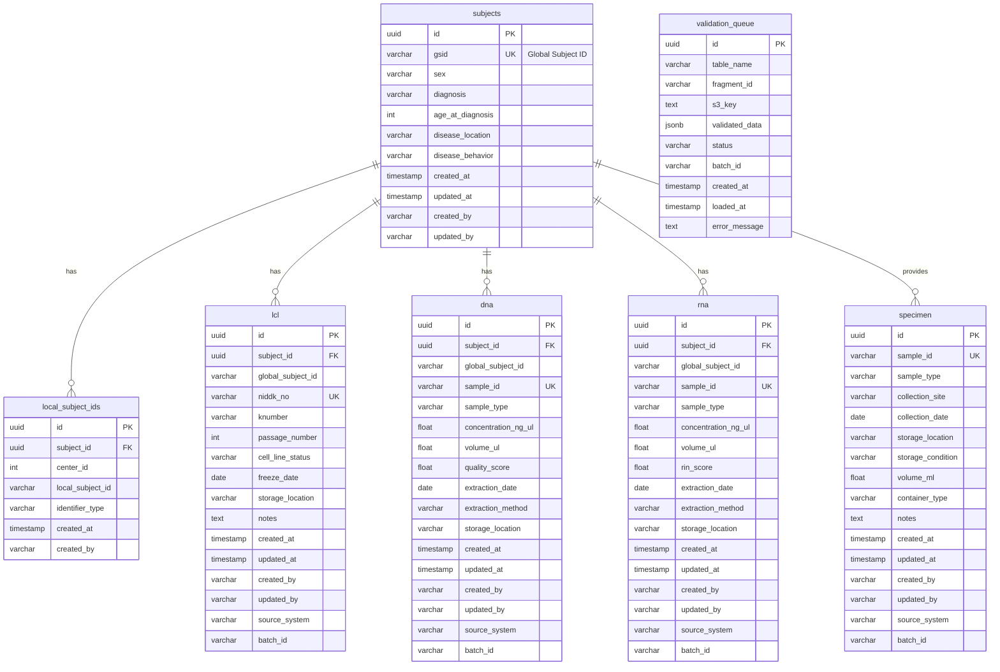

# Database Schema

## Overview

The IDhub database is designed to support biobank data management with a focus on:

- **Subject-centric design**: All data linked to subjects via GSID
- **Natural key support**: Business identifiers for upsert operations
- **Audit trail**: Complete tracking of data creation and modification
- **Referential integrity**: Foreign key constraints ensure data consistency

## Entity Relationship Diagram



## Core Tables

### subjects

**Purpose**: Central subject registry with global subject IDs

**Schema**:

```sql
CREATE TABLE subjects (
    id UUID PRIMARY KEY DEFAULT gen_random_uuid(),
    gsid VARCHAR(26) UNIQUE NOT NULL,
    sex VARCHAR(10),
    diagnosis VARCHAR(50),
    age_at_diagnosis INTEGER,
    disease_location VARCHAR(100),
    disease_behavior VARCHAR(100),
    created_at TIMESTAMP DEFAULT NOW(),
    updated_at TIMESTAMP DEFAULT NOW(),
    created_by VARCHAR(100),
    updated_by VARCHAR(100)
);

CREATE INDEX idx_subjects_gsid ON subjects(gsid);
CREATE INDEX idx_subjects_diagnosis ON subjects(diagnosis);
CREATE INDEX idx_subjects_created_at ON subjects(created_at);
```

**Natural Key**: `gsid`

**Immutable Fields**: `gsid`, `created_at`, `created_by`

**Example Record**:

```json
{
  "id": "550e8400-e29b-41d4-a716-446655440000",
  "gsid": "01HQXYZ123ABCDEF456789",
  "sex": "F",
  "diagnosis": "CD",
  "age_at_diagnosis": 25,
  "disease_location": "Ileal",
  "disease_behavior": "Stricturing",
  "created_at": "2024-01-15T10:00:00Z",
  "created_by": "redcap_pipeline"
}
```

### local_subject_ids

**Purpose**: Map local subject identifiers to global subject IDs

**Schema**:

```sql
CREATE TABLE local_subject_ids (
    id UUID PRIMARY KEY DEFAULT gen_random_uuid(),
    subject_id UUID NOT NULL REFERENCES subjects(id) ON DELETE CASCADE,
    center_id INTEGER NOT NULL,
    local_subject_id VARCHAR(100) NOT NULL,
    identifier_type VARCHAR(50) DEFAULT 'primary',
    created_at TIMESTAMP DEFAULT NOW(),
    created_by VARCHAR(100),
    UNIQUE(center_id, local_subject_id, identifier_type)
);

CREATE INDEX idx_local_ids_subject ON local_subject_ids(subject_id);
CREATE INDEX idx_local_ids_lookup ON local_subject_ids(center_id, local_subject_id);
CREATE INDEX idx_local_ids_type ON local_subject_ids(identifier_type);
```

**Natural Key**: `center_id`, `local_subject_id`, `identifier_type`

**Immutable Fields**: `created_at`, `created_by`

**Example Records**:

```json
[
  {
    "id": "660e8400-e29b-41d4-a716-446655440001",
    "subject_id": "550e8400-e29b-41d4-a716-446655440000",
    "center_id": 1,
    "local_subject_id": "GAP-001",
    "identifier_type": "consortium_id",
    "created_at": "2024-01-15T10:00:00Z"
  },
  {
    "id": "660e8400-e29b-41d4-a716-446655440002",
    "subject_id": "550e8400-e29b-41d4-a716-446655440000",
    "center_id": 1,
    "local_subject_id": "MRN-123456",
    "identifier_type": "mrn",
    "created_at": "2024-01-15T10:00:00Z"
  }
]
```

## Biobank Tables

### lcl

**Purpose**: Lymphoblastoid cell line tracking

**Schema**:

```sql
CREATE TABLE lcl (
    id UUID PRIMARY KEY DEFAULT gen_random_uuid(),
    subject_id UUID REFERENCES subjects(id) ON DELETE CASCADE,
    global_subject_id VARCHAR(26) NOT NULL,
    niddk_no VARCHAR(50) NOT NULL,
    knumber VARCHAR(50),
    passage_number INTEGER,
    cell_line_status VARCHAR(50),
    freeze_date DATE,
    storage_location VARCHAR(200),
    notes TEXT,
    created_at TIMESTAMP DEFAULT NOW(),
    updated_at TIMESTAMP DEFAULT NOW(),
    created_by VARCHAR(100),
    updated_by VARCHAR(100),
    source_system VARCHAR(100),
    batch_id VARCHAR(100),
    UNIQUE(global_subject_id, niddk_no)
);

CREATE INDEX idx_lcl_subject ON lcl(subject_id);
CREATE INDEX idx_lcl_gsid ON lcl(global_subject_id);
CREATE INDEX idx_lcl_niddk ON lcl(niddk_no);
CREATE INDEX idx_lcl_knumber ON lcl(knumber);
CREATE INDEX idx_lcl_status ON lcl(cell_line_status);
CREATE INDEX idx_lcl_batch ON lcl(batch_id);
```

**Natural Key**: `global_subject_id`, `niddk_no`

**Immutable Fields**: `created_at`, `created_by`

**Valid Values**:

- `cell_line_status`: Active, Frozen, Depleted, Contaminated, Failed

**Example Record**:

```json
{
  "id": "770e8400-e29b-41d4-a716-446655440003",
  "subject_id": "550e8400-e29b-41d4-a716-446655440000",
  "global_subject_id": "01HQXYZ123ABCDEF456789",
  "niddk_no": "12345",
  "knumber": "K001",
  "passage_number": 8,
  "cell_line_status": "Active",
  "freeze_date": "2024-01-10",
  "storage_location": "Tank A, Rack 3, Box 12",
  "notes": "High viability, good growth",
  "created_at": "2024-01-15T10:00:00Z",
  "updated_at": "2024-01-20T14:30:00Z",
  "created_by": "redcap_pipeline",
  "updated_by": "redcap_pipeline",
  "source_system": "redcap",
  "batch_id": "batch_20240115_100000"
}
```

### dna

**Purpose**: DNA sample tracking and quality metrics

**Schema**:

```sql
CREATE TABLE dna (
    id UUID PRIMARY KEY DEFAULT gen_random_uuid(),
    subject_id UUID REFERENCES subjects(id) ON DELETE CASCADE,
    global_subject_id VARCHAR(26) NOT NULL,
    sample_id VARCHAR(100) NOT NULL UNIQUE,
    sample_type VARCHAR(50),
    concentration_ng_ul FLOAT,
    volume_ul FLOAT,
    quality_score FLOAT,
    extraction_date DATE,
    extraction_method VARCHAR(100),
    storage_location VARCHAR(200),
    notes TEXT,
    created_at TIMESTAMP DEFAULT NOW(),
    updated_at TIMESTAMP DEFAULT NOW(),
    created_by VARCHAR(100),
    updated_by VARCHAR(100),
    source_system VARCHAR(100),
    batch_id VARCHAR(100),
    UNIQUE(global_subject_id, sample_id)
);

CREATE INDEX idx_dna_subject ON dna(subject_id);
CREATE INDEX idx_dna_gsid ON dna(global_subject_id);
CREATE INDEX idx_dna_sample ON dna(sample_id);
CREATE INDEX idx_dna_type ON dna(sample_type);
CREATE INDEX idx_dna_batch ON dna(batch_id);
```

**Natural Key**: `global_subject_id`, `sample_id`

**Immutable Fields**: `created_at`, `created_by`

**Valid Values**:

- `sample_type`: Genomic, Whole Blood, Buffy Coat, Saliva
- `quality_score`: 260/280 ratio (typically 1.7-2.0)

**Example Record**:

```json
{
  "id": "880e8400-e29b-41d4-a716-446655440004",
  "subject_id": "550e8400-e29b-41d4-a716-446655440000",
  "global_subject_id": "01HQXYZ123ABCDEF456789",
  "sample_id": "DNA-001-2024",
  "sample_type": "Genomic",
  "concentration_ng_ul": 52.5,
  "volume_ul": 100.0,
  "quality_score": 1.9,
  "extraction_date": "2024-01-12",
  "extraction_method": "QIAamp DNA Blood Maxi Kit",
  "storage_location": "Freezer B, Shelf 2, Box 5",
  "created_at": "2024-01-15T10:00:00Z",
  "updated_at": "2024-01-20T11:00:00Z",
  "source_system": "labkey",
  "batch_id": "batch_20240115_100000"
}
```

### rna

**Purpose**: RNA sample tracking and quality metrics

**Schema**:

```sql
CREATE TABLE rna (
    id UUID PRIMARY KEY DEFAULT gen_random_uuid(),
    subject_id UUID REFERENCES subjects(id) ON DELETE CASCADE,
    global_subject_id VARCHAR(26) NOT NULL,
    sample_id VARCHAR(100) NOT NULL UNIQUE,
    sample_type VARCHAR(50),
    concentration_ng_ul FLOAT,
    volume_ul FLOAT,
    rin_score FLOAT,
    extraction_date DATE,
    extraction_method VARCHAR(100),
    storage_location VARCHAR(200),
    notes TEXT,
    created_at TIMESTAMP DEFAULT NOW(),
    updated_at TIMESTAMP DEFAULT NOW(),
    created_by VARCHAR(100),
    updated_by VARCHAR(100),
    source_system VARCHAR(100),
    batch_id VARCHAR(100),
    UNIQUE(global_subject_id, sample_id)
);

CREATE INDEX idx_rna_subject ON rna(subject_id);
CREATE INDEX idx_rna_gsid ON rna(global_subject_id);
CREATE INDEX idx_rna_sample ON rna(sample_id);
CREATE INDEX idx_rna_type ON rna(sample_type);
CREATE INDEX idx_rna_batch ON rna(batch_id);
```

**Natural Key**: `global_subject_id`, `sample_id`

**Immutable Fields**: `created_at`, `created_by`

**Valid Values**:

- `sample_type`: Total RNA, mRNA, Whole Blood
- `rin_score`: RNA Integrity Number (0-10, higher is better)

**Example Record**:

```json
{
  "id": "990e8400-e29b-41d4-a716-446655440005",
  "subject_id": "550e8400-e29b-41d4-a716-446655440000",
  "global_subject_id": "01HQXYZ123ABCDEF456789",
  "sample_id": "RNA-001-2024",
  "sample_type": "Total RNA",
  "concentration_ng_ul": 125.0,
  "volume_ul": 50.0,
  "rin_score": 8.5,
  "extraction_date": "2024-01-12",
  "extraction_method": "RNeasy Mini Kit",
  "storage_location": "Freezer C, Shelf 1, Box 3",
  "created_at": "2024-01-15T10:00:00Z",
  "source_system": "labkey",
  "batch_id": "batch_20240115_100000"
}
```

### specimen

**Purpose**: General specimen tracking (not subject-specific)

**Schema**:

```sql
CREATE TABLE specimen (
    id UUID PRIMARY KEY DEFAULT gen_random_uuid(),
    sample_id VARCHAR(100) NOT NULL UNIQUE,
    sample_type VARCHAR(50),
    collection_site VARCHAR(100),
    collection_date DATE,
    storage_location VARCHAR(200),
    storage_condition VARCHAR(100),
    volume_ml FLOAT,
    container_type VARCHAR(50),
    notes TEXT,
    created_at TIMESTAMP DEFAULT NOW(),
    updated_at TIMESTAMP DEFAULT NOW(),
    created_by VARCHAR(100),
    updated_by VARCHAR(100),
    source_system VARCHAR(100),
    batch_id VARCHAR(100)
);

CREATE INDEX idx_specimen_sample ON specimen(sample_id);
CREATE INDEX idx_specimen_type ON specimen(sample_type);
CREATE INDEX idx_specimen_site ON specimen(collection_site);
CREATE INDEX idx_specimen_date ON specimen(collection_date);
CREATE INDEX idx_specimen_batch ON specimen(batch_id);
```

**Natural Key**: `sample_id`

**Immutable Fields**: `created_at`, `created_by`

**Valid Values**:

- `sample_type`: Serum, Plasma, Tissue, Stool, Urine
- `storage_condition`: -80C, -20C, 4C, Room Temperature

**Example Record**:

```json
{
  "id": "aa0e8400-e29b-41d4-a716-446655440006",
  "sample_id": "SPEC-001-2024",
  "sample_type": "Serum",
  "collection_site": "Cedars-Sinai",
  "collection_date": "2024-01-10",
  "storage_location": "Freezer A, Shelf 4, Box 8",
  "storage_condition": "-80C",
  "volume_ml": 2.5,
  "container_type": "Cryovial",
  "created_at": "2024-01-15T10:00:00Z",
  "source_system": "manual",
  "batch_id": "batch_20240115_100000"
}
```

## System Tables

### validation_queue

**Purpose**: Queue validated fragments for batch loading

**Schema**:

```sql
CREATE TABLE validation_queue (
    id UUID PRIMARY KEY DEFAULT gen_random_uuid(),
    table_name VARCHAR(100) NOT NULL,
    fragment_id VARCHAR(100) NOT NULL,
    s3_key TEXT NOT NULL,
    validated_data JSONB NOT NULL,
    status VARCHAR(50) DEFAULT 'pending',
    batch_id VARCHAR(100),
    created_at TIMESTAMP DEFAULT NOW(),
    loaded_at TIMESTAMP,
    error_message TEXT
);

CREATE INDEX idx_vq_status ON validation_queue(status);
CREATE INDEX idx_vq_table_status ON validation_queue(table_name, status);
CREATE INDEX idx_vq_batch ON validation_queue(batch_id);
CREATE INDEX idx_vq_created ON validation_queue(created_at);
```

**Status Values**: `pending`, `loaded`, `failed`, `skipped`

**Example Record**:

```json
{
  "id": "bb0e8400-e29b-41d4-a716-446655440007",
  "table_name": "lcl",
  "fragment_id": "frag_01HQXYZ123",
  "s3_key": "redcap/gap/batch_20240115_100000/lcl/fragment_001.json",
  "validated_data": {
    "global_subject_id": "01HQXYZ123ABCDEF456789",
    "niddk_no": "12345",
    "knumber": "K001",
    "passage_number": 8
  },
  "status": "pending",
  "batch_id": "batch_20240115_100000",
  "created_at": "2024-01-15T10:05:00Z"
}
```

## Indexes

### Performance Indexes

```sql
-- Subject lookups
CREATE INDEX idx_subjects_gsid ON subjects(gsid);
CREATE INDEX idx_subjects_diagnosis ON subjects(diagnosis);

-- Local ID resolution
CREATE INDEX idx_local_ids_lookup ON local_subject_ids(center_id, local_subject_id);

-- Sample lookups
CREATE INDEX idx_lcl_natural_key ON lcl(global_subject_id, niddk_no);
CREATE INDEX idx_dna_natural_key ON dna(global_subject_id, sample_id);
CREATE INDEX idx_rna_natural_key ON rna(global_subject_id, sample_id);

-- Batch tracking
CREATE INDEX idx_lcl_batch ON lcl(batch_id);
CREATE INDEX idx_dna_batch ON dna(batch_id);
CREATE INDEX idx_rna_batch ON rna(batch_id);

-- Validation queue
CREATE INDEX idx_vq_table_status ON validation_queue(table_name, status);
CREATE INDEX idx_vq_batch ON validation_queue(batch_id);
```

### Composite Indexes

```sql
-- For efficient natural key lookups during upsert
CREATE UNIQUE INDEX idx_lcl_upsert ON lcl(global_subject_id, niddk_no);
CREATE UNIQUE INDEX idx_dna_upsert ON dna(global_subject_id, sample_id);
CREATE UNIQUE INDEX idx_rna_upsert ON rna(global_subject_id, sample_id);
CREATE UNIQUE INDEX idx_local_id_upsert ON local_subject_ids(center_id, local_subject_id, identifier_type);
```

## Constraints

### Foreign Keys

```sql
-- Subject relationships
ALTER TABLE local_subject_ids
    ADD CONSTRAINT fk_local_ids_subject
    FOREIGN KEY (subject_id) REFERENCES subjects(id) ON DELETE CASCADE;

ALTER TABLE lcl
    ADD CONSTRAINT fk_lcl_subject
    FOREIGN KEY (subject_id) REFERENCES subjects(id) ON DELETE CASCADE;

ALTER TABLE dna
    ADD CONSTRAINT fk_dna_subject
    FOREIGN KEY (subject_id) REFERENCES subjects(id) ON DELETE CASCADE;

ALTER TABLE rna
    ADD CONSTRAINT fk_rna_subject
    FOREIGN KEY (subject_id) REFERENCES subjects(id) ON DELETE CASCADE;
```

### Check Constraints

```sql
-- LCL constraints
ALTER TABLE lcl
    ADD CONSTRAINT chk_lcl_passage_positive
    CHECK (passage_number IS NULL OR passage_number >= 0);

ALTER TABLE lcl
    ADD CONSTRAINT chk_lcl_status
    CHECK (cell_line_status IN ('Active', 'Frozen', 'Depleted', 'Contaminated', 'Failed'));

-- DNA constraints
ALTER TABLE dna
    ADD CONSTRAINT chk_dna_concentration_positive
    CHECK (concentration_ng_ul IS NULL OR concentration_ng_ul >= 0);

ALTER TABLE dna
    ADD CONSTRAINT chk_dna_volume_positive
    CHECK (volume_ul IS NULL OR volume_ul >= 0);

ALTER TABLE dna
    ADD CONSTRAINT chk_dna_quality_range
    CHECK (quality_score IS NULL OR (quality_score >= 0 AND quality_score <= 3));

-- RNA constraints
ALTER TABLE rna
    ADD CONSTRAINT chk_rna_concentration_positive
    CHECK (concentration_ng_ul IS NULL OR concentration_ng_ul >= 0);

ALTER TABLE rna
    ADD CONSTRAINT chk_rna_volume_positive
    CHECK (volume_ul IS NULL OR volume_ul >= 0);

ALTER TABLE rna
    ADD CONSTRAINT chk_rna_rin_range
    CHECK (rin_score IS NULL OR (rin_score >= 0 AND rin_score <= 10));

-- Specimen constraints
ALTER TABLE specimen
    ADD CONSTRAINT chk_specimen_volume_positive
    CHECK (volume_ml IS NULL OR volume_ml >= 0);
```

## Triggers

### Auto-update Timestamps

```sql
-- Function to update updated_at timestamp
CREATE OR REPLACE FUNCTION update_updated_at_column()
RETURNS TRIGGER AS $$
BEGIN
    NEW.updated_at = NOW();
    RETURN NEW;
END;
$$ LANGUAGE plpgsql;

-- Apply to all tables with updated_at
CREATE TRIGGER update_subjects_updated_at
    BEFORE UPDATE ON subjects
    FOR EACH ROW
    EXECUTE FUNCTION update_updated_at_column();

CREATE TRIGGER update_lcl_updated_at
    BEFORE UPDATE ON lcl
    FOR EACH ROW
    EXECUTE FUNCTION update_updated_at_column();

CREATE TRIGGER update_dna_updated_at
    BEFORE UPDATE ON dna
    FOR EACH ROW
    EXECUTE FUNCTION update_updated_at_column();

CREATE TRIGGER update_rna_updated_at
    BEFORE UPDATE ON rna
    FOR EACH ROW
    EXECUTE FUNCTION update_updated_at_column();

CREATE TRIGGER update_specimen_updated_at
    BEFORE UPDATE ON specimen
    FOR EACH ROW
    EXECUTE FUNCTION update_updated_at_column();
```

## Views

### Subject Summary View

```sql
CREATE VIEW subject_summary AS
SELECT
    s.id,
    s.gsid,
    s.sex,
    s.diagnosis,
    s.age_at_diagnosis,
    COUNT(DISTINCT l.id) as lcl_count,
    COUNT(DISTINCT d.id) as dna_count,
    COUNT(DISTINCT r.id) as rna_count,
    s.created_at,
    s.updated_at
FROM subjects s
LEFT JOIN lcl l ON s.id = l.subject_id
LEFT JOIN dna d ON s.id = d.subject_id
LEFT JOIN rna r ON s.id = r.subject_id
GROUP BY s.id, s.gsid, s.sex, s.diagnosis, s.age_at_diagnosis, s.created_at, s.updated_at;
```

### Batch Load Summary View

```sql
CREATE VIEW batch_load_summary AS
SELECT
    batch_id,
    table_name,
    COUNT(*) as total_records,
    SUM(CASE WHEN status = 'loaded' THEN 1 ELSE 0 END) as loaded_count,
    SUM(CASE WHEN status = 'failed' THEN 1 ELSE 0 END) as failed_count,
    SUM(CASE WHEN status = 'pending' THEN 1 ELSE 0 END) as pending_count,
    MIN(created_at) as batch_start,
    MAX(loaded_at) as batch_end
FROM validation_queue
GROUP BY batch_id, table_name;
```

## Common Queries

### Find Subject by Local ID

```sql
SELECT s.*
FROM subjects s
JOIN local_subject_ids lsi ON s.id = lsi.subject_id
WHERE lsi.center_id = 1
  AND lsi.local_subject_id = 'GAP-001';
```

### Get All Samples for Subject

```sql
SELECT
    s.gsid,
    'LCL' as sample_type,
    l.niddk_no as sample_id,
    l.cell_line_status as status,
    l.created_at
FROM subjects s
JOIN lcl l ON s.id = l.subject_id
WHERE s.gsid = '01HQXYZ123ABCDEF456789'

UNION ALL

SELECT
    s.gsid,
    'DNA' as sample_type,
    d.sample_id,
    CAST(d.concentration_ng_ul AS VARCHAR) as status,
    d.created_at
FROM subjects s
JOIN dna d ON s.id = d.subject_id
WHERE s.gsid = '01HQXYZ123ABCDEF456789'

UNION ALL

SELECT
    s.gsid,
    'RNA' as sample_type,
    r.sample_id,
    CAST(r.rin_score AS VARCHAR) as status,
    r.created_at
FROM subjects s
JOIN rna r ON s.id = r.subject_id
WHERE s.gsid = '01HQXYZ123ABCDEF456789'

ORDER BY created_at DESC;
```

### Check for Duplicate Natural Keys

```sql
-- Find duplicate LCL records
SELECT global_subject_id, niddk_no, COUNT(*)
FROM lcl
GROUP BY global_subject_id, niddk_no
HAVING COUNT(*) > 1;

-- Find duplicate DNA records
SELECT global_subject_id, sample_id, COUNT(*)
FROM dna
GROUP BY global_subject_id, sample_id
HAVING COUNT(*) > 1;
```

### Batch Loading Status

```sql
SELECT
    batch_id,
    table_name,
    status,
    COUNT(*) as count
FROM validation_queue
WHERE batch_id = 'batch_20240115_100000'
GROUP BY batch_id, table_name, status
ORDER BY table_name, status;
```

## Migration Scripts

### Initial Schema Creation

```sql:migrations/001_initial_schema.sql
-- Create subjects table
CREATE TABLE subjects (
    id UUID PRIMARY KEY DEFAULT gen_random_uuid(),
    gsid VARCHAR(26) UNIQUE NOT NULL,
    sex VARCHAR(10),
    diagnosis VARCHAR(50),
    age_at_diagnosis INTEGER,
    disease_location VARCHAR(100),
    disease_behavior VARCHAR(100),
    created_at TIMESTAMP DEFAULT NOW(),
    updated_at TIMESTAMP DEFAULT NOW(),
    created_by VARCHAR(100),
    updated_by VARCHAR(100)
);

-- Create local_subject_ids table
CREATE TABLE local_subject_ids (
    id UUID PRIMARY KEY DEFAULT gen_random_uuid(),
    subject_id UUID NOT NULL REFERENCES subjects(id) ON DELETE CASCADE,
    center_id INTEGER NOT NULL,
    local_subject_id VARCHAR(100) NOT NULL,
    identifier_type VARCHAR(50) DEFAULT 'primary',
    created_at TIMESTAMP DEFAULT NOW(),
    created_by VARCHAR(100),
    UNIQUE(center_id, local_subject_id, identifier_type)
);

-- Create lcl table
CREATE TABLE lcl (
    id UUID PRIMARY KEY DEFAULT gen_random_uuid(),
    subject_id UUID REFERENCES subjects(id) ON DELETE CASCADE,
    global_subject_id VARCHAR(26) NOT NULL,
    niddk_no VARCHAR(50) NOT NULL,
    knumber VARCHAR(50),
    passage_number INTEGER,
    cell_line_status VARCHAR(50),
    freeze_date DATE,
    storage_location VARCHAR(200),
    notes TEXT,
    created_at TIMESTAMP DEFAULT NOW(),
    updated_at TIMESTAMP DEFAULT NOW(),
    created_by VARCHAR(100),
    updated_by VARCHAR(100),
    source_system VARCHAR(100),
    batch_id VARCHAR(100),
    UNIQUE(global_subject_id, niddk_no)
);

-- Create dna table
CREATE TABLE dna (
    id UUID PRIMARY KEY DEFAULT gen_random_uuid(),
    subject_id UUID REFERENCES subjects(id) ON DELETE CASCADE,
    global_subject_id VARCHAR(26) NOT NULL,
    sample_id VARCHAR(100) NOT NULL UNIQUE,
    sample_type VARCHAR(50),
    concentration_ng_ul FLOAT,
    volume_ul FLOAT,
    quality_score FLOAT,
    extraction_date DATE,
    extraction_method VARCHAR(100),
    storage_location VARCHAR(200),
    notes TEXT,
    created_at TIMESTAMP DEFAULT NOW(),
    updated_at TIMESTAMP DEFAULT NOW(),
    created_by VARCHAR(100),
    updated_by VARCHAR(100),
    source_system VARCHAR(100),
    batch_id VARCHAR(100),
    UNIQUE(global_subject_id, sample_id)
);

-- Create rna table
CREATE TABLE rna (
    id UUID PRIMARY KEY DEFAULT gen_random_uuid(),
    subject_id UUID REFERENCES subjects(id) ON DELETE CASCADE,
    global_subject_id VARCHAR(26) NOT NULL,
    sample_id VARCHAR(100) NOT NULL UNIQUE,
    sample_type VARCHAR(50),
    concentration_ng_ul FLOAT,
    volume_ul FLOAT,
    rin_score FLOAT,
    extraction_date DATE,
    extraction_method VARCHAR(100),
    storage_location VARCHAR(200),
    notes TEXT,
    created_at TIMESTAMP DEFAULT NOW(),
    updated_at TIMESTAMP DEFAULT NOW(),
    created_by VARCHAR(100),
    updated_by VARCHAR(100),
    source_system VARCHAR(100),
    batch_id VARCHAR(100),
    UNIQUE(global_subject_id, sample_id)
);

-- Create specimen table
CREATE TABLE specimen (
    id UUID PRIMARY KEY DEFAULT gen_random_uuid(),
    sample_id VARCHAR(100) NOT NULL UNIQUE,
    sample_type VARCHAR(50),
    collection_site VARCHAR(100),
    collection_date DATE,
    storage_location VARCHAR(200),
    storage_condition VARCHAR(100),
    volume_ml FLOAT,
    container_type VARCHAR(50),
    notes TEXT,
    created_at TIMESTAMP DEFAULT NOW(),
    updated_at TIMESTAMP DEFAULT NOW(),
    created_by VARCHAR(100),
    updated_by VARCHAR(100),
    source_system VARCHAR(100),
    batch_id VARCHAR(100)
);

-- Create validation_queue table
CREATE TABLE validation_queue (
    id UUID PRIMARY KEY DEFAULT gen_random_uuid(),
    table_name VARCHAR(100) NOT NULL,
    fragment_id VARCHAR(100) NOT NULL,
    s3_key TEXT NOT NULL,
    validated_data JSONB NOT NULL,
    status VARCHAR(50) DEFAULT 'pending',
    batch_id VARCHAR(100),
    created_at TIMESTAMP DEFAULT NOW(),
    loaded_at TIMESTAMP,
    error_message TEXT
);

-- Create indexes
CREATE INDEX idx_subjects_gsi

```
