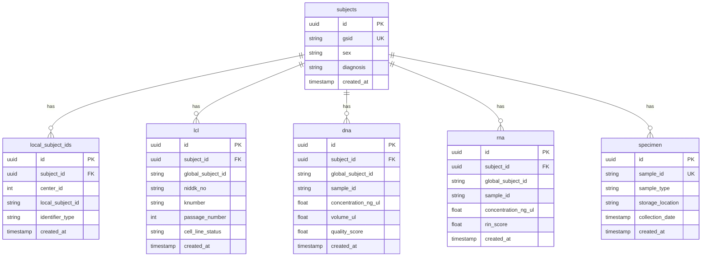

# System Architecture

## Overview

The IBDGC Integrated Data Hub (IDhub) is a microservices-based data integration platform designed to centralize biobank and clinical data from multiple sources while maintaining data quality, provenance, and subject identity consistency.

## Architecture Principles

### 1. **Separation of Concerns**

Each service has a single, well-defined responsibility:

- **GSID Service**: Subject identity management
- **REDCap Pipeline**: Data extraction and transformation
- **Fragment Validator**: Data quality validation
- **Table Loader**: Database persistence
- **Nginx**: Routing and SSL termination

### 2. **Staged Data Pipeline**

Data flows through distinct stages with validation gates:

```
Source → Extract → Stage → Validate → Queue → Load → Database
```

Each stage can fail independently without affecting others, enabling retry logic and error recovery.

### 3. **Immutable Staging**

Data fragments in S3 are immutable once created, providing:

- Complete audit trail
- Ability to replay pipelines
- Source of truth for debugging
- Disaster recovery capability

### 4. **Natural Key Strategy**

Records are identified by business keys (natural keys) rather than database IDs, enabling:

- Idempotent operations
- Cross-system reconciliation
- Intelligent upserts
- Data deduplication

## High-Level Architecture


## Component Architecture

### GSID Service

**Purpose**: Centralized global subject ID management

**Technology**: FastAPI (Python), PostgreSQL

**Key Features**:

- GSID generation (ULID-based)
- Local ID to GSID resolution
- Fuzzy matching for subject identification
- RESTful API with authentication


**Database Tables**:

- `subjects`: Core subject records with GSID
- `local_subject_ids`: Mapping of local IDs to GSIDs

[Detailed documentation →](../services/gsid-service.md)

### REDCap Pipeline

**Purpose**: Extract and transform data from REDCap projects

**Technology**: Python, REDCap API, S3

**Key Features**:

- Multi-project support
- Incremental extraction
- Field mapping and transformation
- Fragment generation


**Configuration**:

- `config/projects.json`: Project definitions
- `config/*_field_mappings.json`: Field mapping rules

[Detailed documentation →](../services/redcap-pipeline.md)

### Fragment Validator

**Purpose**: Validate data quality before database loading

**Technology**: Python, S3, PostgreSQL

**Key Features**:

- Schema validation
- GSID resolution
- Business rule validation
- Duplicate detection


**Validation Steps**:

1. **Schema Validation**: Field types, required fields
2. **GSID Resolution**: Map local IDs to GSIDs
3. **Business Rules**: Domain-specific validation
4. **Duplicate Detection**: Check for existing records

[Detailed documentation →](../services/fragment-validator.md)

### Table Loader

**Purpose**: Load validated data into database with update strategy

**Technology**: Python, PostgreSQL

**Key Features**:

- Natural key-based upserts
- Immutable field protection
- Batch processing
- Transaction management


**Configuration**:

- `config/table_configs.json`: Natural keys, immutable fields

[Detailed documentation →](../services/table-loader.md)

### Nginx Proxy

**Purpose**: Reverse proxy, SSL termination, routing

**Technology**: Nginx

**Key Features**:

- SSL/TLS termination
- Request routing
- Rate limiting
- Static file serving


[Detailed documentation →](../services/nginx.md)

## Data Flow Architecture

### End-to-End Data Flow


[Detailed data flow →](data-flow.md)

## Storage Architecture

### S3 Structure

```
s3://idhub-curated-fragments/
├── redcap/
│   ├── gap/
│   │   ├── batch_20240115_100000/
│   │   │   ├── lcl/
│   │   │   │   ├── fragment_001.json
│   │   │   │   ├── fragment_002.json
│   │   │   │   └── ...
│   │   │   ├── dna/
│   │   │   └── metadata.json
│   │   └── batch_20240116_100000/
│   └── uc_demarc/
├── labkey/
│   └── export_20240115/
└── manual/
    └── upload_20240115_143000/
```

**Key Characteristics**:

- Organized by source and project
- Batch-based organization
- Immutable once written
- Metadata files for tracking

### Database Schema



[Detailed schema documentation →](database-schema.md)

## Security Architecture

### Authentication & Authorization


**Security Layers**:

1. **Network Security**

   - SSL/TLS encryption (Let's Encrypt)
   - Nginx reverse proxy
   - Firewall rules

2. **Application Security**

   - API key authentication
   - Environment-based secrets
   - Input validation

3. **Database Security**

   - Connection pooling
   - Prepared statements
   - Role-based access

4. **Data Security**
   - Encrypted at rest (S3, RDS)
   - Encrypted in transit (HTTPS)
   - Audit logging

[Detailed security documentation →](security.md)

## Deployment Architecture

### Environment Structure


**Environments**:

| Environment     | Purpose              | Database         | S3 Bucket                    |
| --------------- | -------------------- | ---------------- | ---------------------------- |
| **Development** | Local development    | Local PostgreSQL | Local MinIO                  |
| **QA**          | Testing & validation | QA RDS           | `idhub-curated-fragments-qa` |
| **Production**  | Live system          | Production RDS   | `idhub-curated-fragments`    |

### Deployment Process


[Detailed deployment documentation →](../guides/deployment.md)

## Scalability Considerations

### Current Scale

- **Subjects**: ~50,000
- **LCL Lines**: ~30,000
- **DNA Samples**: ~40,000
- **RNA Samples**: ~20,000
- **Daily Ingestion**: ~1,000 records

### Scaling Strategies

**Horizontal Scaling**:

- Multiple validator instances
- Multiple loader instances
- Load balancing via Nginx

**Vertical Scaling**:

- Database connection pooling
- Batch processing optimization
- Query optimization

**Data Partitioning**:

- S3 partitioning by date/source
- Database table partitioning (future)
- Archive old validation queue records

## Monitoring & Observability

### Metrics Collected


**Key Metrics**:

- Pipeline success/failure rates
- GSID resolution performance
- Database load times
- Validation queue depth
- API response times

[Detailed monitoring documentation →](../operations/monitoring.md)

## Technology Stack

### Languages & Frameworks

| Component          | Technology      | Version      |
| ------------------ | --------------- | ------------ |
| GSID Service       | Python, FastAPI | 3.11, 0.104+ |
| REDCap Pipeline    | Python          | 3.11         |
| Fragment Validator | Python          | 3.11         |
| Table Loader       | Python          | 3.11         |
| Database           | PostgreSQL      | 15+          |
| Web UI             | NocoDB          | Latest       |
| Proxy              | Nginx           | 1.24+        |

### Key Libraries

- **Database**: `asyncpg`, `psycopg2`
- **API**: `fastapi`, `uvicorn`, `pydantic`
- **AWS**: `boto3`
- **Testing**: `pytest`, `pytest-asyncio`
- **Validation**: `jsonschema`, `pydantic`

## Design Patterns

### 1. **Pipeline Pattern**

Data flows through sequential stages with clear interfaces:

```python
class Pipeline:
    def extract(self) -> RawData: ...
    def transform(self, data: RawData) -> TransformedData: ...
    def load(self, data: TransformedData) -> Result: ...
```

### 2. **Repository Pattern**

Data access abstracted behind repository interfaces:

```python
class SubjectRepository:
    def find_by_gsid(self, gsid: str) -> Subject: ...
    def find_by_local_id(self, center_id: int, local_id: str) -> Subject: ...
    def create(self, subject: Subject) -> Subject: ...
```

### 3. **Strategy Pattern**

Update strategies configurable per table:

```python
class UpdateStrategy:
    def apply(self, existing: Record, new: Record) -> Action: ...

class UpsertStrategy(UpdateStrategy): ...
class InsertOnlyStrategy(UpdateStrategy): ...
```

### 4. **Factory Pattern**

Service creation based on configuration:

```python
class ValidatorFactory:
    def create(self, table_name: str) -> Validator:
        config = load_table_config(table_name)
        return Validator(config)
```

## Future Enhancements

### Planned Features

1. **Real-time Streaming**

   - Kafka/Kinesis integration
   - Event-driven architecture
   - Real-time validation

2. **Advanced Analytics**

   - Data quality dashboards
   - Lineage visualization
   - Anomaly detection

3. **API Expansion**

   - GraphQL API
   - Bulk operations API
   - Webhook notifications

4. **Performance Optimization**
   - Caching layer (Redis)
   - Database read replicas
   - Async processing

### Research Areas

- Machine learning for fuzzy matching
- Blockchain for immutable audit trail
- Federated learning for privacy-preserving analytics

## Related Documentation

- [Data Flow Details](data-flow.md)
- [Database Schema](database-schema.md)
- [Security Model](security.md)
- [Update Strategy](../update-strategy.md)

## References

- [Microservices Architecture](https://microservices.io/)
- [Twelve-Factor App](https://12factor.net/)
- [REDCap API Documentation](https://redcap.vanderbilt.edu/api/)
- [PostgreSQL Best Practices](https://wiki.postgresql.org/wiki/Don%27t_Do_This)

````

## Data Flow Documentation

```markdown:docs/architecture/data-flow.md
# Data Flow Architecture

## Overview

Data flows through IDhub in a staged pipeline, with validation gates at each stage ensuring data quality and consistency. This document details the complete data journey from source systems to the database.

## Pipeline Stages

```mermaid
graph LR
    A[Source Systems] --> B[Extraction]
    B --> C[Transformation]
    C --> D[Staging]
    D --> E[Validation]
    E --> F[Queueing]
    F --> G[Loading]
    G --> H[Database]

    style A fill:#FF9800
    style D fill:#2196F3
    style E fill:#9C27B0
    style H fill:#4CAF50
````

### Stage 1: Extraction

**Purpose**: Retrieve data from source systems

**Sources**:

- REDCap projects (via API)
- LabKey exports (CSV/TSV)
- Manual uploads (CSV/Excel)

**Process**:

```python
# REDCap extraction example
def extract_redcap_data(project_config):
    """Extract records from REDCap project"""
    api_url = project_config["redcap_api_url"]
    api_token = project_config["api_token"]

    # Fetch records via API
    records = redcap_client.export_records(
        token=api_token,
        format='json',
        type='flat'
    )

    return records
```

**Output**: Raw records in source format

### Stage 2: Transformation

**Purpose**: Map source fields to target schema

**Process**:

1. Load field mappings from configuration
2. Apply transformations (type conversion, formatting)
3. Add metadata (source, timestamp, batch ID)
4. Generate fragments

```python
# Field mapping example
def transform_record(record, field_mappings):
    """Transform source record to target schema"""
    transformed = {}

    for target_field, source_field in field_mappings.items():
        if source_field in record:
            value = record[source_field]
            # Apply transformations
            transformed[target_field] = transform_value(value, target_field)

    # Add metadata
    transformed["source_system"] = "redcap"
    transformed["source_timestamp"] = datetime.utcnow()
    transformed["batch_id"] = generate_batch_id()

    return transformed
```

**Configuration**: `config/*_field_mappings.json`

```json
{
  "field_mapping": {
    "knumber": "knumber",
    "niddk_no": "niddk_no",
    "passage_number": "passage_num"
  },
  "subject_id_candidates": ["consortium_id"],
  "center_id_field": "center_id",
  "default_center_id": 1
}
```

**Output**: Transformed records (fragments)

### Stage 3: Staging

**Purpose**: Store fragments immutably in S3

**S3 Structure**:

```
s3://idhub-curated-fragments/
└── {source}/
    └── {project}/
        └── batch_{timestamp}/
            ├── {table}/
            │   ├── fragment_001.json
            │   ├── fragment_002.json
            │   └── ...
            └── metadata.json
```

**Fragment Format**:

```json
{
  "fragment_id": "frag_01HQXYZ123",
  "table_name": "lcl",
  "source_system": "redcap",
  "source_project": "gap",
  "batch_id": "batch_20240115_100000",
  "created_at": "2024-01-15T10:00:00Z",
  "data": {
    "knumber": "K001",
    "niddk_no": "12345",
    "consortium_id": "GAP-001",
    "passage_number": 5,
    "cell_line_status": "Active"
  }
}
```

**Metadata File**:

```json
{
  "batch_id": "batch_20240115_100000",
  "source_system": "redcap",
  "source_project": "gap",
  "created_at": "2024-01-15T10:00:00Z",
  "tables": {
    "lcl": {
      "fragment_count": 150,
      "s3_prefix": "redcap/gap/batch_20240115_100000/lcl/"
    },
    "dna": {
      "fragment_count": 200,
      "s3_prefix": "redcap/gap/batch_20240115_100000/dna/"
    }
  }
}
```

**Output**: Immutable fragments in S3

### Stage 4: Validation

**Purpose**: Ensure data quality before loading

**Validation Steps**:


#### 4.1 Schema Validation

Validate field types, required fields, and constraints:

```python
def validate_schema(fragment_data, table_name):
    """Validate fragment against table schema"""
    schema = load_table_schema(table_name)

    # Check required fields
    for field in schema["required"]:
        if field not in fragment_data:
            raise ValidationError(f"Missing required field: {field}")

    # Check field types
    for field, value in fragment_data.items():
        expected_type = schema["fields"][field]["type"]
        if not isinstance(value, expected_type):
            raise ValidationError(
                f"Invalid type for {field}: expected {expected_type}"
            )

    return True
```

#### 4.2 GSID Resolution

Resolve local subject IDs to global subject IDs:

```python
def resolve_gsid(fragment_data, mapping_config):
    """Resolve GSID from local identifiers"""
    # Extract subject ID candidates
    candidates = mapping_config["subject_id_candidates"]
    local_id = None

    for candidate in candidates:
        if candidate in fragment_data:
            local_id = fragment_data[candidate]
            break

    if not local_id:
        raise ValidationError("No subject ID found in fragment")

    # Resolve via GSID service
    center_id = fragment_data.get(
        mapping_config["center_id_field"],
        mapping_config["default_center_id"]
    )

    gsid = gsid_service.resolve(
        center_id=center_id,
        local_subject_id=local_id
    )

    if not gsid:
        # Create new subject
        gsid = gsid_service.create_subject(
            center_id=center_id,
            local_subject_id=local_id
        )

    fragment_data["global_subject_id"] = gsid
    return fragment_data
```

#### 4.3 Business Rules Validation

Apply domain-specific validation rules:

```python
def validate_business_rules(fragment_data, table_name):
    """Apply business rules validation"""

    if table_name == "lcl":
        # LCL-specific rules
        if "passage_number" in fragment_data:
            if fragment_data["passage_number"] < 0:
                raise ValidationError("Passage number cannot be negative")
            if fragment_data["passage_number"] > 100:
                raise ValidationError("Passage number suspiciously high")

        if "cell_line_status" in fragment_data:
            valid_statuses = ["Active", "Frozen", "Depleted", "Contaminated"]
            if fragment_data["cell_line_status"] not in valid_statuses:
                raise ValidationError(f"Invalid cell line status")

    elif table_name == "dna":
        # DNA-specific rules
        if "concentration_ng_ul" in fragment_data:
            if fragment_data["concentration_ng_ul"] < 0:
                raise ValidationError("Concentration cannot be negative")

        if "quality_score" in fragment_data:
            if not (0 <= fragment_data["quality_score"] <= 3):
                raise ValidationError("Quality score must be between 0 and 3")

    return True
```

#### 4.4 Duplicate Detection

Check for duplicate fragments:

```python
def check_duplicate(fragment_data, table_name):
    """Check if fragment is duplicate"""
    config = load_table_config(table_name)
    natural_key = config["natural_key"]

    # Build natural key lookup
    key_values = {k: fragment_data[k] for k in natural_key}

    # Check validation queue
    existing = validation_queue.find_pending(table_name, key_values)

    if existing:
        raise DuplicateError(
            f"Duplicate fragment for {table_name}: {key_values}"
        )

    return True
```

**Output**: Validated records in validation queue

### Stage 5: Queueing

**Purpose**: Stage validated data for batch loading

**Validation Queue Table**:

```sql
CREATE TABLE validation_queue (
    id UUID PRIMARY KEY,
    table_name VARCHAR(100) NOT NULL,
    fragment_id VARCHAR(100) NOT NULL,
    s3_key TEXT NOT NULL,
    validated_data JSONB NOT NULL,
    status VARCHAR(50) DEFAULT 'pending',
    batch_id VARCHAR(100),
    created_at TIMESTAMP DEFAULT NOW(),
    loaded_at TIMESTAMP,
    error_message TEXT
);

CREATE INDEX idx_vq_status ON validation_queue(status);
CREATE INDEX idx_vq_table_status ON validation_queue(table_name, status);
CREATE INDEX idx_vq_batch ON validation_queue(batch_id);
```

**Queue Operations**:

```python
def queue_validated_fragment(fragment_data, table_name, s3_key):
    """Add validated fragment to queue"""
    queue_record = {
        "id": str(uuid.uuid4()),
        "table_name": table_name,
        "fragment_id": fragment_data["fragment_id"],
        "s3_key": s3_key,
        "validated_data": json.dumps(fragment_data),
        "status": "pending",
        "batch_id": fragment_data["batch_id"],
        "created_at": datetime.utcnow()
    }

    db.insert("validation_queue", queue_record)
    return queue_record["id"]
```

**Output**: Records queued for loading

### Stage 6: Loading

**Purpose**: Load validated data into database with update strategy

**Process**:


**Batch Loading**:

```python
def load_batch(batch_id, dry_run=False):
    """Load batch from validation queue"""
    # Read pending records
    records = validation_queue.get_pending_batch(batch_id)

    # Group by table
    by_table = {}
    for record in records:
        table = record["table_name"]
        if table not in by_table:
            by_table[table] = []
        by_table[table].append(record)

```
