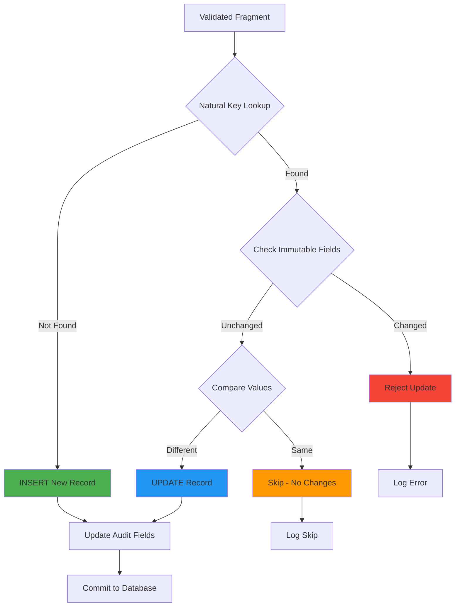

# Universal Update Strategy

The Universal Update Strategy is a core feature of IDhub that enables intelligent data loading with upsert logic, natural key matching, and immutable field protection.

## Overview

The update strategy provides:

- **Natural Key Matching**: Identify existing records using business keys instead of database IDs
- **Intelligent Upserts**: Insert new records or update existing ones based on natural keys
- **Immutable Field Protection**: Prevent modification of audit fields and other protected columns
- **Conflict Resolution**: Handle duplicate records and data conflicts gracefully
- **Audit Trail Preservation**: Maintain complete history of data changes

## Architecture



## Configuration

### Table Configuration

Each table defines its update strategy in `config/table_configs.json`:

```json
{
  "lcl": {
    "natural_key": ["global_subject_id", "niddk_no"],
    "immutable_fields": ["created_at"],
    "update_strategy": "upsert"
  },
  "dna": {
    "natural_key": ["global_subject_id", "sample_id"],
    "immutable_fields": ["created_at", "created_by"],
    "update_strategy": "upsert"
  },
  "rna": {
    "natural_key": ["global_subject_id", "sample_id"],
    "immutable_fields": ["created_at", "created_by"],
    "update_strategy": "upsert"
  },
  "subjects": {
    "natural_key": ["global_subject_id"],
    "immutable_fields": ["created_at", "gsid"],
    "update_strategy": "upsert"
  }
}
```

### Configuration Options

| Field              | Type       | Description                                             |
| ------------------ | ---------- | ------------------------------------------------------- |
| `natural_key`      | `string[]` | Fields that uniquely identify a record                  |
| `immutable_fields` | `string[]` | Fields that cannot be modified after creation           |
| `update_strategy`  | `string`   | Strategy to use: `upsert`, `insert_only`, `update_only` |

## Natural Keys

Natural keys are business identifiers that uniquely identify records without relying on database-generated IDs.

### Examples

**LCL Lines**

```json
{
  "natural_key": ["global_subject_id", "niddk_no"]
}
```

An LCL (lymphoblastoid cell line) is uniquely identified by the subject's GSID and their NIDDK number.

**DNA Samples**

```json
{
  "natural_key": ["global_subject_id", "sample_id"]
}
```

A DNA sample is uniquely identified by the subject and sample ID.

**Subjects**

```json
{
  "natural_key": ["global_subject_id"]
}
```

A subject is uniquely identified by their GSID.

**Specimens**

```json
{
  "natural_key": ["sample_id"]
}
```

A specimen is uniquely identified by its sample ID alone.

### Composite Keys

Natural keys can be composite (multiple fields):

```python
# Example: Finding existing LCL line
natural_key = {
    "global_subject_id": "01HQXYZ123",
    "niddk_no": "12345"
}

# SQL equivalent
SELECT * FROM lcl
WHERE global_subject_id = '01HQXYZ123'
  AND niddk_no = '12345'
```

## Update Strategies

### Upsert (Default)

Insert if record doesn't exist, update if it does.

```python
# Pseudocode
if record_exists(natural_key):
    if immutable_fields_changed():
        reject_update()
    else:
        update_record()
else:
    insert_record()
```

**Use Cases**:

- LCL data that may be corrected or enriched
- DNA/RNA sample information that evolves
- Subject information updates
- Most transactional data

### Insert Only

Only insert new records, reject updates to existing records.

```json
{
  "update_strategy": "insert_only"
}
```

**Use Cases**:

- Immutable audit logs
- Historical snapshots
- Event data

### Update Only

Only update existing records, reject new inserts.

```json
{
  "update_strategy": "update_only"
}
```

**Use Cases**:

- Enrichment of existing data
- Status updates
- Corrections to known records

## Immutable Fields

Immutable fields cannot be changed after record creation.

### Common Immutable Fields

```json
{
  "immutable_fields": [
    "created_at", // Creation timestamp
    "created_by", // Original creator
    "gsid", // Global subject ID
    "source_system", // Original source
    "batch_id" // Original batch
  ]
}
```

### Protection Mechanism

```python
def validate_immutable_fields(existing_record, new_data, immutable_fields):
    """Check if any immutable fields would be changed"""
    for field in immutable_fields:
        if field in new_data:
            existing_value = existing_record.get(field)
            new_value = new_data.get(field)

            if existing_value != new_value:
                raise ImmutableFieldError(
                    f"Cannot modify immutable field '{field}': "
                    f"{existing_value} -> {new_value}"
                )
```

### Handling Violations

When an immutable field violation is detected:

1. **Reject the update**
2. **Log the error** with details
3. **Mark fragment as failed** in validation queue
4. **Notify operators** via monitoring

## Implementation

### Fragment Validator

The validator prepares data for the update strategy:

```python
# fragment-validator/services/validator.py
def validate_fragment(self, fragment_data, table_config):
    """Validate fragment and prepare for loading"""

    # Load table configuration
    natural_key = table_config["natural_key"]

    # Ensure natural key fields are present
    for field in natural_key:
        if field not in fragment_data:
            raise ValidationError(f"Missing natural key field: {field}")

    # Resolve GSID if needed
    if "global_subject_id" in natural_key:
        gsid = self.resolve_gsid(fragment_data)
        fragment_data["global_subject_id"] = gsid

    return fragment_data
```

### Table Loader

The loader executes the update strategy:

```python
# table-loader/services/loader.py
def load_record(self, table_name, record_data):
    """Load record using update strategy"""

    # Get table configuration
    config = self.get_table_config(table_name)
    natural_key = config["natural_key"]
    immutable_fields = config["immutable_fields"]

    # Build natural key lookup
    key_values = {k: record_data[k] for k in natural_key}

    # Check if record exists
    existing = self.find_by_natural_key(table_name, key_values)

    if existing:
        # UPDATE path
        self.validate_immutable_fields(existing, record_data, immutable_fields)
        self.update_record(table_name, existing["id"], record_data)
        return "updated"
    else:
        # INSERT path
        self.insert_record(table_name, record_data)
        return "inserted"
```

## Examples

### Example 1: LCL Line Update

**Initial Insert**

```json
{
  "global_subject_id": "01HQXYZ123",
  "niddk_no": "12345",
  "knumber": "K001",
  "cell_line_status": "Active",
  "passage_number": 5,
  "created_at": "2024-01-15T10:00:00Z"
}
```

**Update Request** (passage number updated)

```json
{
  "global_subject_id": "01HQXYZ123",
  "niddk_no": "12345",
  "knumber": "K001",
  "cell_line_status": "Active",
  "passage_number": 8,
  "updated_at": "2024-01-16T14:30:00Z"
}
```

**Result**: ✅ Update succeeds

- Natural key matches existing record (GSID + NIDDK number)
- No immutable fields changed
- Passage number updated from 5 to 8

### Example 2: Immutable Field Violation

**Existing Record**

```json
{
  "global_subject_id": "01HQXYZ123",
  "niddk_no": "12345",
  "knumber": "K001",
  "created_at": "2024-01-15T10:00:00Z"
}
```

**Update Request** (trying to change created_at)

```json
{
  "global_subject_id": "01HQXYZ123",
  "niddk_no": "12345",
  "knumber": "K001",
  "created_at": "2024-01-16T10:00:00Z"
}
```

**Result**: ❌ Update rejected

```
ImmutableFieldError: Cannot modify immutable field 'created_at':
2024-01-15T10:00:00Z -> 2024-01-16T10:00:00Z
```

### Example 3: New LCL Line Insert

**Insert Request**

```json
{
  "global_subject_id": "01HQABC456",
  "niddk_no": "67890",
  "knumber": "K002",
  "cell_line_status": "Active",
  "passage_number": 3
}
```

**Result**: ✅ Insert succeeds

- Natural key not found in database
- New LCL line record created
- Audit fields auto-populated

### Example 4: DNA Sample with Multiple Fields Updated

**Existing Record**

```json
{
  "global_subject_id": "01HQXYZ123",
  "sample_id": "DNA-001",
  "concentration_ng_ul": 50.0,
  "volume_ul": 100.0,
  "quality_score": 1.8,
  "created_at": "2024-01-10T09:00:00Z"
}
```

**Update Request** (concentration and quality updated after re-measurement)

```json
{
  "global_subject_id": "01HQXYZ123",
  "sample_id": "DNA-001",
  "concentration_ng_ul": 52.5,
  "volume_ul": 100.0,
  "quality_score": 1.9,
  "updated_at": "2024-01-20T11:00:00Z"
}
```

**Result**: ✅ Update succeeds

- Natural key matches (GSID + sample_id)
- Multiple mutable fields updated
- Immutable fields preserved

## Monitoring & Logging

### Metrics Tracked

```python
{
  "batch_id": "batch_20240115_100000",
  "table": "lcl",
  "total_records": 150,
  "inserted": 45,
  "updated": 100,
  "skipped": 3,
  "failed": 2,
  "immutable_violations": 2
}
```

### Log Examples

**Successful Update**

```
INFO: Updated lcl record [GSID: 01HQXYZ123, NIDDK: 12345]
  Changed fields: passage_number (5 -> 8), cell_line_status (Active -> Frozen)
```

**Immutable Violation**

```
ERROR: Immutable field violation in lcl record
  Natural Key: {global_subject_id: "01HQXYZ123", niddk_no: "12345"}
  Field: created_at
  Existing: 2024-01-15T10:00:00Z
  Attempted: 2024-01-16T10:00:00Z
```

**No Changes**

```
DEBUG: Skipped lcl record [GSID: 01HQXYZ123, NIDDK: 12345]
  Reason: No field changes detected
```

**New Insert**

```
INFO: Inserted new lcl record [GSID: 01HQABC456, NIDDK: 67890]
  Fields: knumber=K002, passage_number=3, cell_line_status=Active
```

## Best Practices

### 1. Choose Appropriate Natural Keys

✅ **Good Natural Keys**

- Stable business identifiers (NIDDK numbers, K numbers)
- Guaranteed unique within scope
- Always present in source data
- Combination of GSID + domain-specific ID

❌ **Poor Natural Keys**

- Auto-incrementing IDs from source systems
- Mutable fields (names, dates, status)
- Optional fields
- Fields that might be corrected later

### 2. Define Immutable Fields Carefully

**Always Immutable**

- `created_at`, `created_by`
- `gsid` (global subject ID)
- `source_system`, `source_id`

**Sometimes Immutable**

- `batch_id` (if tracking original batch)
- `niddk_no` (permanent identifier)
- `knumber` (permanent identifier)

**Rarely Immutable**

- Clinical measurements
- Status fields (Active, Frozen, etc.)
- Passage numbers
- Quality metrics
- Descriptive text

### 3. Handle Conflicts Gracefully

```python
try:
    loader.load_record("lcl", record_data)
except ImmutableFieldError as e:
    logger.error(f"Immutable field violation: {e}")
    # Mark for manual review
    queue.mark_for_review(record_data, reason=str(e))
except NaturalKeyConflict as e:
    logger.error(f"Natural key conflict: {e}")
    # Attempt conflict resolution
    resolver.resolve_conflict(record_data)
```

### 4. Test Update Scenarios

```python
# Test suite should cover:
def test_insert_new_lcl_line():
    """Test inserting a new LCL line"""
    pass

def test_update_existing_lcl_line():
    """Test updating mutable fields like passage_number"""
    pass

def test_immutable_field_protection():
    """Test that created_at cannot be changed"""
    pass

def test_no_change_skip():
    """Test that identical data is skipped"""
    pass

def test_natural_key_uniqueness():
    """Test GSID + NIDDK number uniqueness"""
    pass

def test_partial_update():
    """Test updating only some fields"""
    pass
```

## Real-World Scenarios

### Scenario 1: LCL Line Passage Update

A lab maintains LCL lines and periodically updates passage numbers as cells are cultured.

```python
# Initial state
{
  "global_subject_id": "01HQXYZ123",
  "niddk_no": "12345",
  "passage_number": 5
}

# After 3 months of culture
{
  "global_subject_id": "01HQXYZ123",
  "niddk_no": "12345",
  "passage_number": 12
}

# Result: passage_number updated, all other fields preserved
```

### Scenario 2: DNA Sample Re-quantification

A DNA sample is re-measured with better equipment, providing updated concentration values.

```python
# Original measurement
{
  "global_subject_id": "01HQXYZ123",
  "sample_id": "DNA-001",
  "concentration_ng_ul": 50.0,
  "quality_score": 1.8
}

# After re-quantification
{
  "global_subject_id": "01HQXYZ123",
  "sample_id": "DNA-001",
  "concentration_ng_ul": 52.5,
  "quality_score": 1.9
}

# Result: Measurements updated, preserving audit trail
```

### Scenario 3: Subject Information Enrichment

Subject data is enriched over time as more information becomes available.

```python
# Initial subject record
{
  "global_subject_id": "01HQXYZ123",
  "sex": "F",
  "diagnosis": "CD"
}

# Enriched with additional data
{
  "global_subject_id": "01HQXYZ123",
  "sex": "F",
  "diagnosis": "CD",
  "age_at_diagnosis": 25,
  "disease_location": "Ileal"
}

# Result: New fields added, existing fields preserved
```

## Troubleshooting

### Issue: Duplicate Natural Keys

**Symptom**: Multiple LCL records with same GSID + NIDDK number

**Cause**: Data quality issue in source system

**Solution**:

```sql
-- Find duplicates
SELECT global_subject_id, niddk_no, COUNT(*)
FROM lcl
GROUP BY global_subject_id, niddk_no
HAVING COUNT(*) > 1;

-- Investigate and resolve
SELECT * FROM lcl
WHERE global_subject_id = '01HQXYZ123'
  AND niddk_no = '12345';
```

### Issue: Immutable Field Violations

**Symptom**: Updates rejected due to immutable field changes

**Cause**: Source data attempting to modify protected fields

**Solution**:

1. Review source data extraction logic
2. Ensure immutable fields are excluded from updates
3. Check field mappings in `config/lcl_mapping.json`
4. If legitimate change needed, requires manual database update

### Issue: Missing Natural Key Fields

**Symptom**: Validation fails with "Missing natural key field"

**Cause**: Source data missing required fields (GSID or NIDDK number)

**Solution**:

```python
# Check field mappings
{
  "field_mapping": {
    "knumber": "knumber",
    "niddk_no": "niddk_no"  # Ensure this is mapped
  },
  "subject_id_candidates": ["consortium_id"]  # For GSID resolution
}
```

### Issue: Performance with Large Batches

**Symptom**: Slow loading with large LCL datasets

**Optimization**:

```python
# Use batch lookups instead of individual queries
def find_existing_records_batch(self, table_name, natural_keys):
    """Find multiple records by natural keys in single query"""
    # Build efficient WHERE IN clause
    # Return dict mapping natural_key -> record

    # Example for LCL
    gsids = [nk["global_subject_id"] for nk in natural_keys]
    niddk_nos = [nk["niddk_no"] for nk in natural_keys]

    query = """
        SELECT * FROM lcl
        WHERE (global_subject_id, niddk_no) IN %s
    """
    # Execute with tuple list
```

## Related Documentation

- [Data Flow](data-flow.md) - Overall data pipeline
- [Table Loader Service](../services/table-loader.md) - Implementation details
- [Fragment Validator](../services/fragment-validator.md) - Validation before loading
- [Table Configurations](../reference/table-configs.md) - Configuration reference
- [LCL Field Mappings](../reference/field-mappings.md#lcl-mappings) - LCL-specific mappings

## Next Steps

- [Configure table update strategies](../reference/table-configs.md)
- [Set up LCL field mappings](../reference/field-mappings.md#lcl-mappings)
- [Set up monitoring](../operations/monitoring.md)
- [Review troubleshooting guide](../operations/troubleshooting.md)

````

Now let me also update the main index page to remove blood references:

```markdown:docs/index.md
# IBDGC Integrated Data Hub

<div class="grid cards" markdown>

-   :material-database: **Centralized Data Management**

    ---

    Unified platform for biobank and clinical data integration with global subject ID management

-   :material-shield-check: **Data Validation**

    ---

    Comprehensive validation pipeline ensuring data quality before database loading

-   :material-sync: **Multi-Source Integration**

    ---

    Seamless integration with REDCap, LabKey, and manual data uploads

-   :material-history: **Complete Audit Trail**

    ---

    Full lineage tracking from source to database with immutable audit logs

</div>

## What is IDhub?

The IBDGC Integrated Data Hub (IDhub) is a comprehensive data management system designed to:

- **Centralize** biobank and clinical data from multiple sources
- **Validate** data quality and consistency before loading
- **Manage** global subject identifiers (GSIDs) across the consortium
- **Track** complete data lineage and audit trails
- **Automate** data pipelines with GitHub Actions workflows

## System Architecture

```mermaid
graph TB
    subgraph "Data Sources"
        A[REDCap Projects]
        B[LabKey]
        C[Manual Uploads]
    end

    subgraph "Ingestion Layer"
        D[REDCap Pipeline]
        E[Fragment Validator]
    end

    subgraph "Staging"
        F[S3 Curated Fragments]
        G[Validation Queue]
    end

    subgraph "Loading Layer"
        H[Table Loader]
        I[Universal Update Strategy]
    end

    subgraph "Data Layer"
        J[(PostgreSQL)]
        K[GSID Service]
    end

    subgraph "Access Layer"
        L[NocoDB UI]
        M[API]
    end

    A --> D
    B --> E
    C --> E
    D --> F
    E --> F
    F --> G
    G --> H
    H --> I
    I --> J
    K <--> J
    J --> L
    J --> M

    style I fill:#4CAF50
    style K fill:#2196F3
````

## Key Features

### :material-identifier: Global Subject ID Management

Centralized GSID generation and resolution service ensuring consistent subject identification across all data sources.

[Learn more →](services/gsid-service.md){ .md-button }

### :material-pipeline: Automated Data Pipelines

Extract data from REDCap projects, validate, and load into the database with full automation via GitHub Actions.

[Learn more →](guides/data-ingestion.md){ .md-button }

### :material-check-decagram: Universal Update Strategy

Intelligent upsert logic using natural keys, handling updates while preserving immutable fields and audit trails.

[Learn more →](architecture/update-strategy.md){ .md-button .md-button--primary }

### :material-file-document-check: Data Validation

Comprehensive validation including schema checks, GSID resolution, and business rule validation before database loading.

[Learn more →](services/fragment-validator.md){ .md-button }

## Quick Start

=== "Docker Compose"

    ```bash
    # Clone repository
    git clone https://github.com/ibdgc/idhub.git
    cd idhub

    # Configure environment
    cp .env.example .env
    # Edit .env with your settings

    # Start services
    docker-compose up -d

    # Check status
    docker-compose ps
    ```

=== "Local Development"

    ```bash
    # Prerequisites: Python 3.11+, PostgreSQL 15+

    # Set up virtual environment
    python -m venv venv
    source venv/bin/activate  # or `venv\Scripts\activate` on Windows

    # Install dependencies
    pip install -r requirements.txt

    # Configure environment
    cp .env.example .env

    # Run migrations
    python scripts/migrate.py

    # Start services
    python gsid-service/main.py &
    python redcap-pipeline/main.py --project gap
    ```

[Full installation guide →](getting-started/installation.md){ .md-button }

## System Components

| Component              | Purpose                                     | Documentation                          |
| ---------------------- | ------------------------------------------- | -------------------------------------- |
| **GSID Service**       | Global subject ID generation and resolution | [Docs](services/gsid-service.md)       |
| **REDCap Pipeline**    | Extract and transform REDCap data           | [Docs](services/redcap-pipeline.md)    |
| **Fragment Validator** | Validate data fragments before loading      | [Docs](services/fragment-validator.md) |
| **Table Loader**       | Load validated data into database           | [Docs](services/table-loader.md)       |
| **Nginx Proxy**        | Reverse proxy with SSL termination          | [Docs](services/nginx.md)              |

## Data Types Managed

IDhub manages various biobank and clinical data types:

- **LCL Lines**: Lymphoblastoid cell lines with passage tracking
- **DNA Samples**: Extracted DNA with quality metrics
- **RNA Samples**: RNA samples with integrity scores
- **Specimens**: General specimen tracking
- **Subjects**: Patient/participant information
- **Local Subject IDs**: Cross-reference between local and global IDs

## Data Flow Overview

```mermaid
sequenceDiagram
    participant RC as REDCap
    participant RP as REDCap Pipeline
    participant S3 as S3 Staging
    participant FV as Fragment Validator
    participant VQ as Validation Queue
    participant TL as Table Loader
    participant DB as PostgreSQL
    participant GS as GSID Service

    RC->>RP: Extract records
    RP->>RP: Transform & map fields
    RP->>S3: Upload fragments
    S3->>FV: Process fragments
    FV->>GS: Resolve GSIDs
    GS-->>FV: Return GSIDs
    FV->>VQ: Queue validated data
    VQ->>TL: Load batch
    TL->>TL: Apply update strategy
    TL->>DB: Upsert records
    TL->>VQ: Mark as loaded
```

[Detailed data flow →](architecture/data-flow.md){ .md-button }

## Documentation Sections

<div class="grid cards" markdown>

- :material-rocket-launch: **Getting Started**

  ***

  Installation, configuration, and quick start guides

  [:octicons-arrow-right-24: Get started](getting-started/quick-start.md)

- :material-sitemap: **Architecture**

  ***

  System design, data flow, and update strategy

  [:octicons-arrow-right-24: Learn architecture](architecture/overview.md)

- :material-cog: **Services**

  ***

  Detailed documentation for each service component

  [:octicons-arrow-right-24: Explore services](services/index.md)

- :material-book-open-variant: **User Guides**

  ***

  Step-by-step guides for common workflows

  [:octicons-arrow-right-24: Read guides](guides/data-ingestion.md)

- :material-code-braces: **Developer Guide**

  ***

  Development setup, testing, and contributing

  [:octicons-arrow-right-24: Start developing](developer/setup.md)

- :material-api: **API Reference**

  ***

  API endpoints, authentication, and examples

  [:octicons-arrow-right-24: View API docs](api/gsid-api.md)

- :material-server: **Operations**

  ***

  Deployment, monitoring, and troubleshooting

  [:octicons-arrow-right-24: Operations guide](operations/deployment.md)

- :material-file-document: **Reference**

  ***

  Configuration files, environment variables, CLI commands

  [:octicons-arrow-right-24: Reference docs](reference/environment-variables.md)

</div>

## Support & Contributing

- **Issues**: [GitHub Issues](https://github.com/ibdgc/idhub/issues)
- **Discussions**: [GitHub Discussions](https://github.com/ibdgc/idhub/discussions)
- **Contributing**: [Contribution Guide](developer/contributing.md)

## License

This project is licensed under the MIT License - see the LICENSE file for details.
