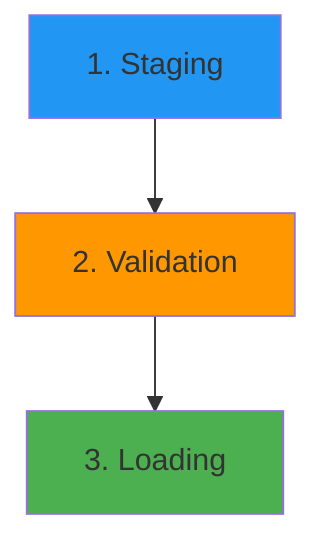

# Data Ingestion Overview

This guide provides a high-level overview of how data gets into IDhub. Understanding this process helps in preparing data for submission and troubleshooting any issues that may arise.

## The Three Main Stages

All data, regardless of its source, goes through three main stages before it appears in the IDhub database.

---

### Stage 1: Staging - Preparing the Data

This is the first step where data from different sources is converted into a standardized format called "fragments". A fragment is a small, structured piece of data, usually representing a single record or sample.

**Data Sources:**

- **REDCap Projects**: Data is **automatically** extracted by the REDCap Pipeline service.
- **Manual Uploads**: You or other curators provide data as CSV which are then converted into fragments.

At the end of this stage, all data exists as standardized fragments in a staging area, ready for validation.

---

### Stage 2: Validation - Ensuring Data Quality

This is the most critical step for data curators. The **Fragment Validator** service inspects every single fragment to ensure it meets IDhub's quality standards.

The key validation steps include:

1.  **Schema Check**:

    - Are all required fields present? (e.g., a `genotype` record must have a `genotype_id`).
    - Are the data types correct? (e.g., is the `passage_number` a number?).

2.  **Subject ID Resolution**:

    - The validator checks the subject identifier (e.g., `consortium_id`, `local_subject_id`) in your data.
    - It communicates with the **GSID Service** to find the corresponding Global Subject ID (GSID).
    - If the subject doesn't exist in IDhub, a **new GSID is created** for them automatically.
    - The correct GSID is attached to the data fragment.

    > [!tip]
    > Learn more about the purpose and scope of GSIDs in the [What is a GSID?](../what-is-a-gsid.md) guide.

3.  **Business Rule Checks**:
    - Does the data make sense? (e.g., the `genotyping_project` is a known project).
    - Does the data conflict with existing records? (e.g., attempting to load a `sample_id` that already exists for a different subject).

Fragments that pass all checks are placed in a **Validation Queue**, ready for the final stage. Fragments that fail are logged with detailed error reports for you to review and correct.

---

### Stage 3: Loading - Committing to the Database

The **Table Loader** service takes the validated fragments from the queue and loads them into the main IDhub database.

- **Batch Processing**: Data is loaded in batches for efficiency and safety.
- **Intelligent Updates**: The loader knows whether to insert a new record or update an existing one based on its unique "natural key". For example, if a `genotype` record with the same `genotype_id` already exists, the loader will update it instead of creating a duplicate.
- **Transactional Safety**: If any part of a batch fails, the entire batch is rolled back to prevent partially loaded or inconsistent data.

Once this stage is complete, the data is officially in IDhub and accessible through the NocoDB interface and other tools.
