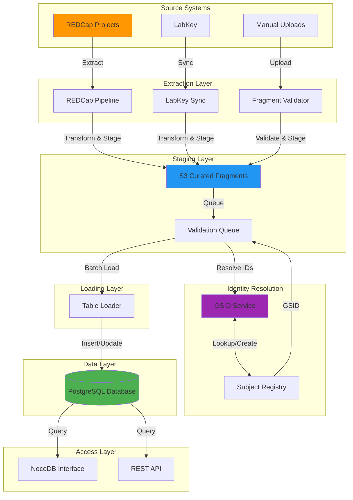

# Data Flow Documentation

## Overview

This document describes how data flows through the IDhub system, from source systems through validation and into the database.

## High-Level Data Flow



## Detailed Data Flows

!!! abstract "1. REDCap Pipeline Flow"
    ```mermaid
    sequenceDiagram
        participant RC as REDCap
        participant RCP as REDCap Pipeline
        participant MAP as Field Mapper
        participant S3 as S3 Bucket
        participant VQ as Validation Queue

        Note over RCP: Scheduled/Manual Trigger

        RCP->>RC: GET /api/ (export records)
        RC-->>RCP: JSON records

        Note over RCP: Incremental filtering
        RCP->>RCP: Filter new/updated records

        loop For each record
            RCP->>MAP: Transform record
            MAP->>MAP: Apply field mappings
            MAP->>MAP: Apply transformations
            MAP-->>RCP: Transformed record

            RCP->>RCP: Generate fragment
            RCP->>S3: Upload fragment
            S3-->>RCP: S3 key

            RCP->>VQ: Insert queue entry
            VQ-->>RCP: Queue ID
        end

        Note over RCP: Batch complete
        RCP->>RCP: Update last_run timestamp
    ```

    !!! info "Steps"
        1.  **Trigger**: Scheduled (cron) or manual execution
        2.  **Authentication**: Load API token from environment
        3.  **Incremental Check**: Query last successful run timestamp
        4.  **Extract**: Call REDCap API with filters
        5.  **Transform**: Apply field mappings for each table
        6.  **Fragment Generation**: Create JSON fragments
        7.  **S3 Upload**: Upload to staging bucket
        8.  **Queue**: Insert into validation_queue
        9.  **Metadata**: Update extraction metadata

    !!! example "Example Parameters"
        ```python
        params = {
            'token': api_token,
            'content': 'record',
            'format': 'json',
            'type': 'flat',
            'dateRangeBegin': last_run_date
        }
        ```

    !!! example "Example Fragment"
        ```json
        {
          "fragment_id": "frag_01HQXYZ123",
          "table_name": "lcl",
          "source_system": "redcap",
          "project_name": "GAP",
          "batch_id": "batch_20240115_100000",
          "extracted_at": "2024-01-15T10:00:00Z",
          "data": {
            "consortium_id": "GAP-001",
            "center_id": 1,
            "knumber": "K001",
            "niddk_no": "12345",
            "passage_number": 8,
            "cell_line_status": "Active",
            "freeze_date": "2024-01-10",
            "storage_location": "Tank A, Rack 3, Box 12"
          }
        }
        ```

---

!!! abstract "2. Fragment Validation Flow"
    ```mermaid
    sequenceDiagram
        participant USER as User/System
        participant FV as Fragment Validator
        participant S3 as S3 Bucket
        participant GSID as GSID Service
        participant VQ as Validation Queue
        participant NOCODB as NocoDB

        USER->>FV: Validate file
        FV->>FV: Load mapping config
        FV->>FV: Parse input file

        loop For each row
            FV->>FV: Apply field mappings
            FV->>FV: Validate data types
            FV->>FV: Check required fields

            alt Subject ID Resolution
                FV->>GSID: Resolve local ID
                GSID-->>FV: GSID or 404

                alt GSID not found
                    FV->>GSID: Generate new GSID
                    GSID-->>FV: New GSID
                end
            end

            FV->>FV: Add GSID to record
            FV->>FV: Generate fragment

            FV->>S3: Upload fragment
            S3-->>FV: S3 key

            FV->>VQ: Insert queue entry
            VQ-->>FV: Queue ID

            opt NocoDB Update
                FV->>NOCODB: Update validation status
                NOCODB-->>FV: Success
            end
        end

        FV-->>USER: Validation summary
    ```

    !!! info "Steps"
        1.  **Input**: CSV/Excel file with source data
        2.  **Configuration**: Load table-specific mapping config
        3.  **Parsing**: Read and parse input file
        4.  **Row Processing**:
            -   Apply field mappings
            -   Validate data types
            -   Check required fields
            -   Validate constraints
        5.  **Subject ID Resolution**:
            -   Extract subject ID candidates
            -   Call GSID service to resolve
            -   Generate new GSID if needed
        6.  **Fragment Generation**: Create validated JSON fragment
        7.  **S3 Upload**: Upload to curated fragments bucket
        8.  **Queue**: Insert into validation_queue
        9.  **Status Update**: Update source system (if applicable)

    !!! example "Validation Rules (Python Pseudocode)"
        ```python
        # Example validation logic
        def validate_record(record, table_config):
            """Validate a single record"""
            errors = []

            # Check required fields
            for field in table_config['required_fields']:
                if field not in record or record[field] is None:
                    errors.append(f"Missing required field: {field}")

            # Validate data types
            for field, value in record.items():
                expected_type = table_config['field_types'].get(field)
                if expected_type and not validate_type(value, expected_type):
                    errors.append(f"Invalid type for {field}: expected {expected_type}")

            # Check natural key uniqueness
            natural_key = tuple(record[k] for k in table_config['natural_key'])
            if natural_key in seen_keys:
                errors.append(f"Duplicate natural key: {natural_key}")

            return errors
        ```

---

!!! abstract "3. GSID Resolution Flow"
    ```mermaid
    sequenceDiagram
        participant CLIENT as Client
        participant GSID as GSID Service
        participant DB as Database

        CLIENT->>GSID: POST /resolve
        Note over CLIENT,GSID: {center_id: 1, local_subject_id: "GAP-001"}

        GSID->>DB: Query local_subject_ids
        Note over GSID,DB: WHERE center_id=1 AND local_subject_id='GAP-001'

        alt Subject Found
            DB-->>GSID: subject_id, gsid
            GSID->>DB: Query subjects
            DB-->>GSID: Subject details
            GSID-->>CLIENT: 200 OK {gsid, found: true}
        else Subject Not Found
            GSID-->>CLIENT: 404 Not Found {found: false}
        end
    ```

    !!! example "Resolution Logic (Python Pseudocode)"
        ```python
        async def resolve_subject_id(center_id: int, local_subject_id: str) -> Optional[str]:
            """
            Resolve local subject ID to GSID

            Args:
                center_id: Center identifier
                local_subject_id: Local subject identifier

            Returns:
                GSID if found, None otherwise
            """
            # Query local_subject_ids table
            query = """
                SELECT s.gsid
                FROM subjects s
                JOIN local_subject_ids lsi ON s.id = lsi.subject_id
                WHERE lsi.center_id = $1
                  AND lsi.local_subject_id = $2
                LIMIT 1
            """

            result = await db.fetchrow(query, center_id, local_subject_id)

            if result:
                return result['gsid']

            return None
        ```

    !!! example "Generation Logic (Python Pseudocode)"
        ```python
        async def generate_gsid(
            center_id: int,
            local_subject_id: str,
            identifier_type: str = "consortium_id",
            metadata: dict = None
        ) -> str:
            """
            Generate new GSID and create subject record

            Args:
                center_id: Center identifier
                local_subject_id: Local subject identifier
                identifier_type: Type of identifier
                metadata: Optional subject metadata

            Returns:
                New GSID
            """
            # Generate GSID
            gsid = str(ulid.create())

            # Create subject record
            subject_query = """
                INSERT INTO subjects (gsid, sex, diagnosis, age_at_diagnosis)
                VALUES ($1, $2, $3, $4)
                RETURNING id
            """

            subject_id = await db.fetchval(
                subject_query,
                gsid,
                metadata.get('sex'),
                metadata.get('diagnosis'),
                metadata.get('age_at_diagnosis')
            )

            # Create local ID mapping
            mapping_query = """
                INSERT INTO local_subject_ids
                (subject_id, center_id, local_subject_id, identifier_type)
                VALUES ($1, $2, $3, $4)
            """

            await db.execute(
                mapping_query,
                subject_id,
                center_id,
                local_subject_id,
                identifier_type
            )

            return gsid
        ```

---

!!! abstract "4. Table Loader Flow"
    ```mermaid
    sequenceDiagram
        participant USER as User/Operator
        participant TL as Table Loader
        participant VQ as Validation Queue
        participant S3 as S3 Bucket
        participant DB as Database

        USER->>TL: Load batch
        Note over USER,TL: batch_id, dry_run=false

        TL->>VQ: Query pending fragments
        Note over TL,VQ: WHERE batch_id=X AND status='pending'
        VQ-->>TL: Fragment list

        TL->>TL: Group by table_name

        loop For each table
            loop For each fragment
                TL->>S3: Download fragment
                S3-->>TL: Fragment data

                TL->>TL: Extract natural key
                TL->>DB: Check if exists

                alt Record exists
                    TL->>TL: Prepare UPDATE
                    TL->>DB: UPDATE record
                else Record new
                    TL->>TL: Prepare INSERT
                    TL->>DB: INSERT record
                end

                DB-->>TL: Success/Error

                alt Success
                    TL->>VQ: UPDATE status='loaded'
                else Error
                    TL->>VQ: UPDATE status='failed', error_message
                end
            end
        end

        TL-->>USER: Load summary
    ```

    !!! info "Steps"
        1.  **Batch Selection**: Identify batch to load
        2.  **Query Queue**: Get pending fragments for batch
        3.  **Group by Table**: Process one table at a time
        4.  **Fragment Processing**:
            -   Download from S3
            -   Parse JSON
            -   Extract natural key
            -   Check for existing record
        5.  **Upsert Logic**:
            -   If exists: UPDATE (respecting immutable fields)
            -   If new: INSERT
        6.  **Status Update**: Mark as loaded/failed
        7.  **Summary**: Generate load statistics

    !!! example "Upsert Logic (Python Pseudocode)"
        ```python
        async def upsert_record(table_name: str, record: dict, table_config: dict):
            """
            Insert or update record based on natural key

            Args:
                table_name: Target table
                record: Record data
                table_config: Table configuration (natural keys, immutable fields)
            """
            # Extract natural key
            natural_key = {k: record[k] for k in table_config['natural_key']}

            # Check if record exists
            where_clause = ' AND '.join([f"{k} = ${i+1}" for i, k in enumerate(natural_key.keys())])
            check_query = f"SELECT id FROM {table_name} WHERE {where_clause}"

            existing = await db.fetchrow(check_query, *natural_key.values())

            if existing:
                # UPDATE - exclude immutable fields
                update_fields = {
                    k: v for k, v in record.items()
                    if k not in table_config['immutable_fields']
                }

                set_clause = ', '.join([
                    f"{k} = ${i+len(natural_key)+1}"
                    for i, k in enumerate(update_fields.keys())
                ])

                update_query = f"""
                    UPDATE {table_name}
                    SET {set_clause}, updated_at = NOW()
                    WHERE {where_clause}
                """

                await db.execute(
                    update_query,
                    *natural_key.values(),
                    *update_fields.values()
                )

                return 'updated'
            else:
                # INSERT
                columns = ', '.join(record.keys())
                placeholders = ', '.join([f"${i+1}" for i in range(len(record))])

                insert_query = f"""
                    INSERT INTO {table_name} ({columns})
                    VALUES ({placeholders})
                """

                await db.execute(insert_query, *record.values())

                return 'inserted'
        ```

---

!!! abstract "5. LabKey Sync Flow"
    ```mermaid
    sequenceDiagram
        participant LK as LabKey
        participant LKS as LabKey Sync
        participant MAP as Field Mapper
        participant S3 as S3 Bucket
        participant VQ as Validation Queue

        Note over LKS: Scheduled Trigger

        LKS->>LK: Query modified records
        Note over LKS,LK: SELECT * WHERE Modified > last_sync
        LK-->>LKS: Result set

        loop For each record
            LKS->>MAP: Transform record
            MAP->>MAP: Apply field mappings
            MAP-->>LKS: Transformed record

            LKS->>LKS: Generate fragment
            LKS->>S3: Upload fragment
            S3-->>LKS: S3 key

            LKS->>VQ: Insert queue entry
            VQ-->>LKS: Queue ID
        end

        LKS->>LKS: Update last_sync timestamp
    ```

    !!! info "Steps"
        1.  **Trigger**: Scheduled execution (e.g., hourly)
        2.  **Authentication**: LabKey API credentials
        3.  **Incremental Query**: Query records modified since last sync
        4.  **Transform**: Apply field mappings
        5.  **Fragment Generation**: Create JSON fragments
        6.  **S3 Upload**: Upload to staging bucket
        7.  **Queue**: Insert into validation_queue
        8.  **Metadata**: Update sync timestamp

---

## Data Transformations

!!! abstract "Field Mapping"
    ```python
    def apply_field_mapping(source_record: dict, mapping_config: dict) -> dict:
        """
        Apply field mappings to transform source record

        Args:
            source_record: Source data
            mapping_config: Mapping configuration

        Returns:
            Transformed record
        """
        target_record = {}
        field_mapping = mapping_config['field_mapping']

        for target_field, source_field in field_mapping.items():
            if source_field in source_record:
                value = source_record[source_field]

                # Apply transformations
                if target_field in mapping_config.get('transformations', {}):
                    transform_type = mapping_config['transformations'][target_field]
                    value = apply_transformation(value, transform_type)

                target_record[target_field] = value

        return target_record
    ```

!!! abstract "Type Transformations"
    ```python
    def apply_transformation(value: Any, transform_type: str) -> Any:
        """Apply type transformation to value"""
        if value is None or value == '':
            return None

        transformations = {
            'integer': lambda v: int(float(v)),
            'float': lambda v: float(v),
            'date': lambda v: parse_date(v),
            'datetime': lambda v: parse_datetime(v),
            'boolean': lambda v: str(v).lower() in ('true', '1', 'yes'),
            'string': lambda v: str(v).strip(),
            'uppercase': lambda v: str(v).upper(),
            'lowercase': lambda v: str(v).lower()
        }

        transform_func = transformations.get(transform_type)
        if transform_func:
            try:
                return transform_func(value)
            except (ValueError, TypeError):
                return None

        return value
    ```

!!! abstract "Subject ID Resolution"
    ```python
    async def resolve_subject_id_from_candidates(
        record: dict,
        candidates: list,
        center_id: int,
        gsid_client: GSIDClient
    ) -> Optional[str]:
        """
        Try to resolve subject ID from candidate fields

        Args:
            record: Source record
            candidates: List of field names to try
            center_id: Center identifier
            gsid_client: GSID service client

        Returns:
            GSID if resolved, None otherwise
        """
        for candidate_field in candidates:
            if candidate_field in record and record[candidate_field]:
                local_id = str(record[candidate_field]).strip()

                # Try to resolve
                gsid = await gsid_client.resolve(
                    center_id=center_id,
                    local_subject_id=local_id
                )

                if gsid:
                    return gsid

        return None
    ```

---

## Error Handling

!!! abstract "Extraction Errors"
    ```python
    class ExtractionError(Exception):
        """Base class for extraction errors"""
        pass

    class APIError(ExtractionError):
        """API communication error"""
        pass

    class AuthenticationError(ExtractionError):
        """Authentication failure"""
        pass

    # Error handling in pipeline
    try:
        records = await redcap_client.export_records()
    except AuthenticationError:
        logger.error("Authentication failed - check API token")
        raise
    except APIError as e:
        logger.error(f"API error: {e}")
        # Retry logic
        await asyncio.sleep(60)
        records = await redcap_client.export_records()
    ```

!!! abstract "Validation Errors"
    ```python
    class ValidationError(Exception):
        """Data validation error"""
        def __init__(self, field: str, message: str):
            self.field = field
            self.message = message
            super().__init__(f"{field}: {message}")

    # Collect validation errors
    errors = []
    for field, value in record.items():
        try:
            validate_field(field, value, schema)
        except ValidationError as e:
            errors.append({
                'field': e.field,
                'message': e.message,
                'value': value
            })

    if errors:
        # Log errors but continue processing
        logger.warning(f"Validation errors for record: {errors}")
    ```

!!! abstract "Loading Errors"
    ```python
    # Transaction-based loading
    async with db.transaction():
        try:
            for fragment in fragments:
                await upsert_record(fragment)

            # Mark all as loaded
            await mark_batch_loaded(batch_id)

        except Exception as e:
            # Rollback transaction
            logger.error(f"Load failed: {e}")
            await mark_batch_failed(batch_id, str(e))
            raise
    ```

---

## Performance Optimization

!!! abstract "Batch Processing"
    ```python
    # Process records in batches
    BATCH_SIZE = 100

    async def process_in_batches(records: list, batch_size: int = BATCH_SIZE):
        """Process records in batches"""
        for i in range(0, len(records), batch_size):
            batch = records[i:i + batch_size]

            # Process batch
            tasks = [process_record(record) for record in batch]
            results = await asyncio.gather(*tasks, return_exceptions=True)

            # Handle results
            for record, result in zip(batch, results):
                if isinstance(result, Exception):
                    logger.error(f"Error processing {record['id']}: {result}")
                else:
                    logger.info(f"Processed {record['id']}")
    ```

!!! abstract "Parallel Processing"
    ```python
    # Process multiple tables in parallel
    async def load_batch_parallel(batch_id: str):
        """Load batch with parallel table processing"""
        # Group fragments by table
        fragments_by_table = await get_fragments_by_table(batch_id)

        # Process tables in parallel
        tasks = [
            load_table(table_name, fragments)
            for table_name, fragments in fragments_by_table.items()
        ]

        results = await asyncio.gather(*tasks, return_exceptions=True)

        return results
    ```

!!! abstract "Connection Pooling"
    ```python
    # Database connection pool
    pool = await asyncpg.create_pool(
        host=DB_HOST,
        database=DB_NAME,
        user=DB_USER,
        password=DB_PASSWORD,
        min_size=5,
        max_size=20,
        command_timeout=60
    )

    # HTTP connection pool
    session = aiohttp.ClientSession(
        connector=aiohttp.TCPConnector(
            limit=100,
            limit_per_host=30
        )
    )
    ```

---

## Monitoring and Observability

!!! abstract "Metrics"
    ```python
    # Track pipeline metrics
    metrics = {
        'records_extracted': 0,
        'records_transformed': 0,
        'records_validated': 0,
        'records_loaded': 0,
        'errors': 0,
        'duration_seconds': 0
    }

    # Update metrics
    metrics['records_extracted'] += len(records)
    metrics['duration_seconds'] = time.time() - start_time
    ```

!!! abstract "Logging"
    ```python
    # Structured logging
    logger.info(
        "Pipeline execution complete",
        extra={
            'project': project_name,
            'batch_id': batch_id,
            'records_processed': metrics['records_extracted'],
            'duration_seconds': metrics['duration_seconds'],
            'errors': metrics['errors']
        }
    )
    ```

!!! abstract "Alerting"
    ```python
    # Alert on errors
    if metrics['errors'] > ERROR_THRESHOLD:
        send_alert(
            severity='high',
            message=f"Pipeline errors exceeded threshold: {metrics['errors']}",
            details=metrics
        )
    ```

---

## Data Quality Checks

!!! abstract "Pre-Load Validation"
    ```python
    async def validate_batch(batch_id: str) -> dict:
        """
        Validate batch before loading

        Returns:
            Validation report
        """
        fragments = await get_batch_fragments(batch_id)

        checks = {
            'total_fragments': len(fragments),
            'missing_gsids': 0,
            'duplicate_natural_keys': 0,
            'invalid_data_types': 0,
            'missing_required_fields': 0
        }

        seen_keys = set()

        for fragment in fragments:
            # Check GSID
            if not fragment.get('global_subject_id'):
                checks['missing_gsids'] += 1

            # Check natural key uniqueness
            natural_key = extract_natural_key(fragment)
            if natural_key in seen_keys:
                checks['duplicate_natural_keys'] += 1
            seen_keys.add(natural_key)

            # Check data types
            if not validate_data_types(fragment):
                checks['invalid_data_types'] += 1

            # Check required fields
            if not validate_required_fields(fragment):
                checks['missing_required_fields'] += 1

        return checks
    ```

!!! abstract "Post-Load Verification"
    ```python
    async def verify_load(batch_id: str) -> dict:
        """
        Verify batch was loaded correctly

        Returns:
            Verification report
        """
        # Count queue entries
        queue_stats = await db.fetchrow("""
            SELECT
                COUNT(*) as total,
                SUM(CASE WHEN status = 'loaded' THEN 1 ELSE 0 END) as loaded,
                SUM(CASE WHEN status = 'failed' THEN 1 ELSE 0 END) as failed
            FROM validation_queue
            WHERE batch_id = $1
        """, batch_id)

        # Verify database records
        for table_name in ['lcl', 'genotype', 'sequence']:
            count = await db.fetchval(f"""
                SELECT COUNT(*)
                FROM {table_name}
                WHERE batch_id = $1
            """, batch_id)

            logger.info(f"Loaded {count} records into {table_name}")

        return {
            'total_queued': queue_stats['total'],
            'successfully_loaded': queue_stats['loaded'],
            'failed': queue_stats['failed'],
            'success_rate': queue_stats['loaded'] / queue_stats['total']
        }
    ```

---

## Related Documentation

-   [REDCap Pipeline Service](../services/redcap-pipeline.md)
-   [Fragment Validator Service](../services/fragment-validator.md)
-   [Table Loader Service](../services/table-loader.md)
-   [GSID Service](../services/gsid-service.md)
-   [Database Schema](database-schema.md)
-   [API Reference](../api/gsid-service.md)

## Support

For questions or issues:

-   GitHub Issues: https://github.com/ibdgc/idhub/issues
-   Email: support@ibdgc.org