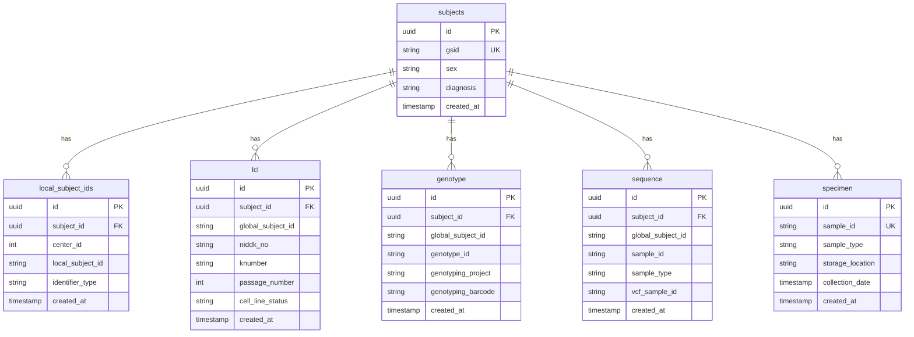

# Database Schema

## Overview

The IDhub database is designed to support biobank data management with a focus on:

-   **Subject-centric design**: All data linked to subjects via GSID
-   **Natural key support**: Business identifiers for upsert operations
-   **Audit trail**: Complete tracking of data creation and modification
-   **Referential integrity**: Foreign key constraints ensure data consistency

## Core Tables

This diagram shows the core tables responsible for managing subject identity.

!!! abstract "Table: `subjects`"
    The central registry for every individual in the biobank.

    | Column              | Type      | Description                               |
    | ------------------- | --------- | ----------------------------------------- |
    | `global_subject_id` | `VARCHAR` | **Primary Key**: The unique ID for a subject. |
    | `center_id`         | `INT`     | Foreign key to the `centers` table.       |
    | `registration_year` | `DATE`    | Year the subject was registered.          |
    | `control`           | `BOOLEAN` | Flag indicating if the subject is a control. |
    | `withdrawn`         | `BOOLEAN` | Flag indicating if the subject has withdrawn. |
    | `family_id`         | `VARCHAR` | Foreign key to the `family` table.        |
    | `created_by`        | `VARCHAR` | Source system that created the record.    |

!!! abstract "Table: `centers`"
    Defines the participating medical centers or institutions.

    | Column         | Type      | Description                          |
    | -------------- | --------- | ------------------------------------ |
    | `center_id`    | `SERIAL`  | **Primary Key**: Unique center ID.   |
    | `name`         | `VARCHAR` | Full name of the center.             |
    | `investigator` | `VARCHAR` | Principal investigator at the center.|
    | `consortium`   | `VARCHAR` | Research consortium.                 |

!!! abstract "Table: `local_subject_ids`"
    Maps the various local identifiers from different centers to a single Global Subject ID (GSID), enabling a unified subject view.

    | Column             | Type      | Description                             |
    | ------------------ | --------- | --------------------------------------- |
    | `center_id`        | `INT`     | **Composite Key**: Center ID.           |
    | `local_subject_id` | `VARCHAR` | **Composite Key**: The ID from the source system. |
    | `identifier_type`  | `VARCHAR` | **Composite Key**: The type of local ID.  |
    | `global_subject_id`| `VARCHAR` | Foreign key to the `subjects` table.    |

## Sample & Assay Tables

These tables store information about the different types of biological samples and assays performed. They are all linked back to the `subjects` table via the `global_subject_id`.

!!! abstract "Table: `specimen`"
    General-purpose specimen tracking.

    | Column              | Type      | Description                         |
    | ------------------- | --------- | ----------------------------------- |
    | `sample_id`         | `VARCHAR` | **Primary Key**: Unique sample ID.    |
    | `global_subject_id` | `VARCHAR` | Foreign key to the `subjects` table.  |
    | `sample_type`       | `VARCHAR` | The type of specimen collected.       |
    | `project`           | `VARCHAR` | The project associated with the sample. |

!!! abstract "Table: `genotype`"
    Stores genotype data.

    | Column               | Type      | Description                         |
    | -------------------- | --------- | ----------------------------------- |
    | `genotype_id`        | `TEXT`    | **Primary Key**: Unique genotype ID.  |
    | `global_subject_id`  | `VARCHAR` | Foreign key to the `subjects` table.  |
    | `genotyping_project` | `TEXT`    | The project that performed genotyping.|
    | `genotyping_barcode` | `TEXT`    | The barcode of the genotyping array.  |

!!! abstract "Table: `sequence`"
    Stores sequencing data.

    | Column              | Type      | Description                           |
    | ------------------- | --------- | ------------------------------------- |
    | `sample_id`         | `TEXT`    | **Primary Key**: Unique sample ID.      |
    | `global_subject_id` | `VARCHAR` | Foreign key to the `subjects` table.    |
    | `sample_type`       | `VARCHAR` | The type of sample sequenced.         |
    | `vcf_sample_id`     | `VARCHAR` | The sample ID found within the VCF file.|

!!! abstract "Table: `lcl`"
    Lymphoblastoid cell line tracking.

    | Column              | Type      | Description                         |
    | ------------------- | --------- | ----------------------------------- |
    | `niddk_no`          | `INT`     | **Primary Key**: NIDDK number.        |
    | `global_subject_id` | `VARCHAR` | Foreign key to the `subjects` table.  |
    | `knumber`           | `VARCHAR` | K-number identifier for the cell line.|

!!! abstract "Table: `enteroid`"
    Enteroid culture tracking.

    | Column              | Type      | Description                         |
    | ------------------- | --------- | ----------------------------------- |
    | `sample_id`         | `VARCHAR` | **Primary Key**: Unique sample ID.    |
    | `global_subject_id` | `VARCHAR` | Foreign key to the `subjects` table.  |

!!! abstract "Table: `olink`"
    Olink proteomics data.

    | Column              | Type      | Description                         |
    | ------------------- | --------- | ----------------------------------- |
    | `sample_id`         | `VARCHAR` | **Primary Key**: Unique sample ID.    |
    | `global_subject_id` | `VARCHAR` | Foreign key to the `subjects` table.  |

## System & Audit Tables

These tables are used internally by the IDhub platform to manage data ingestion, resolve conflicts, and maintain an audit trail.

!!! abstract "Table: `identity_resolutions`"
    Logs every attempt to resolve a local ID to a GSID, including conflicts.
!!! abstract "Table: `conflict_resolutions`"
    Tracks data conflicts (e.g., `center_mismatch`) that require manual review.
!!! abstract "Table: `fragment_resolutions`"
    Tracks the status of each data file (fragment) loaded into the system.
!!! abstract "Table: `data_change_audit`"
    Logs every single `INSERT` and `UPDATE` operation, providing a complete history of data changes.
!!! abstract "Table: `sample_resolutions`"
    Tracks the resolution of sample IDs to subjects.