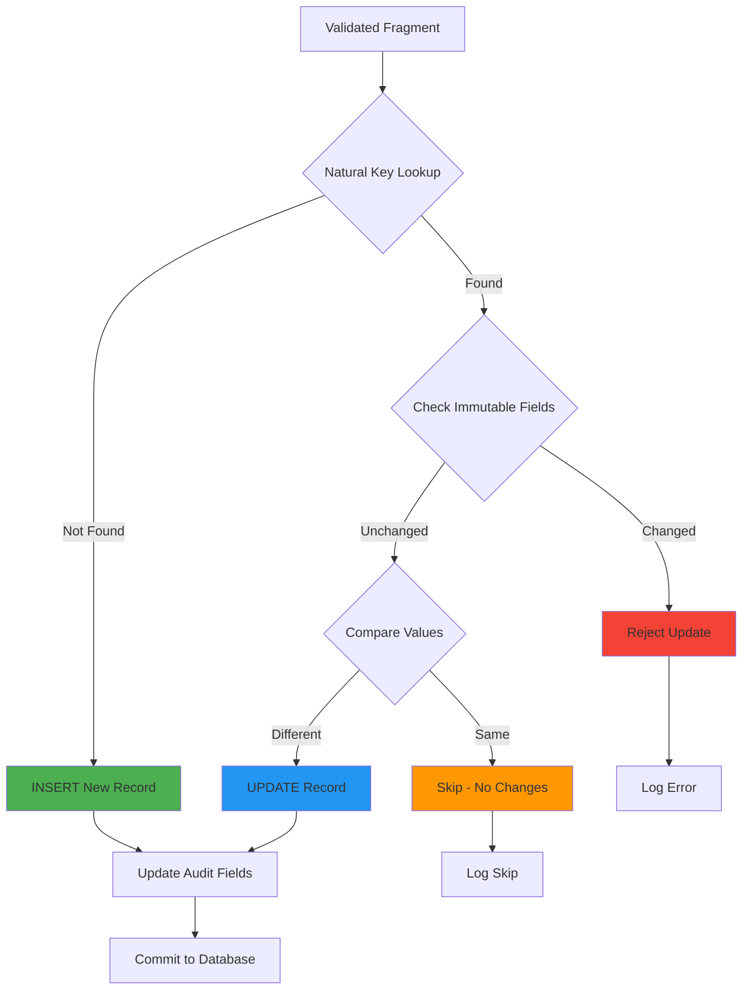

# Universal Update Strategy

The Universal Update Strategy is a core feature of IDhub that enables intelligent data loading with upsert logic, natural key matching, and immutable field protection.

## Overview

The update strategy provides:

-   **Natural Key Matching**: Identify existing records using business keys instead of database IDs
-   **Intelligent Upserts**: Insert new records or update existing ones based on natural keys
-   **Immutable Field Protection**: Prevent modification of audit fields and other protected columns
-   **Conflict Resolution**: Handle duplicate records and data conflicts gracefully
-   **Audit Trail Preservation**: Maintain complete history of data changes

## Architecture



## Configuration

### Table Configuration

Each table defines its update strategy in `config/table_configs.json`:

```json
{
  "lcl": {
    "natural_key": ["global_subject_id", "niddk_no"],
    "immutable_fields": ["created_at"],
    "update_strategy": "upsert"
  },
  "genotype": {
    "natural_key": ["global_subject_id", "genotype_id"],
    "immutable_fields": ["created_at", "created_by"],
    "update_strategy": "upsert"
  },
  "sequence": {
    "natural_key": ["global_subject_id", "sample_id"],
    "immutable_fields": ["created_at", "created_by"],
    "update_strategy": "upsert"
  },
  "subjects": {
    "natural_key": ["global_subject_id"],
    "immutable_fields": ["created_at", "gsid"],
    "update_strategy": "upsert"
  }
}
```

### Configuration Options

| Field              | Type       | Description                                             |
| ------------------ | ---------- | ------------------------------------------------------- |
| `natural_key`      | `string[]` | Fields that uniquely identify a record                  |
| `immutable_fields` | `string[]` | Fields that cannot be modified after creation           |
| `update_strategy`  | `string`   | Strategy to use: `upsert`, `insert_only`, `update_only` |

## Natural Keys

Natural keys are business identifiers that uniquely identify records without relying on database-generated IDs.

### Examples

**LCL Lines**

```json
{
  "natural_key": ["global_subject_id", "niddk_no"]
}
```

An LCL (lymphoblastoid cell line) is uniquely identified by the subject's GSID and their NIDDK number.

**Genotype Data**

```json
{
  "natural_key": ["global_subject_id", "genotype_id"]
}
```

A genotype record is uniquely identified by the subject and genotype ID.

**Subjects**

```json
{
  "natural_key": ["global_subject_id"]
}
```

A subject is uniquely identified by their GSID.

**Specimens**

```json
{
  "natural_key": ["sample_id"]
}
```

A specimen is uniquely identified by its sample ID alone.

### Composite Keys

Natural keys can be composite (multiple fields):

```python
# Example: Finding existing LCL line
natural_key = {
    "global_subject_id": "01HQXYZ123",
    "niddk_no": "12345"
}

# SQL equivalent
SELECT * FROM lcl
WHERE global_subject_id = '01HQXYZ123'
  AND niddk_no = '12345'
```

## Update Strategies

### Upsert (Default)

Insert if record doesn't exist, update if it does.

```python
# Pseudocode
if record_exists(natural_key):
    if immutable_fields_changed():
        reject_update()
    else:
        update_record()
else:
    insert_record()
```

**Use Cases**:

-   LCL data that may be corrected or enriched
-   Genotype/sequence data that may be enriched
-   Subject information updates
-   Most transactional data

### Insert Only

Only insert new records, reject updates to existing records.

```json
{
  "update_strategy": "insert_only"
}
```

**Use Cases**:

-   Immutable audit logs
-   Historical snapshots
-   Event data

### Update Only

Only update existing records, reject new inserts.

```json
{
  "update_strategy": "update_only"
}
```

**Use Cases**:

-   Enrichment of existing data
-   Status updates
-   Corrections to known records

## Immutable Fields

Immutable fields cannot be changed after record creation.

### Common Immutable Fields

```json
{
  "immutable_fields": [
    "created_at", // Creation timestamp
    "created_by", // Original creator
    "gsid", // Global subject ID
    "source_system", // Original source
    "batch_id" // Original batch
  ]
}
```

### Protection Mechanism

```python
def validate_immutable_fields(existing_record, new_data, immutable_fields):
    """Check if any immutable fields would be changed"""
    for field in immutable_fields:
        if field in new_data:
            existing_value = existing_record.get(field)
            new_value = new_data.get(field)

            if existing_value != new_value:
                raise ImmutableFieldError(
                    f"Cannot modify immutable field '{field}': "
                    f"{existing_value} -> {new_value}"
                )
```

### Handling Violations

When an immutable field violation is detected:

1.  **Reject the update**
2.  **Log the error** with details
3.  **Mark fragment as failed** in validation queue
4.  **Notify operators** via monitoring

## Implementation

### Fragment Validator

The validator prepares data for the update strategy:

```python
# fragment-validator/services/validator.py
def validate_fragment(self, fragment_data, table_config):
    """Validate fragment and prepare for loading"""

    # Load table configuration
    natural_key = table_config["natural_key"]

    # Ensure natural key fields are present
    for field in natural_key:
        if field not in fragment_data:
            raise ValidationError(f"Missing natural key field: {field}")

    # Resolve GSID if needed
    if "global_subject_id" in natural_key:
        gsid = self.resolve_gsid(fragment_data)
        fragment_data["global_subject_id"] = gsid

    return fragment_data
```

### Table Loader

The loader executes the update strategy:

```python
# table-loader/services/loader.py
def load_record(self, table_name, record_data):
    """Load record using update strategy"""

    # Get table configuration
    config = self.get_table_config(table_name)
    natural_key = config["natural_key"]
    immutable_fields = config["immutable_fields"]

    # Build natural key lookup
    key_values = {k: record_data[k] for k in natural_key}

    # Check if record exists
    existing = self.find_by_natural_key(table_name, key_values)

    if existing:
        # UPDATE path
        self.validate_immutable_fields(existing, record_data, immutable_fields)
        self.update_record(table_name, existing["id"], record_data)
        return "updated"
    else:
        # INSERT path
        self.insert_record(table_name, record_data)
        return "inserted"
```

## Examples

### Example 1: LCL Line Update

**Initial Insert**

```json
{
  "global_subject_id": "01HQXYZ123",
  "niddk_no": "12345",
  "knumber": "K001",
  "cell_line_status": "Active",
  "passage_number": 5,
  "created_at": "2024-01-15T10:00:00Z"
}
```

**Update Request** (passage number updated)

```json
{
  "global_subject_id": "01HQXYZ123",
  "niddk_no": "12345",
  "knumber": "K001",
  "cell_line_status": "Active",
  "passage_number": 8,
  "updated_at": "2024-01-16T14:30:00Z"
}
```

**Result**: ✅ Update succeeds

-   Natural key matches existing record (GSID + NIDDK number)
-   No immutable fields changed
-   Passage number updated from 5 to 8

### Example 2: Immutable Field Violation

**Existing Record**

```json
{
  "global_subject_id": "01HQXYZ123",
  "niddk_no": "12345",
  "knumber": "K001",
  "created_at": "2024-01-15T10:00:00Z"
}
```

**Update Request** (trying to change created_at)

```json
{
  "global_subject_id": "01HQXYZ123",
  "niddk_no": "12345",
  "knumber": "K001",
  "created_at": "2024-01-16T10:00:00Z"
}
```

**Result**: ❌ Update rejected

```
ImmutableFieldError: Cannot modify immutable field 'created_at':
2024-01-15T10:00:00Z -> 2024-01-16T10:00:00Z
```

### Example 3: New LCL Line Insert

**Insert Request**

```json
{
  "global_subject_id": "01HQABC456",
  "niddk_no": "67890",
  "knumber": "K002",
  "cell_line_status": "Active",
  "passage_number": 3
}
```

**Result**: ✅ Insert succeeds

-   Natural key not found in database
-   New LCL line record created
-   Audit fields auto-populated

### Example 4: Genotype Data with New Annotation

**Existing Record**

```json
{
  "global_subject_id": "01HQXYZ123",
  "genotype_id": "GENO-001",
  "genotyping_project": "ProjectA",
  "genotyping_barcode": "BC123",
  "created_at": "2024-01-10T09:00:00Z"
}
```

**Update Request** (A new analysis batch is added)

```json
{
  "global_subject_id": "01HQXYZ123",
  "genotype_id": "GENO-001",
  "genotyping_project": "ProjectA",
  "genotyping_barcode": "BC123",
  "batch": "AnalysisBatch_2024_Q1",
  "updated_at": "2024-01-20T11:00:00Z"
}
```

**Result**: ✅ Update succeeds

-   Natural key matches (GSID + genotype_id)
-   A mutable field (`batch`) is added/updated.
-   Immutable fields preserved

## Monitoring & Logging

### Metrics Tracked

```python
{
  "batch_id": "batch_20240115_100000",
  "table": "lcl",
  "total_records": 150,
  "inserted": 45,
  "updated": 100,
  "skipped": 3,
  "failed": 2,
  "immutable_violations": 2
}
```

### Log Examples

**Successful Update**

```
INFO: Updated lcl record [GSID: 01HQXYZ123, NIDDK: 12345]
  Changed fields: passage_number (5 -> 8), cell_line_status (Active -> Frozen)
```

**Immutable Violation**

```
ERROR: Immutable field violation in lcl record
  Natural Key: {global_subject_id: "01HQXYZ123", niddk_no: "12345"}
  Field: created_at
  Existing: 2024-01-15T10:00:00Z
  Attempted: 2024-01-16T10:00:00Z
```

**No Changes**

```
DEBUG: Skipped lcl record [GSID: 01HQXYZ123, NIDDK: 12345]
  Reason: No field changes detected
```

**New Insert**

```
INFO: Inserted new lcl record [GSID: 01HQABC456, NIDDK: 67890]
  Fields: knumber=K002, passage_number=3, cell_line_status=Active
```

## Best Practices

### 1. Choose Appropriate Natural Keys

✅ **Good Natural Keys**

-   Stable business identifiers (NIDDK numbers, K numbers)
-   Guaranteed unique within scope
-   Always present in source data
-   Combination of GSID + domain-specific ID

❌ **Poor Natural Keys**

-   Auto-incrementing IDs from source systems
-   Mutable fields (names, dates, status)
-   Optional fields
-   Fields that might be corrected later

### 2. Define Immutable Fields Carefully

**Always Immutable**

-   `created_at`, `created_by`
-   `gsid` (global subject ID)
-   `source_system`, `source_id`

**Sometimes Immutable**

-   `batch_id` (if tracking original batch)
-   `niddk_no` (permanent identifier)
-   `knumber` (permanent identifier)

**Rarely Immutable**

-   Clinical measurements
-   Status fields (Active, Frozen, etc.)
-   Passage numbers
-   Quality metrics
-   Descriptive text

### 3. Handle Conflicts Gracefully

```python
try:
    loader.load_record("lcl", record_data)
except ImmutableFieldError as e:
    logger.error(f"Immutable field violation: {e}")
    # Mark for manual review
    queue.mark_for_review(record_data, reason=str(e))
except NaturalKeyConflict as e:
    logger.error(f"Natural key conflict: {e}")
    # Attempt conflict resolution
    resolver.resolve_conflict(record_data)
```

### 4. Test Update Scenarios

```python
# Test suite should cover:
def test_insert_new_lcl_line():
    """Test inserting a new LCL line"""
    pass

def test_update_existing_lcl_line():
    """Test updating mutable fields like passage_number"""
    pass

def test_immutable_field_protection():
    """Test that created_at cannot be changed"""
    pass

def test_no_change_skip():
    """Test that identical data is skipped"""
    pass

def test_natural_key_uniqueness():
    """Test GSID + NIDDK number uniqueness"""
    pass

def test_partial_update():
    """Test updating only some fields"""
    pass
```

## Real-World Scenarios

### Scenario 1: LCL Line Passage Update

A lab maintains LCL lines and periodically updates passage numbers as cells are cultured.

```python
# Initial state
{
  "global_subject_id": "01HQXYZ123",
  "niddk_no": "12345",
  "passage_number": 5
}

# After 3 months of culture
{
  "global_subject_id": "01HQXYZ123",
  "niddk_no": "12345",
  "passage_number": 12
}

# Result: passage_number updated, all other fields preserved
```

### Scenario 2: Sequence Data Annotation Update

A sequence sample is run through a new analysis pipeline, and the `vcf_sample_id` is updated.

```python
# Original measurement
{
  "global_subject_id": "01HQXYZ123",
  "sample_id": "SEQ-001",
  "vcf_sample_id": "OLD_VCF_ID_1"
}

# After re-analysis
{
  "global_subject_id": "01HQXYZ123",
  "sample_id": "SEQ-001",
  "vcf_sample_id": "NEW_VCF_ID_2"
}

# Result: vcf_sample_id updated, preserving audit trail
```

### Scenario 3: Subject Information Enrichment

Subject data is enriched over time as more information becomes available.

```python
# Initial subject record
{
  "global_subject_id": "01HQXYZ123",
  "sex": "F",
  "diagnosis": "CD"
}

# Enriched with additional data
{
  "global_subject_id": "01HQXYZ123",
  "sex": "F",
  "diagnosis": "CD",
  "age_at_diagnosis": 25,
  "disease_location": "Ileal"
}

# Result: New fields added, existing fields preserved
```

## Troubleshooting

### Issue: Duplicate Natural Keys

**Symptom**: Multiple LCL records with same GSID + NIDDK number

**Cause**: Data quality issue in source system

**Solution**:

```sql
-- Find duplicates
SELECT global_subject_id, niddk_no, COUNT(*)
FROM lcl
GROUP BY global_subject_id, niddk_no
HAVING COUNT(*) > 1;

-- Investigate and resolve
SELECT * FROM lcl
WHERE global_subject_id = '01HQXYZ123'
  AND niddk_no = '12345';
```

### Issue: Immutable Field Violations

**Symptom**: Updates rejected due to immutable field changes

**Cause**: Source data attempting to modify protected fields

**Solution**:

1.  Review source data extraction logic
2.  Ensure immutable fields are excluded from updates
3.  Check field mappings in `config/lcl_mapping.json`
4.  If legitimate change needed, requires manual database update

### Issue: Missing Natural Key Fields

**Symptom**: Validation fails with "Missing natural key field"

**Cause**: Source data missing required fields (GSID or NIDDK number)

**Solution**:

```python
# Check field mappings
{
  "field_mapping": {
    "knumber": "knumber",
    "niddk_no": "niddk_no"  # Ensure this is mapped
  },
  "subject_id_candidates": ["consortium_id"]  # For GSID resolution
}
```

### Issue: Performance with Large Batches

**Symptom**: Slow loading with large LCL datasets

**Optimization**:

```python
# Use batch lookups instead of individual queries
def find_existing_records_batch(self, table_name, natural_keys):
    """Find multiple records by natural keys in single query"""
    # Build efficient WHERE IN clause
    # Return dict mapping natural_key -> record

    # Example for LCL
    gsids = [nk["global_subject_id"] for nk in natural_keys]
    niddk_nos = [nk["niddk_no"] for nk in natural_keys]

    query = """
        SELECT * FROM lcl
        WHERE (global_subject_id, niddk_no) IN %s
    """
    # Execute with tuple list
```


## Next Steps

-   [Configure table update strategies](../reference/table-configs.md)
-   [Set up monitoring](../operations/monitoring.md)
-   [Review troubleshooting guide](../operations/troubleshooting.md)
