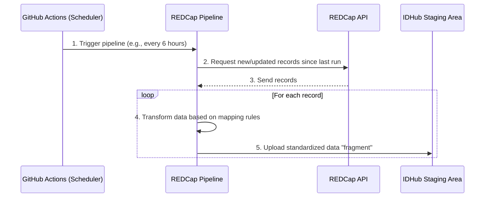

# Automated REDCap Pipeline

The REDCap Pipeline is the automated system that extracts data from various REDCap projects and prepares it for import into IDHub. As a data curator, you don't typically run this pipeline yourself, but understanding how it works is helpful.

## How It Works

The pipeline runs on a schedule, automatically checking REDCap projects for new or updated records.

1.  **Scheduled Trigger**: The pipeline is automatically triggered by a scheduler (GitHub Actions). The production environment runs daily, while the QA environment runs more frequently.
2.  **Extract Data**: The pipeline connects to each configured REDCap project via its API and asks for records that have been created or modified since the last successful run. This is an **incremental** process, so it only pulls in new changes.
3.  **Transform Data**: This is a key step. The pipeline uses a set of **field mapping configuration files** to translate the data from REDCap's format to IDHub's standard format. For example, it might:
    *   Rename a field from `collection_date` in REDCap to `date_collected` for IDHub.
    *   Convert a multiple-choice value (e.g., `1`) to its text equivalent (e.g., `Whole Blood`).
    *   Identify which field should be used as the subject identifier (e.g., `consortium_id`).
4.  **Stage Fragments**: Each transformed record is saved as a standardized data "fragment" and uploaded to a secure staging area in IDHub.

From this point, the fragments enter the standard [Validation and Loading](./ingestion-overview.md#stage-2-validation---ensuring-data-quality) process.

## Configuration

While software maintainers manage the core configuration, it's useful for data curators to know what is being configured.

### Project Configuration

A central file (`projects.json`) tells the pipeline which REDCap projects to connect to. Each project has its own settings, including:

*   **Project ID**: The ID of the project in REDCap.
*   **API Token**: The credentials needed to access the project's data.
*   **Field Mappings File**: Which mapping file to use for transforming the data from this specific project.
*   **Enabled Flag**: Whether the project should be included in the automated runs.

### Field Mappings

This is the most important configuration from a data curator's perspective. Each project has one or more mapping files that act as a "Rosetta Stone" between the REDCap data dictionary and the IDHub database schema.

These files define rules such as:

*   `"target_field": "source_field"`: Maps a REDCap field to an IDHub field.
*   `subject_id_candidates`: A list of fields to try, in order, to identify the subject.
*   `transformations`: Rules for converting data, like changing date formats or mapping codes to values.

If you notice that data from a REDCap project is not appearing correctly in IDHub, it is often an issue with these mapping files.

## What You Need to Do

For the most part, the REDCap pipeline is a "hands-off" system for data curators. Your main responsibilities are:

1.  **Ensure Data Quality in REDCap**: The pipeline can only extract what is in REDCap. Correcting data at the source is always the best approach.
2.  **Communicate Changes**: If you or your team are planning to change the data dictionary of a connected REDCap project (e.g., renaming fields, adding new fields), you **must** notify the IDHub software maintainers. The pipeline's field mapping configurations will need to be updated to match, otherwise the pipeline will fail or data will be missed.
3.  **Review Validation Errors**: If records extracted by the pipeline fail the [Validation Stage](./ingestion-overview.md#stage-2-validation---ensuring-data-quality), the errors will be logged. You may be asked to review these errors and correct the data in REDCap.
