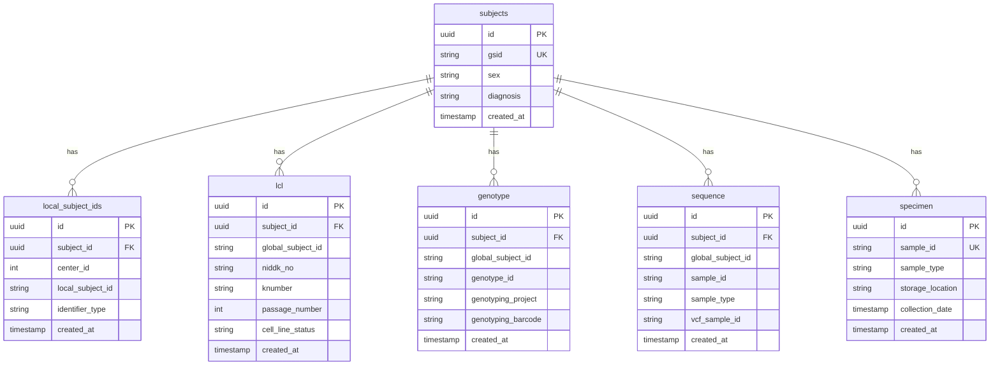

# System Architecture

## Overview

The IBDGC Integrated Data Hub (IDhub) is a microservices-based data integration platform designed to centralize biobank and clinical data from multiple sources while maintaining data quality, provenance, and subject identity consistency.

## Architecture Principles

### 1. **Separation of Concerns**

Each service has a single, well-defined responsibility:

-   **GSID Service**: Subject identity management
-   **REDCap Pipeline**: Data extraction and transformation
-   **Fragment Validator**: Data quality validation
-   **Table Loader**: Database persistence
-   **Nginx**: Routing and SSL termination

### 2. **Staged Data Pipeline**

Data flows through distinct stages with validation gates:

```
Source → Extract → Stage → Validate → Queue → Load → Database
```

Each stage can fail independently without affecting others, enabling retry logic and error recovery.

### 3. **Immutable Staging**

Data fragments in S3 are immutable once created, providing:

-   Complete audit trail
-   Ability to replay pipelines
-   Source of truth for debugging
-   Disaster recovery capability

### 4. **Natural Key Strategy**

Records are identified by business keys (natural keys) rather than database IDs, enabling:

-   Idempotent operations
-   Cross-system reconciliation
-   Intelligent upserts
-   Data deduplication

## High-Level Architecture


## Component Architecture

### GSID Service

**Purpose**: Centralized global subject ID management

**Technology**: FastAPI (Python), PostgreSQL

**Key Features**:

-   GSID generation (Custom format)
-   Local ID to GSID resolution
-   Fuzzy matching for subject identification
-   RESTful API with authentication


**Database Tables**:

-   `subjects`: Core subject records with GSID
-   `local_subject_ids`: Mapping of local IDs to GSIDs

[Detailed documentation →](../services/gsid-service.md)

### REDCap Pipeline

**Purpose**: Extract and transform data from REDCap projects

**Technology**: Python, REDCap API, S3

**Key Features**:

-   Multi-project support
-   Incremental extraction
-   Field mapping and transformation
-   Fragment generation


**Configuration**:

-   `config/projects.json`: Project definitions
-   `config/*_field_mappings.json`: Field mapping rules

[Detailed documentation →](../services/redcap-pipeline.md)

### Fragment Validator

**Purpose**: Validate data quality before database loading

**Technology**: Python, S3, PostgreSQL

**Key Features**:

-   Schema validation
-   GSID resolution
-   Business rule validation
-   Duplicate detection


**Validation Steps**:

1.  **Schema Validation**: Field types, required fields
2.  **GSID Resolution**: Map local IDs to GSIDs
3.  **Business Rules**: Domain-specific validation
4.  **Duplicate Detection**: Check for existing records

[Detailed documentation →](../services/fragment-validator.md)

### Table Loader

**Purpose**: Load validated data into database with update strategy

**Technology**: Python, PostgreSQL

**Key Features**:

-   Natural key-based upserts
-   Immutable field protection
-   Batch processing
-   Transaction management


**Configuration**:

-   `config/table_configs.json`: Natural keys, immutable fields

[Detailed documentation →](../services/table-loader.md)

### Nginx Proxy

**Purpose**: Reverse proxy, SSL termination, routing

**Technology**: Nginx

**Key Features**:

-   SSL/TLS termination
-   Request routing
-   Rate limiting
-   Static file serving


[Detailed documentation →](../services/nginx.md)

## Data Flow Architecture

### End-to-End Data Flow


[Detailed data flow →](data-flow.md)

## Storage Architecture

### S3 Structure

```
s3://idhub-curated-fragments/
├── redcap/
│   ├── gap/
│   │   ├── batch_20240115_100000/
│   │   │   ├── lcl/
│   │   │   │   ├── fragment_001.json
│   │   │   │   ├── fragment_002.json
│   │   │   │   └── ...
│   │   │   ├── genotype/
│   │   │   ├── sequence/
│   │   │   └── metadata.json
│   │   └── batch_20240116_100000/
│   └── uc_demarc/
├── labkey/
│   └── export_20240115/
└── manual/
    └── upload_20240115_143000/
```

**Key Characteristics**:

-   Organized by source and project
-   Batch-based organization
-   Immutable once written
-   Metadata files for tracking

### Database Schema



[Detailed schema documentation →](database-schema.md)

## Security Architecture

### Authentication & Authorization


**Security Layers**:

1.  **Network Security**

    -   SSL/TLS encryption (Let's Encrypt)
    -   Nginx reverse proxy
    -   Firewall rules

2.  **Application Security**

    -   API key authentication
    -   Environment-based secrets
    -   Input validation

3.  **Database Security**

    -   Connection pooling
    -   Prepared statements
    -   Role-based access

4.  **Data Security**
    -   Encrypted at rest (S3, RDS)
    -   Encrypted in transit (HTTPS)
    -   Audit logging

[Detailed security documentation →](../security-guide.md)

## Deployment Architecture

### Environment Structure


**Environments**:

| Environment     | Purpose              | Database         | S3 Bucket                    |
| --------------- | -------------------- | ---------------- | ---------------------------- |
| **Development** | Local development    | Local PostgreSQL | Local MinIO                  |
| **QA**          | Testing & validation | QA RDS           | `idhub-curated-fragments-qa` |
| **Production**  | Live system          | Production RDS   | `idhub-curated-fragments`    |

### Deployment Process


[Detailed deployment documentation →](../deployment-guide.md)

## Scalability Considerations

### Current Scale

-   **Subjects**: ~50,000
-   **LCL Lines**: ~30,000
-   **Genotypes**: ~40,000
-   **Sequences**: ~20,000
-   **Daily Ingestion**: ~1,000 records

### Scaling Strategies

**Horizontal Scaling**:

-   Multiple validator instances
-   Multiple loader instances
-   Load balancing via Nginx

**Vertical Scaling**:

-   Database connection pooling
-   Batch processing optimization
-   Query optimization

**Data Partitioning**:

-   S3 partitioning by date/source
-   Database table partitioning (future)
-   Archive old validation queue records

## Monitoring & Observability

### Metrics


**Key Metrics**:

-   Pipeline success/failure rates
-   GSID resolution performance
-   Database load times
-   Validation queue depth
-   API response times

[Detailed monitoring documentation →](../operations-monitoring.md)

## Technology Stack

### Languages & Frameworks

| Component          | Technology      | Version      |
| ------------------ | --------------- | ------------ |
| GSID Service       | Python, FastAPI | 3.11, 0.104+ |
| REDCap Pipeline    | Python          | 3.11         |
| Fragment Validator | Python          | 3.11         |
| Table Loader       | Python          | 3.11         |
| Database           | PostgreSQL      | 15+          |
| Web UI             | NocoDB          | Latest       |
| Proxy              | Nginx           | 1.24+        |

### Key Libraries

-   **Database**: `asyncpg`, `psycopg2`
-   **API**: `fastapi`, `uvicorn`, `pydantic`
-   **AWS**: `boto3`
-   **Testing**: `pytest`, `pytest-asyncio`
-   **Validation**: `jsonschema`, `pydantic`
-   **ETL**: `pandas`, `openpyxl`

## Related Documentation

-   [Data Flow Details](data-flow.md)
-   [Database Schema](database-schema.md)
-   [Security Model](../security-guide.md)
-   [Update Strategy](update-strategy.md)