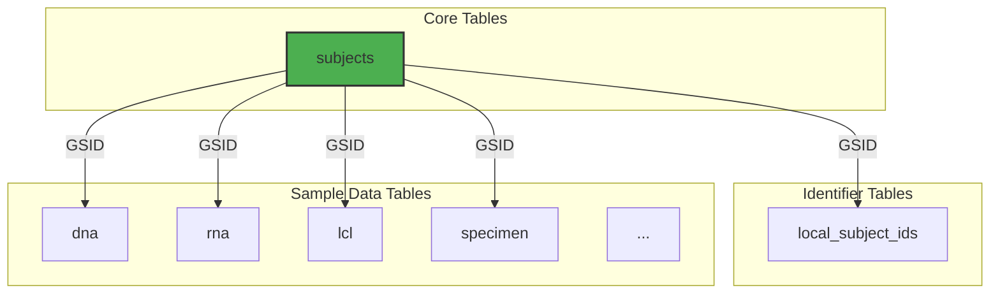

# Database Schema Overview

The IDHub database is where all the validated and curated data is stored. Understanding the basic structure of the database will help you find the information you need. This guide provides a simplified overview of the most important tables and how they connect.

## The Subject-Centric Model

The entire database is designed around a **subject-centric model**. This means that almost every piece of data can be traced back to a unique individual, who is identified by a **Global Subject ID (GSID)**.

---

## Key Tables Explained

Here are the most important tables and what they contain.

### 1. `subjects`

This is the most important table in the database. It is the central registry for every individual.

*   **Purpose**: To store the master list of all subjects in IDHub.
*   **Key Columns**:
    *   `global_subject_id` (GSID): The unique, permanent identifier for a subject across all projects and centers. **This is the primary key you will use to link data together.**
    *   `center_id`: The ID of the center that first registered the subject.
    *   `withdrawn`: A flag indicating if the subject has withdrawn consent.
    *   `created_by`: The source system or process that created the subject record.

### 2. `local_subject_ids`

A single subject might have many different identifiers across different studies or clinical centers (e.g., a "consortium ID", a "MRN", a "site ID"). This table connects all of those local IDs back to a single GSID.

*   **Purpose**: To link various local identifiers to the one true Global Subject ID.
*   **Key Columns**:
    *   `global_subject_id`: The GSID the local ID belongs to.
    *   `local_subject_id`: The original identifier from the source system (e.g., `A000101-130001`).
    *   `identifier_type`: The type of local ID (e.g., `consortium_id`, `mrn`).
    *   `center_id`: The center that uses this local ID.

> **How to use this table**: If you have a local ID and need to find the subject's GSID, you can search this table for the `local_subject_id` to find the corresponding `global_subject_id`.

### 3. Sample Tables (`dna`, `rna`, `lcl`, `specimen`, etc.)

These tables contain information about the specific biological samples collected from subjects. Each table is dedicated to a specific sample type.

*   **Purpose**: To store inventory, metadata, and quality metrics for different types of samples.
*   **Common Key Columns**:
    *   `global_subject_id`: The GSID of the subject from whom the sample was taken. This links the sample back to the `subjects` table.
    *   `sample_id`: The unique identifier for that specific sample (e.g., `GM210-3361`, `RNA-001-2024`). In some tables, this might be named differently (e.g., `genotype_id`, `knumber`).

#### Example: `dna` Table

*   **Contains**: Information about DNA samples.
*   **Example Columns**: `sample_id`, `concentration_ng_ul`, `volume_ul`, `quality_score`, `extraction_date`.

#### Example: `lcl` Table

*   **Contains**: Information about Lymphoblastoid Cell Lines.
*   **Example Columns**: `knumber`, `niddk_no`, `passage_number`, `freeze_date`, `cell_line_status`.

---

## How the Tables Relate

Understanding the relationships between these tables is key to making sense of the data.

### Finding All Samples for a Subject

You can find all the different types of samples for a single subject by using their `global_subject_id`.

1.  Start with a `global_subject_id` from the `subjects` table.
2.  Use that GSID to search in the `dna` table to find all their DNA samples.
3.  Use that same GSID to search in the `rna` table to find all their RNA samples.
4.  ...and so on for all other sample tables.

This subject-centric design ensures that all data related to an individual can be easily aggregated and analyzed, even if it comes from different sources at different times.
