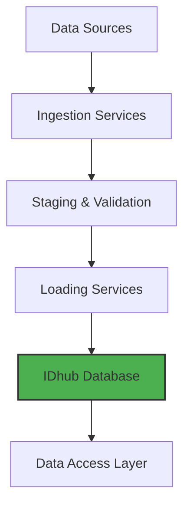

# Welcome to IDhub

IDhub is the IBDGC's centralized platform for managing, curating, and sharing biobank and clinical data. It provides a consistent, reliable, and auditable system for data integration.

-   :material-account-search-outline: **For External Users**

    ---

    New to IDhub? Learn how to browse and query the data.

    [:octicons-arrow-right-24: Explore the Data](for-users/exploring-with-nocodb.md)

-   :material-upload: **For Data Curators**

    ---

    Learn how to prepare, validate, and ingest data into IDhub.

    [:octicons-arrow-right-24: Go to Ingestion Guides](for-data-curators/ingestion-overview.md)

-   :material-code-tags: **For Developers & Admins**

    ---

    Find technical architecture, deployment, and API documentation.

    [:octicons-arrow-right-24: See Technical Docs](for-developers/development-guide.md)

## What is IDhub?

The IBDGC Integrated Data Hub (IDhub) is a comprehensive data management system designed to:

-   :material-database-check: **Centralize** biobank and clinical data from multiple sources.
-   :material-shield-check: **Validate** data quality and consistency before loading.
-   :material-identifier: **Manage** global subject identifiers (GSIDs) across the consortium.
-   :material-history: **Track** complete data lineage and audit trails.
-   :material-robot: **Automate** data pipelines with robust, repeatable workflows.

## System Architecture Overview

IDhub uses a microservices architecture to create a staged data pipeline, ensuring that data is validated and processed correctly at each step before being loaded into the central database.

-   **Data Sources**: REDCap, LabKey, and manual file uploads.
-   **Ingestion & Validation**: Data is extracted, transformed, and validated against schema and business rules. Subject IDs are resolved to Global Subject IDs (GSIDs).
-   **Loading**: Validated data is loaded into the database using an intelligent "upsert" strategy.
-   **Data Access**: Users and applications can access data through the NocoDB web interface or the GSID REST API.

[Learn more about the architecture →](for-developers/architecture/overview.md)
