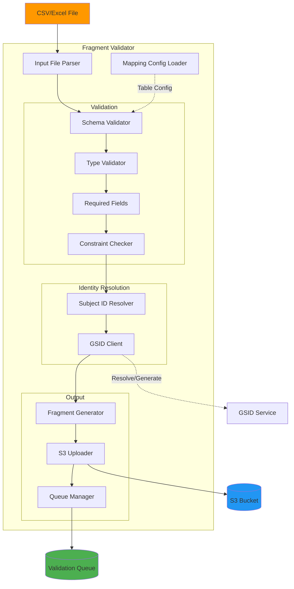

# Fragment Validator Documentation

## Overview

The Fragment Validator is a service that validates data files against target table schemas, resolves subject identities, and stages validated data as JSON fragments in S3 for loading into the database.

## Architecture



## Features

- **Multi-Format Support**: CSV, Excel, TSV input files
- **Schema Validation**: Validate against table schemas
- **Type Checking**: Automatic type conversion and validation
- **Subject ID Resolution**: Resolve local IDs to GSIDs
- **Duplicate Detection**: Check for duplicate records
- **Batch Processing**: Process large files efficiently
- **Error Reporting**: Detailed validation error reports
- **Dry Run Mode**: Preview validation without uploading

## Configuration

### Table Configuration

Table configurations define validation rules and natural keys:

```json
{
  "lcl": {
    "natural_key": ["global_subject_id", "niddk_no"],
    "immutable_fields": ["created_at"],
    "update_strategy": "upsert",
    "required_fields": ["global_subject_id", "knumber", "niddk_no"],
    "field_types": {
      "knumber": "string",
      "niddk_no": "string",
      "passage_number": "integer",
      "freeze_date": "date",
      "cell_line_status": "string",
      "storage_location": "string"
    },
    "constraints": {
      "passage_number": { "min": 0, "max": 100 },
      "cell_line_status": {
        "allowed_values": ["Active", "Inactive", "Depleted", "Contaminated"]
      }
    }
  },
  "dna": {
    "natural_key": ["global_subject_id", "sample_id"],
    "immutable_fields": ["created_at", "created_by"],
    "update_strategy": "upsert",
    "required_fields": ["global_subject_id", "sample_id", "sample_type"],
    "field_types": {
      "sample_id": "string",
      "sample_type": "string",
      "concentration_ng_ul": "float",
      "volume_ul": "float",
      "quality_score": "float",
      "extraction_date": "date"
    },
    "constraints": {
      "concentration_ng_ul": { "min": 0 },
      "volume_ul": { "min": 0 },
      "quality_score": { "min": 0, "max": 10 }
    }
  }
}
```

**Configuration Fields**:

| Field              | Type   | Description                                          |
| ------------------ | ------ | ---------------------------------------------------- |
| `natural_key`      | array  | Fields that uniquely identify a record               |
| `immutable_fields` | array  | Fields that cannot be updated                        |
| `update_strategy`  | string | How to handle existing records (upsert, insert_only) |
| `required_fields`  | array  | Fields that must be present                          |
| `field_types`      | object | Expected data types for each field                   |
| `constraints`      | object | Value constraints (min, max, allowed_values)         |

### Mapping Configuration

Mapping configurations define how source data maps to target schema:

```json
{
  "field_mapping": {
    "knumber": "knumber",
    "niddk_no": "niddk_no",
    "passage_number": "passage_number",
    "cell_line_status": "status",
    "freeze_date": "date_frozen",
    "storage_location": "location",
    "notes": "comments"
  },
  "subject_id_candidates": ["consortium_id", "subject_id"],
  "center_id_field": "center_id",
  "default_center_id": 1,
  "exclude_from_load": ["consortium_id", "center_id"],
  "transformations": {
    "freeze_date": "date",
    "passage_number": "integer"
  }
}
```

**Mapping Fields**:

| Field                   | Type    | Description                             |
| ----------------------- | ------- | --------------------------------------- |
| `field_mapping`         | object  | Source → Target field mappings          |
| `subject_id_candidates` | array   | Fields to try for subject ID resolution |
| `center_id_field`       | string  | Field containing center ID              |
| `default_center_id`     | integer | Default center ID if not in data        |
| `exclude_from_load`     | array   | Fields to exclude from output           |
| `transformations`       | object  | Field type transformations              |

### Environment Variables

```bash
# S3 Configuration
S3_BUCKET=idhub-curated-fragments
AWS_ACCESS_KEY_ID=your_access_key
AWS_SECRET_ACCESS_KEY=your_secret_key
AWS_REGION=us-east-1

# GSID Service
GSID_SERVICE_URL=https://api.idhub.ibdgc.org
GSID_API_KEY=your_gsid_api_key

# NocoDB (optional - for status updates)
NOCODB_URL=https://idhub.ibdgc.org
NOCODB_API_TOKEN=your_nocodb_token

# Validation Configuration
MAX_ERRORS_PER_FILE=100
BATCH_SIZE=100
DRY_RUN=false
LOG_LEVEL=INFO
```

## Usage

### Command Line

```bash
# Basic validation
python main.py \
  --table-name lcl \
  --input-file data/lcl_export.csv \
  --mapping-config config/lcl_mapping.json \
  --source "LabKey"

# With environment selection
python main.py \
  --environment qa \
  --table-name dna \
  --input-file data/dna_samples.xlsx \
  --mapping-config config/dna_mapping.json \
  --source "Manual Upload"

# Dry run (validation only, no upload)
python main.py \
  --table-name specimen \
  --input-file data/specimens.csv \
  --mapping-config config/specimen_mapping.json \
  --source "Import" \
  --dry-run

# With custom batch size
python main.py \
  --table-name lcl \
  --input-file data/large_file.csv \
  --mapping-config config/lcl_mapping.json \
  --source "LabKey" \
  --batch-size 500

# Skip subject ID resolution (for tables without subjects)
python main.py \
  --table-name specimen \
  --input-file data/specimens.csv \
  --mapping-config config/specimen_mapping.json \
  --source "Import" \
  --skip-subject-resolution
```

### Programmatic Usage

```python
from services import (
    FragmentValidator,
    S3Client,
    NocoDBClient,
    GSIDClient,
    SubjectIDResolver
)
import os

# Initialize clients
s3_client = S3Client(bucket=os.getenv("S3_BUCKET"))
nocodb_client = NocoDBClient(
    url=os.getenv("NOCODB_URL"),
    token=os.getenv("NOCODB_API_TOKEN")
)
gsid_client = GSIDClient(
    service_url=os.getenv("GSID_SERVICE_URL"),
    api_key=os.getenv("GSID_API_KEY")
)

# Create subject ID resolver
subject_resolver = SubjectIDResolver(gsid_client)

# Create validator
validator = FragmentValidator(
    s3_client=s3_client,
    nocodb_client=nocodb_client,
    subject_resolver=subject_resolver
)

# Process file
results = await validator.process_file(
    input_file="data/lcl_export.csv",
    table_name="lcl",
    mapping_config_path="config/lcl_mapping.json",
    source_system="LabKey",
    dry_run=False
)

# Check results
print(f"Valid records: {results['valid_count']}")
print(f"Invalid records: {results['invalid_count']}")
print(f"Fragments uploaded: {results['fragments_uploaded']}")
```

### Docker Usage

```bash
# Build image
docker build -t fragment-validator:latest .

# Run with local file
docker run --rm \
  -v $(pwd)/data:/app/data \
  -e S3_BUCKET=idhub-curated-fragments \
  -e GSID_API_KEY=your_key \
  fragment-validator:latest \
  python main.py \
    --table-name lcl \
    --input-file /app/data/lcl_export.csv \
    --mapping-config config/lcl_mapping.json \
    --source "LabKey"

# Run with docker-compose
docker-compose run --rm \
  -v /local/path/data.csv:/app/data/data.csv \
  fragment-validator python main.py \
    --table-name specimen \
    --input-file /app/data/data.csv \
    --mapping-config config/specimen_mapping.json \
    --source "Manual Upload"
```

## Validation Workflow

### 1. File Parsing

```python
class FileParser:
    @staticmethod
    def parse_file(file_path: str) -> list:
        """
        Parse input file (CSV, Excel, TSV)

        Args:
            file_path: Path to input file

        Returns:
            List of records as dictionaries
        """
        file_ext = Path(file_path).suffix.lower()

        if file_ext == '.csv':
            return FileParser.parse_csv(file_path)
        elif file_ext in ['.xlsx', '.xls']:
            return FileParser.parse_excel(file_path)
        elif file_ext == '.tsv':
            return FileParser.parse_tsv(file_path)
        else:
            raise ValueError(f"Unsupported file format: {file_ext}")

    @staticmethod
    def parse_csv(file_path: str) -> list:
        """Parse CSV file"""
        records = []

        with open(file_path, 'r', encoding='utf-8-sig') as f:
            reader = csv.DictReader(f)

            for row in reader:
                # Remove empty values
                record = {k: v for k, v in row.items() if v}
                records.append(record)

        return records

    @staticmethod
    def parse_excel(file_path: str) -> list:
        """Parse Excel file"""
        import pandas as pd

        df = pd.read_excel(file_path)

        # Convert to records, replacing NaN with None
        records = df.where(pd.notnull(df), None).to_dict('records')

        return records
```

### 2. Field Mapping

```python
class FieldMapper:
    def __init__(self, mapping_config: dict):
        self.mapping_config = mapping_config

    def apply_mapping(self, record: dict) -> dict:
        """
        Apply field mappings to record

        Args:
            record: Source record

        Returns:
            Mapped record
        """
        mapped = {}
        field_mapping = self.mapping_config['field_mapping']

        for target_field, source_field in field_mapping.items():
            if source_field in record:
                value = record[source_field]

                # Apply transformations
                if target_field in self.mapping_config.get('transformations', {}):
                    transform_type = self.mapping_config['transformations'][target_field]
                    value = self.apply_transformation(value, transform_type)

                mapped[target_field] = value

        # Exclude specified fields
        for field in self.mapping_config.get('exclude_from_load', []):
            mapped.pop(field, None)

        return mapped

    def apply_transformation(self, value: Any, transform_type: str) -> Any:
        """Apply type transformation"""
        if value is None or value == '':
            return None

        transformations = {
            'integer': lambda v: int(float(v)),
            'float': lambda v: float(v),
            'date': lambda v: self.parse_date(v),
            'datetime': lambda v: self.parse_datetime(v),
            'boolean': lambda v: str(v).lower() in ('true', '1', 'yes'),
            'string': lambda v: str(v).strip(),
            'uppercase': lambda v: str(v).upper(),
            'lowercase': lambda v: str(v).lower()
        }

        transform_func = transformations.get(transform_type)
        if transform_func:
            try:
                return transform_func(value)
            except (ValueError, TypeError):
                return None

        return value

    @staticmethod
    def parse_date(value: Any) -> Optional[str]:
        """Parse date to ISO format"""
        from dateutil import parser

        try:
            dt = parser.parse(str(value))
            return dt.date().isoformat()
        except (ValueError, TypeError):
            return None
```

### 3. Schema Validation

```python
class SchemaValidator:
    def __init__(self, table_config: dict):
        self.table_config = table_config

    def validate_record(self, record: dict) -> tuple[bool, list]:
        """
        Validate record against schema

        Args:
            record: Record to validate

        Returns:
            Tuple of (is_valid, errors)
        """
        errors = []

        # Check required fields
        for field in self.table_config.get('required_fields', []):
            if field not in record or record[field] is None:
                errors.append({
                    'field': field,
                    'error': 'required_field_missing',
                    'message': f"Required field '{field}' is missing"
                })

        # Validate field types
        for field, value in record.items():
            if value is None:
                continue

            expected_type = self.table_config.get('field_types', {}).get(field)
            if expected_type:
                type_valid, type_error = self.validate_type(
                    field, value, expected_type
                )
                if not type_valid:
                    errors.append(type_error)

        # Validate constraints
        for field, value in record.items():
            if value is None:
                continue

            constraints = self.table_config.get('constraints', {}).get(field)
            if constraints:
                constraint_errors = self.validate_constraints(
                    field, value, constraints
                )
                errors.extend(constraint_errors)

        is_valid = len(errors) == 0
        return is_valid, errors

    def validate_type(
        self,
        field: str,
        value: Any,
        expected_type: str
    ) -> tuple[bool, Optional[dict]]:
        """Validate field type"""
        type_validators = {
            'string': lambda v: isinstance(v, str),
            'integer': lambda v: isinstance(v, int) or (
                isinstance(v, str) and v.isdigit()
            ),
            'float': lambda v: isinstance(v, (int, float)) or (
                isinstance(v, str) and self.is_float(v)
            ),
            'date': lambda v: self.is_date(v),
            'datetime': lambda v: self.is_datetime(v),
            'boolean': lambda v: isinstance(v, bool) or str(v).lower() in (
                'true', 'false', '1', '0', 'yes', 'no'
            )
        }

        validator = type_validators.get(expected_type)
        if not validator:
            return True, None

        if validator(value):
            return True, None

        return False, {
            'field': field,
            'error': 'invalid_type',
            'message': f"Expected {expected_type}, got {type(value).__name__}",
            'value': value
        }

    def validate_constraints(
        self,
        field: str,
        value: Any,
        constraints: dict
    ) -> list:
        """Validate field constraints"""
        errors = []

        # Min/max for numeric values
        if 'min' in constraints:
            try:
                if float(value) < constraints['min']:
                    errors.append({
                        'field': field,
                        'error': 'value_too_small',
                        'message': f"Value {value} is less than minimum {constraints['min']}",
                        'value': value
                    })
            except (ValueError, TypeError):
                pass

        if 'max' in constraints:
            try:
                if float(value) > constraints['max']:
                    errors.append({
                        'field': field,
                        'error': 'value_too_large',
                        'message': f"Value {value} exceeds maximum {constraints['max']}",
                        'value': value
                    })
            except (ValueError, TypeError):
                pass

        # Allowed values
        if 'allowed_values' in constraints:
            if value not in constraints['allowed_values']:
                errors.append({
                    'field': field,
                    'error': 'invalid_value',
                    'message': f"Value '{value}' not in allowed values: {constraints['allowed_values']}",
                    'value': value
                })

        # Pattern matching
        if 'pattern' in constraints:
            import re
            if not re.match(constraints['pattern'], str(value)):
                errors.append({
                    'field': field,
                    'error': 'pattern_mismatch',
                    'message': f"Value '{value}' does not match pattern {constraints['pattern']}",
                    'value': value
                })

        return errors

    @staticmethod
    def is_float(value: str) -> bool:
        """Check if string can be converted to float"""
        try:
            float(value)
            return True
        except (ValueError, TypeError):
            return False

    @staticmethod
    def is_date(value: Any) -> bool:
        """Check if value is a valid date"""
        from dateutil import parser
        try:
            parser.parse(str(value))
            return True
        except (ValueError, TypeError):
            return False

    @staticmethod
    def is_datetime(value: Any) -> bool:
        """Check if value is a valid datetime"""
        return SchemaValidator.is_date(value)
```

### 4. Subject ID Resolution

```python
class SubjectIDResolver:
    def __init__(self, gsid_client: GSIDClient):
        self.gsid_client = gsid_client

    async def resolve_subject_id(
        self,
        record: dict,
        mapping_config: dict
    ) -> tuple[Optional[str], Optional[dict]]:
        """
        Resolve subject ID from record

        Args:
            record: Source record
            mapping_config: Mapping configuration

        Returns:
            Tuple of (gsid, error)
        """
        # Get center ID
        center_id = record.get(mapping_config.get('center_id_field'))
        if not center_id:
            center_id = mapping_config.get('default_center_id', 0)

        # Try each candidate field
        candidates = mapping_config.get('subject_id_candidates', [])

        for candidate_field in candidates:
            if candidate_field not in record or not record[candidate_field]:
                continue

            local_id = str(record[candidate_field]).strip()

            try:
                # Try to resolve existing GSID
                result = await self.gsid_client.resolve(
                    center_id=center_id,
                    local_subject_id=local_id
                )

                if result and result.get('found'):
                    logger.debug(f"Resolved {local_id} -> {result['gsid']}")
                    return result['gsid'], None

                # Generate new GSID if not found
                logger.info(f"Generating new GSID for {local_id}")
                new_result = await self.gsid_client.generate(
                    center_id=center_id,
                    local_subject_id=local_id,
                    identifier_type=candidate_field
                )

                if new_result and new_result.get('gsid'):
                    return new_result['gsid'], None

            except Exception as e:
                logger.warning(f"Failed to resolve {local_id}: {e}")
                continue

        # No GSID could be resolved or generated
        error = {
            'field': 'subject_id',
            'error': 'subject_id_resolution_failed',
            'message': f"Could not resolve subject ID from candidates: {candidates}",
            'candidates_tried': candidates
        }

        return None, error
```

### 5. Duplicate Detection

```python
class DuplicateDetector:
    def __init__(self, table_config: dict):
        self.table_config = table_config
        self.seen_keys = set()

    def check_duplicate(self, record: dict) -> tuple[bool, Optional[dict]]:
        """
        Check if record is a duplicate based on natural key

        Args:
            record: Record to check

        Returns:
            Tuple of (is_duplicate, error)
        """
        natural_key_fields = self.table_config.get('natural_key', [])

        # Extract natural key values
        try:
            natural_key = tuple(
                record.get(field) for field in natural_key_fields
            )
        except KeyError as e:
            return False, {
                'error': 'missing_natural_key_field',
                'message': f"Missing natural key field: {e}",
                'natural_key_fields': natural_key_fields
            }

        # Check if we've seen this key before
        if natural_key in self.seen_keys:
            return True, {
                'error': 'duplicate_record',
                'message': f"Duplicate natural key: {dict(zip(natural_key_fields, natural_key))}",
                'natural_key': dict(zip(natural_key_fields, natural_key))
            }

        # Add to seen keys
        self.seen_keys.add(natural_key)

        return False, None

    def reset(self):
        """Reset seen keys"""
        self.seen_keys.clear()
```

### 6. Fragment Generation

```python
class FragmentGenerator:
    @staticmethod
    def generate_fragment(
        record: dict,
        table_name: str,
        source_system: str,
        batch_id: str,
        gsid: Optional[str] = None
    ) -> dict:
        """
        Generate fragment from validated record

        Args:
            record: Validated record
            table_name: Target table name
            source_system: Source system identifier
            batch_id: Batch identifier
            gsid: Global subject ID (if applicable)

        Returns:
            Fragment dictionary
        """
        import ulid
        from datetime import datetime

        fragment = {
            "fragment_id": f"frag_{ulid.create()}",
            "table_name": table_name,
            "source_system": source_system,
            "batch_id": batch_id,
            "validated_at": datetime.utcnow().isoformat(),
            "data": record
        }

        if gsid:
            fragment["global_subject_id"] = gsid
            fragment["data"]["global_subject_id"] = gsid

        return fragment
```

### 7. Complete Validation Process

```python
class FragmentValidator:
    def __init__(
        self,
        s3_client: S3Client,
        nocodb_client: Optional[NocoDBClient],
        subject_resolver: SubjectIDResolver
    ):
        self.s3_client = s3_client
        self.nocodb_client = nocodb_client
        self.subject_resolver = subject_resolver

    async def process_file(
        self,
        input_file: str,
        table_name: str,
        mapping_config_path: str,
        source_system: str,
        dry_run: bool = False,
        skip_subject_resolution: bool = False
    ) -> dict:
        """
        Process and validate input file

        Args:
            input_file: Path to input file
            table_name: Target table name
            mapping_config_path: Path to mapping configuration
            source_system: Source system identifier
            dry_run: If True, don't upload fragments
            skip_subject_resolution: Skip subject ID resolution

        Returns:
            Processing results
        """
        from datetime import datetime
        import ulid

        start_time = time.time()
        batch_id = f"batch_{datetime.utcnow().strftime('%Y%m%d_%H%M%S')}"

        results = {
            'batch_id': batch_id,
            'table_name': table_name,
            'source_system': source_system,
            'total_records': 0,
            'valid_count': 0,
            'invalid_count': 0,
            'fragments_uploaded': 0,
            'errors': [],
            'duration_seconds': 0
        }

        try:
            # Load configurations
            logger.info(f"Loading configurations for table: {table_name}")
            mapping_config = Settings.load_mapping_config(mapping_config_path)
            table_config = Settings.load_table_config(table_name)

            # Initialize validators
            field_mapper = FieldMapper(mapping_config)
            schema_validator = SchemaValidator(table_config)
            duplicate_detector = DuplicateDetector(table_config)

            # Parse input file
            logger.info(f"Parsing input file: {input_file}")
            records = FileParser.parse_file(input_file)
            results['total_records'] = len(records)

            logger.info(f"Processing {len(records)} records")

            # Process each record
            for idx, source_record in enumerate(records, 1):
                record_errors = []

                try:
                    # 1. Apply field mapping
                    mapped_record = field_mapper.apply_mapping(source_record)

                    # 2. Validate schema
                    is_valid, validation_errors = schema_validator.validate_record(
                        mapped_record
                    )
                    if not is_valid:
                        record_errors.extend(validation_errors)

                    # 3. Check for duplicates
                    is_duplicate, dup_error = duplicate_detector.check_duplicate(
                        mapped_record
                    )
                    if is_duplicate:
                        record_errors.append(dup_error)

                    # 4. Resolve subject ID (if applicable)
                    gsid = None
                    if not skip_subject_resolution:
                        gsid, subject_error = await self.subject_resolver.resolve_subject_id(
                            source_record,
                            mapping_config
                        )
                        if subject_error:
                            record_errors.append(subject_error)

                    # If there are errors, mark as invalid
                    if record_errors:
                        results['invalid_count'] += 1
                        results['errors'].append({
                            'record_number': idx,
                            'record': source_record,
                            'errors': record_errors
                        })
                        continue

                    # 5. Generate fragment
                    fragment = FragmentGenerator.generate_fragment(
                        record=mapped_record,
                        table_name=table_name,
                        source_system=source_system,
                        batch_id=batch_id,
                        gsid=gsid
                    )

                    # 6. Upload to S3 (unless dry run)
                    if not dry_run:
                        s3_key = await self.upload_fragment(fragment)
                        await self.create_queue_entry(fragment, s3_key)
                        results['fragments_uploaded'] += 1

                    results['valid_count'] += 1

                    if idx % 100 == 0:
                        logger.info(f"Processed {idx}/{len(records)} records")

                except Exception as e:
                    logger.error(f"Error processing record {idx}: {e}", exc_info=True)
                    results['invalid_count'] += 1
                    results['errors'].append({
                        'record_number': idx,
                        'record': source_record,
                        'errors': [{
                            'error': 'processing_error',
                            'message': str(e)
                        }]
                    })

            results['duration_seconds'] = time.time() - start_time

            # Log summary
            logger.info(
                f"Validation complete: {results['valid_count']} valid, "
                f"{results['invalid_count']} invalid out of {results['total_records']} total "
                f"in {results['duration_seconds']:.2f}s"
            )

            # Generate error report if there are errors
            if results['errors']:
                error_report_path = self.generate_error_report(results)
                logger.info(f"Error report generated: {error_report_path}")

        except Exception as e:
            logger.error(f"Validation failed: {e}", exc_info=True)
            raise

        return results

    async def upload_fragment(self, fragment: dict) -> str:
        """Upload fragment to S3"""
        s3_key = (
            f"staging/{fragment['batch_id']}/"
            f"{fragment['table_name']}/"
            f"{fragment['fragment_id']}.json"
        )

        await self.s3_client.upload_json(
            key=s3_key,
            data=fragment
        )

        return s3_key

    async def create_queue_entry(self, fragment: dict, s3_key: str):
        """Create validation queue entry"""
        # Implementation depends on database client
        pass

    def generate_error_report(self, results: dict) -> str:
        """Generate error report CSV"""
        import csv
        from datetime import datetime

        report_path = f"validation_errors_{results['batch_id']}.csv"

        with open(report_path, 'w', newline='') as f:
            writer = csv.writer(f)

            # Header
            writer.writerow([
                'Record Number',
                'Field',
                'Error Type',
                'Error Message',
                'Value'
            ])

            # Errors
            for error_record in results['errors']:
                record_num = error_record['record_number']

                for error in error

```
