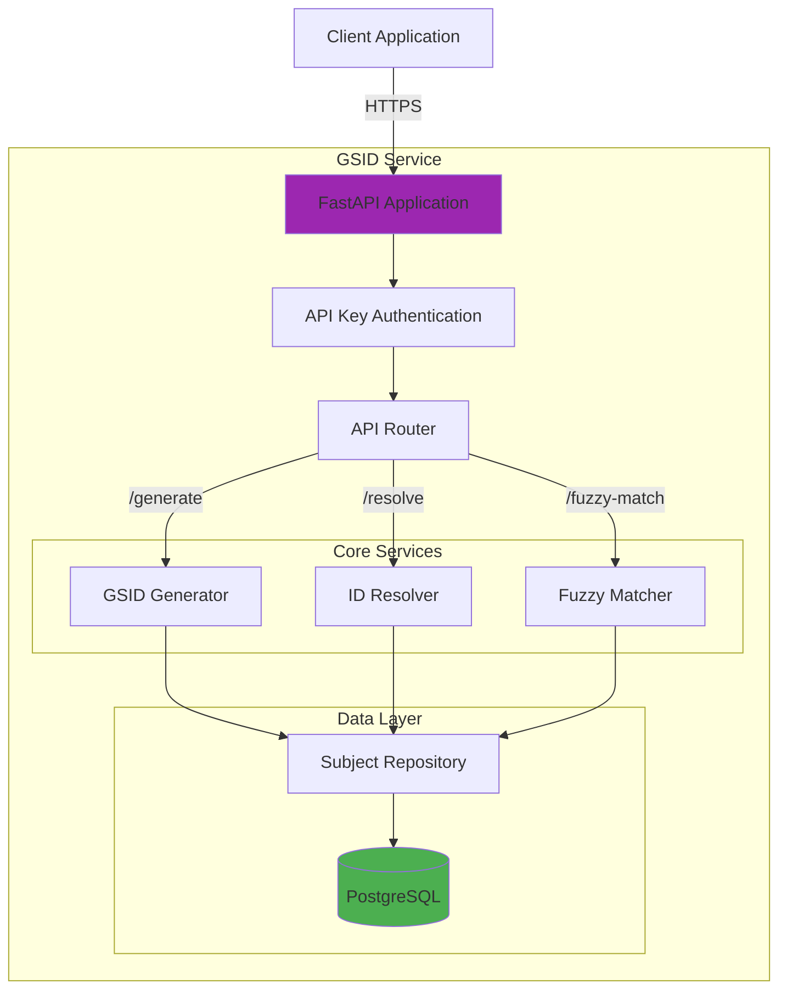

# GSID Service Documentation

## Overview

The Global Subject ID (GSID) Service is a centralized microservice responsible for managing subject identities across the IDhub platform. It provides GSID generation, local ID resolution, and fuzzy matching capabilities.

## Architecture



## Technology Stack

- **Framework**: FastAPI 0.104+
- **Language**: Python 3.11+
- **Database**: PostgreSQL 15+ (asyncpg)
- **Authentication**: API Key (Header-based)
- **Deployment**: Docker, Uvicorn

## API Endpoints

### Health Check

**Endpoint**: `GET /health`

**Description**: Service health and version information

**Authentication**: None required

**Response**:

```json
{
  "status": "healthy",
  "service": "gsid-service",
  "version": "1.0.0",
  "database": "connected"
}
```

**Example**:

```bash
curl https://api.idhub.ibdgc.org/api/gsid/health
```

---

### Generate GSID

**Endpoint**: `POST /api/gsid/generate`

**Description**: Generate a new GSID for a subject

**Authentication**: Required (API Key)

**Request Body**:

```json
{
  "center_id": 1,
  "local_subject_id": "GAP-001",
  "identifier_type": "consortium_id",
  "metadata": {
    "sex": "F",
    "diagnosis": "CD",
    "age_at_diagnosis": 25
  }
}
```

**Response** (201 Created):

```json
{
  "gsid": "01HQXYZ123ABCDEF456789",
  "subject_id": "550e8400-e29b-41d4-a716-446655440000",
  "local_subject_id": "GAP-001",
  "center_id": 1,
  "identifier_type": "consortium_id",
  "created_at": "2024-01-15T10:00:00Z"
}
```

**Error Responses**:

- `400 Bad Request`: Invalid input data
- `401 Unauthorized`: Missing or invalid API key
- `409 Conflict`: Local ID already exists

**Example**:

```bash
curl -X POST https://api.idhub.ibdgc.org/api/gsid/generate \
  -H "X-API-Key: your-api-key" \
  -H "Content-Type: application/json" \
  -d '{
    "center_id": 1,
    "local_subject_id": "GAP-001",
    "identifier_type": "consortium_id"
  }'
```

**Python Example**:

```python
import requests

response = requests.post(
    "https://api.idhub.ibdgc.org/api/gsid/generate",
    headers={"X-API-Key": "your-api-key"},
    json={
        "center_id": 1,
        "local_subject_id": "GAP-001",
        "identifier_type": "consortium_id"
    }
)

if response.status_code == 201:
    gsid = response.json()["gsid"]
    print(f"Generated GSID: {gsid}")
```

---

### Resolve GSID

**Endpoint**: `POST /api/gsid/resolve`

**Description**: Resolve a local subject ID to a GSID

**Authentication**: Required (API Key)

**Request Body**:

```json
{
  "center_id": 1,
  "local_subject_id": "GAP-001",
  "identifier_type": "consortium_id"
}
```

**Response** (200 OK):

```json
{
  "gsid": "01HQXYZ123ABCDEF456789",
  "subject_id": "550e8400-e29b-41d4-a716-446655440000",
  "local_subject_id": "GAP-001",
  "center_id": 1,
  "identifier_type": "consortium_id",
  "found": true
}
```

**Response** (404 Not Found):

```json
{
  "gsid": null,
  "found": false,
  "message": "No subject found for center_id=1, local_subject_id=GAP-001"
}
```

**Example**:

```bash
curl -X POST https://api.idhub.ibdgc.org/api/gsid/resolve \
  -H "X-API-Key: your-api-key" \
  -H "Content-Type: application/json" \
  -d '{
    "center_id": 1,
    "local_subject_id": "GAP-001"
  }'
```

---

### Batch Resolve

**Endpoint**: `POST /api/gsid/batch/resolve`

**Description**: Resolve multiple local IDs in a single request

**Authentication**: Required (API Key)

**Request Body**:

```json
{
  "identifiers": [
    {
      "center_id": 1,
      "local_subject_id": "GAP-001",
      "identifier_type": "consortium_id"
    },
    {
      "center_id": 1,
      "local_subject_id": "GAP-002",
      "identifier_type": "consortium_id"
    }
  ]
}
```

**Response** (200 OK):

```json
{
  "results": [
    {
      "local_subject_id": "GAP-001",
      "gsid": "01HQXYZ123ABCDEF456789",
      "found": true
    },
    {
      "local_subject_id": "GAP-002",
      "gsid": "01HQXYZ456GHIJKL789012",
      "found": true
    }
  ],
  "total": 2,
  "found": 2,
  "not_found": 0
}
```

**Example**:

```python
import requests

response = requests.post(
    "https://api.idhub.ibdgc.org/api/gsid/batch/resolve",
    headers={"X-API-Key": "your-api-key"},
    json={
        "identifiers": [
            {"center_id": 1, "local_subject_id": "GAP-001"},
            {"center_id": 1, "local_subject_id": "GAP-002"}
        ]
    }
)

results = response.json()["results"]
for result in results:
    print(f"{result['local_subject_id']} -> {result['gsid']}")
```

---

### Fuzzy Match

**Endpoint**: `POST /api/gsid/fuzzy-match`

**Description**: Find potential subject matches using fuzzy matching

**Authentication**: Required (API Key)

**Request Body**:

```json
{
  "first_name": "John",
  "last_name": "Doe",
  "date_of_birth": "1990-01-15",
  "threshold": 0.85
}
```

**Response** (200 OK):

```json
{
  "matches": [
    {
      "gsid": "01HQXYZ123ABCDEF456789",
      "confidence": 0.95,
      "matched_fields": {
        "first_name": "John",
        "last_name": "Doe",
        "date_of_birth": "1990-01-15"
      }
    },
    {
      "gsid": "01HQXYZ456GHIJKL789012",
      "confidence": 0.87,
      "matched_fields": {
        "first_name": "Jon",
        "last_name": "Doe",
        "date_of_birth": "1990-01-15"
      }
    }
  ],
  "total_matches": 2
}
```

**Parameters**:

- `threshold`: Minimum confidence score (0.0-1.0, default: 0.8)

**Example**:

```bash
curl -X POST https://api.idhub.ibdgc.org/api/gsid/fuzzy-match \
  -H "X-API-Key: your-api-key" \
  -H "Content-Type: application/json" \
  -d '{
    "first_name": "John",
    "last_name": "Doe",
    "date_of_birth": "1990-01-15",
    "threshold": 0.85
  }'
```

---

### Get Subject by GSID

**Endpoint**: `GET /api/gsid/subjects/{gsid}`

**Description**: Retrieve subject details by GSID

**Authentication**: Required (API Key)

**Response** (200 OK):

```json
{
  "gsid": "01HQXYZ123ABCDEF456789",
  "subject_id": "550e8400-e29b-41d4-a716-446655440000",
  "sex": "F",
  "diagnosis": "CD",
  "age_at_diagnosis": 25,
  "local_identifiers": [
    {
      "center_id": 1,
      "local_subject_id": "GAP-001",
      "identifier_type": "consortium_id"
    },
    {
      "center_id": 1,
      "local_subject_id": "MRN-123456",
      "identifier_type": "mrn"
    }
  ],
  "created_at": "2024-01-15T10:00:00Z",
  "updated_at": "2024-01-20T14:30:00Z"
}
```

**Response** (404 Not Found):

```json
{
  "detail": "Subject not found"
}
```

**Example**:

```bash
curl https://api.idhub.ibdgc.org/api/gsid/subjects/01HQXYZ123ABCDEF456789 \
  -H "X-API-Key: your-api-key"
```

---

## GSID Format

### Structure

GSIDs are based on truncated ULIDs (Universally Unique Lexicographically Sortable Identifiers):

```
01HQXYZ123ABCDEF456789
│ │      │
│ │      └─ Random component (16 chars)
│ └─ Timestamp component (10 chars)
└─ Version prefix
```

**Characteristics**:

- **Length**: 26 characters
- **Character set**: Crockford's Base32 (0-9, A-Z excluding I, L, O, U)
- **Sortable**: Lexicographically sortable by creation time
- **Unique**: 128-bit uniqueness (same as UUID)
- **URL-safe**: No special characters

### Generation Algorithm

```python
import ulid
from datetime import datetime

def generate_gsid() -> str:
    """Generate a new GSID"""
    # Generate ULID
    new_ulid = ulid.create()

    # Convert to string (26 characters)
    gsid = str(new_ulid)

    return gsid

# Example
gsid = generate_gsid()
# Output: 01HQXYZ123ABCDEF456789
```

### Validation

```python
import re

def validate_gsid(gsid: str) -> bool:
    """Validate GSID format"""
    # Check length
    if len(gsid) != 26:
        return False

    # Check character set (Crockford's Base32)
    pattern = r'^[0-9A-HJKMNP-TV-Z]{26}$'
    return bool(re.match(pattern, gsid))

# Examples
validate_gsid("01HQXYZ123ABCDEF456789")  # True
validate_gsid("invalid")                 # False
validate_gsid("01HQXYZ123ABCDEF45678")   # False (too short)
```

### Timestamp Extraction

```python
import ulid

def extract_timestamp(gsid: str) -> datetime:
    """Extract creation timestamp from GSID"""
    ulid_obj = ulid.parse(gsid)
    return ulid_obj.timestamp().datetime

# Example
gsid = "01HQXYZ123ABCDEF456789"
created_at = extract_timestamp(gsid)
print(f"Created at: {created_at}")
# Output: Created at: 2024-01-15 10:00:00.123
```

## Configuration

### Environment Variables

```bash
# Database Configuration
DB_HOST=idhub_db
DB_NAME=idhub
DB_USER=idhub_user
DB_PASSWORD=your_secure_password
DB_PORT=5432

# API Configuration
GSID_API_KEY=your-secure-random-key-here-min-32-chars
API_HOST=0.0.0.0
API_PORT=8000

# Logging
LOG_LEVEL=INFO

# CORS (optional)
CORS_ORIGINS=https://idhub.ibdgc.org,https://qa.idhub.ibdgc.org

# Fuzzy Matching
FUZZY_MATCH_THRESHOLD=0.8
```

### Database Connection

```python
# core/database.py
import asyncpg
from typing import Optional

class Database:
    def __init__(self):
        self.pool: Optional[asyncpg.Pool] = None

    async def connect(self):
        """Create database connection pool"""
        self.pool = await asyncpg.create_pool(
            host=os.getenv("DB_HOST"),
            port=int(os.getenv("DB_PORT", 5432)),
            database=os.getenv("DB_NAME"),
            user=os.getenv("DB_USER"),
            password=os.getenv("DB_PASSWORD"),
            min_size=5,
            max_size=20,
            command_timeout=60
        )

    async def disconnect(self):
        """Close database connection pool"""
        if self.pool:
            await self.pool.close()

db = Database()
```

## Authentication

### API Key Authentication

The GSID Service uses header-based API key authentication:

```python
# core/auth.py
from fastapi import Security, HTTPException, status
from fastapi.security import APIKeyHeader

API_KEY_HEADER = APIKeyHeader(name="X-API-Key")

async def verify_api_key(api_key: str = Security(API_KEY_HEADER)):
    """Verify API key"""
    expected_key = os.getenv("GSID_API_KEY")

    if not expected_key:
        raise HTTPException(
            status_code=status.HTTP_500_INTERNAL_SERVER_ERROR,
            detail="API key not configured"
        )

    if api_key != expected_key:
        raise HTTPException(
            status_code=status.HTTP_401_UNAUTHORIZED,
            detail="Invalid API key"
        )

    return api_key
```

### Usage in Endpoints

```python
from fastapi import Depends
from core.auth import verify_api_key

@router.post("/generate")
async def generate_gsid(
    request: GenerateRequest,
    api_key: str = Depends(verify_api_key)
):
    # Endpoint logic
    pass
```

### Client Authentication

```python
import requests

# Set API key in headers
headers = {
    "X-API-Key": "your-api-key-here",
    "Content-Type": "application/json"
}

response = requests.post(
    "https://api.idhub.ibdgc.org/api/gsid/generate",
    headers=headers,
    json={"center_id": 1, "local_subject_id": "GAP-001"}
)
```

## Error Handling

### Error Response Format

```json
{
  "detail": "Error message",
  "error_code": "ERROR_CODE",
  "timestamp": "2024-01-15T10:00:00Z"
}
```

### Common Error Codes

| Status Code | Error Code       | Description                |
| ----------- | ---------------- | -------------------------- |
| 400         | `INVALID_INPUT`  | Invalid request data       |
| 401         | `UNAUTHORIZED`   | Missing or invalid API key |
| 404         | `NOT_FOUND`      | Resource not found         |
| 409         | `CONFLICT`       | Resource already exists    |
| 500         | `INTERNAL_ERROR` | Server error               |

### Error Handling Example

```python
import requests

try:
    response = requests.post(
        "https://api.idhub.ibdgc.org/api/gsid/generate",
        headers={"X-API-Key": "your-api-key"},
        json={"center_id": 1, "local_subject_id": "GAP-001"}
    )
    response.raise_for_status()

    gsid = response.json()["gsid"]
    print(f"Generated GSID: {gsid}")

except requests.exceptions.HTTPError as e:
    if e.response.status_code == 409:
        print("Subject already exists")
    elif e.response.status_code == 401:
        print("Invalid API key")
    else:
        print(f"Error: {e.response.json()['detail']}")

except requests.exceptions.RequestException as e:
    print(f"Request failed: {e}")
```

## Performance

### Benchmarks

| Operation           | Avg Response Time | Throughput |
| ------------------- | ----------------- | ---------- |
| Generate GSID       | 15ms              | 500 req/s  |
| Resolve GSID        | 10ms              | 800 req/s  |
| Batch Resolve (100) | 50ms              | 2000 IDs/s |
| Fuzzy Match         | 100ms             | 100 req/s  |

### Optimization Tips

1. **Use Batch Operations**: Resolve multiple IDs in a single request
2. **Connection Pooling**: Reuse HTTP connections
3. **Caching**: Cache frequently accessed GSIDs
4. **Async Requests**: Use async HTTP clients for concurrent requests

### Batch Processing Example

```python
import asyncio
import aiohttp

async def batch_resolve_async(identifiers, api_key):
    """Resolve multiple IDs asynchronously"""
    async with aiohttp.ClientSession() as session:
        async with session.post(
            "https://api.idhub.ibdgc.org/api/gsid/batch/resolve",
            headers={"X-API-Key": api_key},
            json={"identifiers": identifiers}
        ) as response:
            return await response.json()

# Usage
identifiers = [
    {"center_id": 1, "local_subject_id": f"GAP-{i:03d}"}
    for i in range(1, 101)
]

results = asyncio.run(batch_resolve_async(identifiers, "your-api-key"))
print(f"Resolved {results['found']} out of {results['total']} IDs")
```

## Monitoring

### Health Checks

```bash
# Basic health check
curl https://api.idhub.ibdgc.org/api/gsid/health

# Database connectivity check
curl https://api.idhub.ibdgc.org/api/gsid/health/db
```

### Metrics

The service exposes the following metrics:

- **Request count**: Total API requests
- **Request duration**: Response time percentiles
- **Error rate**: Failed requests per endpoint
- **Database connections**: Active/idle connections
- **GSID generation rate**: GSIDs created per minute

### Logging

```python
# Structured logging format
{
  "timestamp": "2024-01-15T10:00:00Z",
  "level": "INFO",
  "service": "gsid-service",
  "endpoint": "/api/gsid/generate",
  "method": "POST",
  "status_code": 201,
  "duration_ms": 15,
  "gsid": "01HQXYZ123ABCDEF456789",
  "center_id": 1,
  "local_subject_id": "GAP-001"
}
```

## Development

### Local Setup

```bash
# Clone repository
git clone https://github.com/ibdgc/idhub.git
cd idhub/gsid-service

# Create virtual environment
python -m venv venv
source venv/bin/activate  # On Windows: venv\Scripts\activate

# Install dependencies
pip install -r requirements.txt
pip install -r requirements-test.txt

# Set environment variables
cp .env.example .env
# Edit .env with your configuration

# Run database migrations
python -m alembic upgrade head

# Start development server
uvicorn main:app --reload --port 8000
```

### Running Tests

```bash
# Run all tests
pytest

# Run with coverage
pytest --cov=. --cov-report=html

# Run specific test file
pytest tests/test_api.py -v

# Run integration tests only
pytest -m integration
```

### Docker Development

```bash
# Build image
docker build -t gsid-service:dev .

# Run container
docker run -p 8000:8000 \
  -e DB_HOST=host.docker.internal \
  -e DB_NAME=idhub \
  -e GSID_API_KEY=test-key \
  gsid-service:dev

# Run with docker-compose
docker-compose up gsid-service
```

## Deployment

### Production Deployment

```bash
# Build production image
docker build -t gsid-service:latest .

# Run with production settings
docker run -d \
  --name gsid-service \
  -p 8000:8000 \
  -e DB_HOST=prod-db.example.com \
  -e DB_NAME=idhub \
  -e DB_USER=idhub_user \
  -e DB_PASSWORD=${DB_PASSWORD} \
  -e GSID_API_KEY=${GSID_API_KEY} \
  -e LOG_LEVEL=INFO \
  --restart unless-stopped \
  gsid-service:latest
```

### Health Check Configuration

```yaml
# docker-compose.yml
services:
  gsid-service:
    image: gsid-service:latest
    healthcheck:
      test: ["CMD", "curl", "-f", "http://localhost:8000/health"]
      interval: 30s
      timeout: 10s
      retries: 3
      start_period: 40s
```

## Troubleshooting

### Common Issues

#### 1. Database Connection Errors

**Symptom**: `asyncpg.exceptions.ConnectionDoesNotExistError`

**Solution**:

```bash
# Check database connectivity
psql -h $DB_HOST -U $DB_USER -d $DB_NAME

# Verify environment variables
echo $DB_HOST
echo $DB_PORT
echo $DB_NAME

# Check connection pool settings
# Increase max_size if needed
```

#### 2. API Key Authentication Failures

**Symptom**: `401 Unauthorized`

**Solution**:

```bash
# Verify API key is set
echo $GSID_API_KEY

# Check header format
curl -H "X-API-Key: your-key" https://api.idhub.ibdgc.org/api/gsid/health

# Ensure no trailing whitespace in .env file
```

#### 3. Slow Response Times

**Symptom**: Requests taking >1 second

**Solution**:

```sql
-- Check database indexes
SELECT schemaname, tablename, indexname
FROM pg_indexes
WHERE tablename IN ('subjects', 'local_subject_ids');

-- Analyze query performance
EXPLAIN ANALYZE
SELECT * FROM local_subject_ids
WHERE center_id = 1 AND local_subject_id = 'GAP-001';

-- Rebuild indexes if needed
REINDEX TABLE local_subject_ids;
```

## Related Documentation

- [API Reference](../api/gsid-api.md)
- [Database Schema](../architecture/database-schema.md)
- [Deployment Guide](../operations/deployment.md)
- [Security Model](../architecture/security.md)

## Support

For issues or questions:

- GitHub Issues: https://github.com/ibdgc/idhub/issues
- Email: support@ibdgc.org

````

Now let's create the REDCap Pipeline documentation:

```markdown:docs/services/redcap-pipeline.md
# REDCap Pipeline Documentation

## Overview

The REDCap Pipeline is an automated data extraction and transformation service that pulls data from multiple REDCap projects, transforms it according to configurable field mappings, and stages it in S3 for validation and loading.

## Architecture

```mermaid
graph TB
    subgraph "REDCap Pipeline"
        SCHED[Scheduler/Trigger]
        CONFIG[Configuration Loader]

        subgraph "Extraction"
            API[REDCap API Client]
            INCR[Incremental Tracker]
        end

        subgraph "Transformation"
            MAP[Field Mapper]
            TRANS[Data Transformer]
            VAL[Basic Validator]
        end

        subgraph "Loading"
            FRAG[Fragment Generator]
            S3[S3 Uploader]
            META[Metadata Tracker]
        end
    end

    RC[REDCap Projects] -->|API| API
    API --> INCR
    INCR --> MAP
    MAP --> TRANS
    TRANS --> VAL
    VAL --> FRAG
    FRAG --> S3
    S3 --> META

    CONFIG -.->|Field Mappings| MAP
    CONFIG -.->|Project Config| API

    S3 -->|Upload| S3BUCKET[(S3 Bucket)]

    style RC fill:#FF9800
    style S3BUCKET fill:#2196F3
````

## Features

- **Multi-Project Support**: Extract from multiple REDCap projects
- **Incremental Extraction**: Only fetch new/updated records
- **Field Mapping**: Transform source fields to target schema
- **Batch Processing**: Process records in configurable batches
- **Error Handling**: Robust error handling and retry logic
- **Audit Trail**: Complete logging of extraction and transformation

## Configuration

### Project Configuration

Projects are defined in `config/projects.json`:

```json
{
  "projects": {
    "gap": {
      "name": "GAP",
      "redcap_project_id": "16894",
      "api_token_env": "REDCAP_API_TOKEN_GAP",
      "field_mappings": "gap_field_mappings.json",
      "schedule": "continuous",
      "batch_size": 50,
      "enabled": true,
      "description": "Main biobank project",
      "tables": ["lcl", "dna", "rna"]
    },
    "uc_demarc": {
      "name": "UC DEMARC",
      "redcap_project_id": "12345",
      "api_token_env": "REDCAP_API_TOKEN_UC_DEMARC",
      "field_mappings": "uc_demarc_field_mappings.json",
      "schedule": "daily",
      "batch_size": 100,
      "enabled": true,
      "description": "UC DEMARC study data",
      "tables": ["specimen", "dna"]
    }
  }
}
```

**Configuration Fields**:

| Field               | Type    | Required | Description                                     |
| ------------------- | ------- | -------- | ----------------------------------------------- |
| `name`              | string  | Yes      | Human-readable project name                     |
| `redcap_project_id` | string  | Yes      | REDCap project ID                               |
| `api_token_env`     | string  | Yes      | Environment variable name for API token         |
| `field_mappings`    | string  | Yes      | Field mapping configuration file                |
| `schedule`          | string  | No       | Extraction schedule (continuous, daily, weekly) |
| `batch_size`        | integer | No       | Records per batch (default: 50)                 |
| `enabled`           | boolean | No       | Enable/disable project (default: true)          |
| `tables`            | array   | Yes      | Target tables for this project                  |

### Field Mapping Configuration

Field mappings define how source fields map to target schema:

```json:config/gap_field_mappings.json
{
  "lcl": {
    "field_mapping": {
      "knumber": "k_number",
      "niddk_no": "niddk_number",
      "passage_number": "passage_num",
      "cell_line_status": "status",
      "freeze_date": "date_frozen",
      "storage_location": "location",
      "notes": "comments"
    },
    "subject_id_candidates": ["consortium_id", "subject_id"],
    "center_id_field": "center",
    "default_center_id": 1,
    "exclude_from_load": ["record_id", "redcap_event_name"],
    "transformations": {
      "freeze_date": "date",
      "passage_number": "integer"
    }
  },
  "dna": {
    "field_mapping": {
      "sample_id": "dna_sample_id",
      "sample_type": "dna_type",
      "concentration_ng_ul": "dna_concentration",
      "volume_ul": "dna_volume",
      "quality_score": "dna_260_280",
      "extraction_date": "dna_extraction_date",
      "extraction_method": "dna_method",
      "storage_location": "dna_location"
    },
    "subject_id_candidates": ["consortium_id"],
    "center_id_field": "center",
    "default_center_id": 1,
    "exclude_from_load": ["record_id"],
    "transformations": {
      "extraction_date": "date",
      "concentration_ng_ul": "float",
      "volume_ul": "float",
      "quality_score": "float"
    }
  }
}
```

**Mapping Fields**:

| Field                   | Type    | Description                             |
| ----------------------- | ------- | --------------------------------------- |
| `field_mapping`         | object  | Source → Target field mappings          |
| `subject_id_candidates` | array   | Fields to try for subject ID resolution |
| `center_id_field`       | string  | Field containing center ID              |
| `default_center_id`     | integer | Default center ID if not in data        |
| `exclude_from_load`     | array   | Fields to exclude from output           |
| `transformations`       | object  | Field type transformations              |

## Usage

### Command Line

```bash
# Run pipeline for all enabled projects
python main.py

# Run for specific project
python main.py --project gap

# Run with custom batch size
python main.py --project gap --batch-size 100

# Dry run (no S3 upload)
python main.py --project gap --dry-run

# Specify date range
python main.py --project gap --start-date 2024-01-01 --end-date 2024-01-31
```

### Programmatic Usage

```python
from services.pipeline import REDCapPipeline
from core.config import settings

# Initialize pipeline
pipeline = REDCapPipeline(
    project_config={
        "name": "GAP",
        "redcap_project_id": "16894",
        "api_token": "your_token",
        "field_mappings": "gap_field_mappings.json"
    }

```
