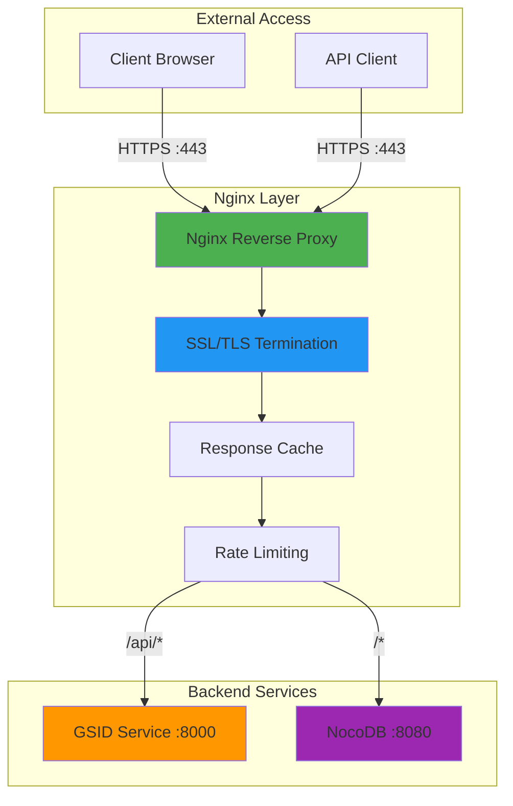

# Nginx Reverse Proxy Documentation

## Overview

Nginx serves as the reverse proxy and SSL termination point for the IDhub platform, routing traffic to the appropriate backend services (GSID Service, NocoDB) and providing security, caching, and load balancing capabilities.

## Architecture



## Features

- **SSL/TLS Termination**: Automatic HTTPS with Let's Encrypt
- **Reverse Proxy**: Route requests to backend services
- **Rate Limiting**: Protect against abuse and DDoS
- **Response Caching**: Improve performance for static content
- **Load Balancing**: Distribute traffic across multiple backends
- **Security Headers**: HSTS, CSP, X-Frame-Options, etc.
- **Access Logging**: Detailed request logging
- **Health Checks**: Monitor backend service health
- **WebSocket Support**: For real-time features

## Configuration

### Main Configuration

```nginx:nginx/nginx.conf
user nginx;
worker_processes auto;
error_log /var/log/nginx/error.log warn;
pid /var/run/nginx.pid;

events {
    worker_connections 1024;
    use epoll;
    multi_accept on;
}

http {
    include /etc/nginx/mime.types;
    default_type application/octet-stream;

    # Logging format
    log_format main '$remote_addr - $remote_user [$time_local] "$request" '
                    '$status $body_bytes_sent "$http_referer" '
                    '"$http_user_agent" "$http_x_forwarded_for" '
                    'rt=$request_time uct="$upstream_connect_time" '
                    'uht="$upstream_header_time" urt="$upstream_response_time"';

    access_log /var/log/nginx/access.log main;

    # Performance settings
    sendfile on;
    tcp_nopush on;
    tcp_nodelay on;
    keepalive_timeout 65;
    types_hash_max_size 2048;
    client_max_body_size 100M;

    # Gzip compression
    gzip on;
    gzip_vary on;
    gzip_proxied any;
    gzip_comp_level 6;
    gzip_types text/plain text/css text/xml text/javascript
               application/json application/javascript application/xml+rss
               application/rss+xml font/truetype font/opentype
               application/vnd.ms-fontobject image/svg+xml;

    # Rate limiting zones
    limit_req_zone $binary_remote_addr zone=api_limit:10m rate=10r/s;
    limit_req_zone $binary_remote_addr zone=web_limit:10m rate=30r/s;
    limit_conn_zone $binary_remote_addr zone=conn_limit:10m;

    # Cache settings
    proxy_cache_path /var/cache/nginx levels=1:2 keys_zone=api_cache:10m
                     max_size=100m inactive=60m use_temp_path=off;

    # Upstream definitions
    upstream gsid_backend {
        least_conn;
        server gsid-service:8000 max_fails=3 fail_timeout=30s;
        keepalive 32;
    }

    upstream nocodb_backend {
        least_conn;
        server nocodb:8080 max_fails=3 fail_timeout=30s;
        keepalive 32;
    }

    # Include site configurations
    include /etc/nginx/conf.d/*.conf;
}
```

### Site Configuration (HTTP)

```nginx:nginx/conf.d/default.conf
# HTTP server - redirect to HTTPS
server {
    listen 80;
    listen [::]:80;
    server_name idhub.ibdgc.org api.idhub.ibdgc.org;

    # Let's Encrypt challenge
    location /.well-known/acme-challenge/ {
        root /var/www/certbot;
    }

    # Redirect all other traffic to HTTPS
    location / {
        return 301 https://$host$request_uri;
    }
}
```

### Site Configuration (HTTPS)

```nginx:nginx/conf.d/ssl.conf
# Main web interface (NocoDB)
server {
    listen 443 ssl http2;
    listen [::]:443 ssl http2;
    server_name idhub.ibdgc.org;

    # SSL certificates
    ssl_certificate /etc/letsencrypt/live/idhub.ibdgc.org/fullchain.pem;
    ssl_certificate_key /etc/letsencrypt/live/idhub.ibdgc.org/privkey.pem;

    # SSL configuration
    ssl_protocols TLSv1.2 TLSv1.3;
    ssl_ciphers 'ECDHE-ECDSA-AES128-GCM-SHA256:ECDHE-RSA-AES128-GCM-SHA256:ECDHE-ECDSA-AES256-GCM-SHA384:ECDHE-RSA-AES256-GCM-SHA384';
    ssl_prefer_server_ciphers off;
    ssl_session_cache shared:SSL:10m;
    ssl_session_timeout 10m;
    ssl_stapling on;
    ssl_stapling_verify on;

    # Security headers
    add_header Strict-Transport-Security "max-age=31536000; includeSubDomains" always;
    add_header X-Frame-Options "SAMEORIGIN" always;
    add_header X-Content-Type-Options "nosniff" always;
    add_header X-XSS-Protection "1; mode=block" always;
    add_header Referrer-Policy "strict-origin-when-cross-origin" always;

    # Rate limiting
    limit_req zone=web_limit burst=50 nodelay;
    limit_conn conn_limit 20;

    # Proxy to NocoDB
    location / {
        proxy_pass http://nocodb_backend;
        proxy_http_version 1.1;

        # Headers
        proxy_set_header Host $host;
        proxy_set_header X-Real-IP $remote_addr;
        proxy_set_header X-Forwarded-For $proxy_add_x_forwarded_for;
        proxy_set_header X-Forwarded-Proto $scheme;
        proxy_set_header X-Forwarded-Host $host;
        proxy_set_header X-Forwarded-Port $server_port;

        # WebSocket support
        proxy_set_header Upgrade $http_upgrade;
        proxy_set_header Connection "upgrade";

        # Timeouts
        proxy_connect_timeout 60s;
        proxy_send_timeout 60s;
        proxy_read_timeout 60s;

        # Buffering
        proxy_buffering on;
        proxy_buffer_size 4k;
        proxy_buffers 8 4k;
        proxy_busy_buffers_size 8k;
    }

    # Health check endpoint
    location /health {
        access_log off;
        return 200 "healthy\n";
        add_header Content-Type text/plain;
    }
}

# API server (GSID Service)
server {
    listen 443 ssl http2;
    listen [::]:443 ssl http2;
    server_name api.idhub.ibdgc.org;

    # SSL certificates
    ssl_certificate /etc/letsencrypt/live/api.idhub.ibdgc.org/fullchain.pem;
    ssl_certificate_key /etc/letsencrypt/live/api.idhub.ibdgc.org/privkey.pem;

    # SSL configuration (same as above)
    ssl_protocols TLSv1.2 TLSv1.3;
    ssl_ciphers 'ECDHE-ECDSA-AES128-GCM-SHA256:ECDHE-RSA-AES128-GCM-SHA256:ECDHE-ECDSA-AES256-GCM-SHA384:ECDHE-RSA-AES256-GCM-SHA384';
    ssl_prefer_server_ciphers off;
    ssl_session_cache shared:SSL:10m;
    ssl_session_timeout 10m;

    # Security headers
    add_header Strict-Transport-Security "max-age=31536000; includeSubDomains" always;
    add_header X-Content-Type-Options "nosniff" always;
    add_header X-Frame-Options "DENY" always;

    # Rate limiting (stricter for API)
    limit_req zone=api_limit burst=20 nodelay;
    limit_conn conn_limit 10;

    # API endpoints
    location /api/ {
        # Remove /api prefix when proxying
        rewrite ^/api/(.*) /$1 break;

        proxy_pass http://gsid_backend;
        proxy_http_version 1.1;

        # Headers
        proxy_set_header Host $host;
        proxy_set_header X-Real-IP $remote_addr;
        proxy_set_header X-Forwarded-For $proxy_add_x_forwarded_for;
        proxy_set_header X-Forwarded-Proto $scheme;

        # Timeouts
        proxy_connect_timeout 30s;
        proxy_send_timeout 30s;
        proxy_read_timeout 30s;

        # Caching for GET requests
        proxy_cache api_cache;
        proxy_cache_methods GET HEAD;
        proxy_cache_valid 200 5m;
        proxy_cache_valid 404 1m;
        proxy_cache_key "$scheme$request_method$host$request_uri";
        proxy_cache_bypass $http_cache_control;
        add_header X-Cache-Status $upstream_cache_status;
    }

    # Health check
    location /health {
        access_log off;
        proxy_pass http://gsid_backend/health;
    }

    # Docs (no rate limiting)
    location /docs {
        limit_req off;
        proxy_pass http://gsid_backend/docs;
    }

    location /openapi.json {
        limit_req off;
        proxy_pass http://gsid_backend/openapi.json;
    }
}
```

### QA Environment Configuration

```nginx:nginx/conf.d/qa.conf
# QA Web Interface
server {
    listen 443 ssl http2;
    listen [::]:443 ssl http2;
    server_name qa.idhub.ibdgc.org;

    ssl_certificate /etc/letsencrypt/live/qa.idhub.ibdgc.org/fullchain.pem;
    ssl_certificate_key /etc/letsencrypt/live/qa.idhub.ibdgc.org/privkey.pem;

    # SSL and security settings (same as production)
    include /etc/nginx/snippets/ssl-params.conf;
    include /etc/nginx/snippets/security-headers.conf;

    # Less strict rate limiting for QA
    limit_req zone=web_limit burst=100 nodelay;

    location / {
        proxy_pass http://nocodb_qa:8080;
        include /etc/nginx/snippets/proxy-params.conf;
    }
}

# QA API
server {
    listen 443 ssl http2;
    listen [::]:443 ssl http2;
    server_name api.qa.idhub.ibdgc.org;

    ssl_certificate /etc/letsencrypt/live/api.qa.idhub.ibdgc.org/fullchain.pem;
    ssl_certificate_key /etc/letsencrypt/live/api.qa.idhub.ibdgc.org/privkey.pem;

    include /etc/nginx/snippets/ssl-params.conf;
    include /etc/nginx/snippets/security-headers.conf;

    location /api/ {
        rewrite ^/api/(.*) /$1 break;
        proxy_pass http://gsid_service_qa:8000;
        include /etc/nginx/snippets/proxy-params.conf;
    }
}
```

### Reusable Snippets

```nginx:nginx/snippets/ssl-params.conf
# SSL parameters
ssl_protocols TLSv1.2 TLSv1.3;
ssl_ciphers 'ECDHE-ECDSA-AES128-GCM-SHA256:ECDHE-RSA-AES128-GCM-SHA256:ECDHE-ECDSA-AES256-GCM-SHA384:ECDHE-RSA-AES256-GCM-SHA384';
ssl_prefer_server_ciphers off;
ssl_session_cache shared:SSL:10m;
ssl_session_timeout 10m;
ssl_stapling on;
ssl_stapling_verify on;
resolver 8.8.8.8 8.8.4.4 valid=300s;
resolver_timeout 5s;
```

```nginx:nginx/snippets/security-headers.conf
# Security headers
add_header Strict-Transport-Security "max-age=31536000; includeSubDomains; preload" always;
add_header X-Frame-Options "SAMEORIGIN" always;
add_header X-Content-Type-Options "nosniff" always;
add_header X-XSS-Protection "1; mode=block" always;
add_header Referrer-Policy "strict-origin-when-cross-origin" always;
add_header Permissions-Policy "geolocation=(), microphone=(), camera=()" always;
```

```nginx:nginx/snippets/proxy-params.conf
# Proxy parameters
proxy_http_version 1.1;
proxy_set_header Host $host;
proxy_set_header X-Real-IP $remote_addr;
proxy_set_header X-Forwarded-For $proxy_add_x_forwarded_for;
proxy_set_header X-Forwarded-Proto $scheme;
proxy_set_header X-Forwarded-Host $host;
proxy_set_header X-Forwarded-Port $server_port;
proxy_set_header Upgrade $http_upgrade;
proxy_set_header Connection "upgrade";
proxy_connect_timeout 60s;
proxy_send_timeout 60s;
proxy_read_timeout 60s;
proxy_buffering on;
```

## SSL/TLS Setup

### Let's Encrypt with Certbot

```bash
# Install certbot
apt-get update
apt-get install -y certbot python3-certbot-nginx

# Obtain certificates
certbot certonly --webroot \
  -w /var/www/certbot \
  -d idhub.ibdgc.org \
  -d api.idhub.ibdgc.org \
  --email admin@ibdgc.org \
  --agree-tos \
  --no-eff-email

# Auto-renewal (add to crontab)
0 0,12 * * * certbot renew --quiet --post-hook "nginx -s reload"
```

### Docker Compose Integration

```yaml:docker-compose.yml
services:
  nginx:
    image: nginx:alpine
    container_name: idhub_nginx
    ports:
      - "80:80"
      - "443:443"
    volumes:
      - ./nginx/nginx.conf:/etc/nginx/nginx.conf:ro
      - ./nginx/conf.d:/etc/nginx/conf.d:ro
      - ./nginx/snippets:/etc/nginx/snippets:ro
      - ./certbot/conf:/etc/letsencrypt:ro
      - ./certbot/www:/var/www/certbot:ro
      - nginx_cache:/var/cache/nginx
      - nginx_logs:/var/log/nginx
    depends_on:
      - gsid-service
      - nocodb
    networks:
      - idhub_network
    restart: unless-stopped

  certbot:
    image: certbot/certbot
    container_name: idhub_certbot
    volumes:
      - ./certbot/conf:/etc/letsencrypt
      - ./certbot/www:/var/www/certbot
    entrypoint: "/bin/sh -c 'trap exit TERM; while :; do certbot renew; sleep 12h & wait $${!}; done;'"
    networks:
      - idhub_network

volumes:
  nginx_cache:
  nginx_logs:

networks:
  idhub_network:
    driver: bridge
```

## Rate Limiting

### Configuration

```nginx
http {
    # Define rate limit zones

    # API: 10 requests per second, burst of 20
    limit_req_zone $binary_remote_addr zone=api_limit:10m rate=10r/s;

    # Web: 30 requests per second, burst of 50
    limit_req_zone $binary_remote_addr zone=web_limit:10m rate=30r/s;

    # Connection limit: 10 concurrent connections
    limit_conn_zone $binary_remote_addr zone=conn_limit:10m;

    # Per-endpoint limits
    limit_req_zone $binary_remote_addr zone=login_limit:10m rate=5r/m;
    limit_req_zone $binary_remote_addr zone=search_limit:10m rate=20r/s;
}
```

### Apply to Locations

```nginx
# Strict limit for authentication
location /api/auth/login {
    limit_req zone=login_limit burst=3 nodelay;
    proxy_pass http://gsid_backend;
}

# Moderate limit for search
location /api/search {
    limit_req zone=search_limit burst=30 nodelay;
    proxy_pass http://gsid_backend;
}

# Standard API limit
location /api/ {
    limit_req zone=api_limit burst=20 nodelay;
    limit_conn conn_limit 10;
    proxy_pass http://gsid_backend;
}
```

### Custom Error Pages

```nginx
# Rate limit error page
error_page 429 /429.html;
location = /429.html {
    root /usr/share/nginx/html;
    internal;
}
```

```html:/usr/share/nginx/html/429.html
<!DOCTYPE html>
<html>
<head>
    <title>Rate Limit Exceeded</title>
    <style>
        body {
            font-family: Arial, sans-serif;
            text-align: center;
            padding: 50px;
        }
        h1 { color: #d32f2f; }
    </style>
</head>
<body>
    <h1>429 - Too Many Requests</h1>
    <p>You have exceeded the rate limit. Please try again later.</p>
</body>
</html>
```

## Caching

### Cache Configuration

```nginx
http {
    # Cache path
    proxy_cache_path /var/cache/nginx
        levels=1:2
        keys_zone=api_cache:10m
        max_size=100m
        inactive=60m
        use_temp_path=off;

    # Cache for static assets
    proxy_cache_path /var/cache/nginx/static
        levels=1:2
        keys_zone=static_cache:10m
        max_size=1g
        inactive=7d
        use_temp_path=off;
}
```

### Apply Caching

```nginx
# Cache API responses
location /api/subjects {
    proxy_cache api_cache;
    proxy_cache_methods GET HEAD;
    proxy_cache_valid 200 5m;
    proxy_cache_valid 404 1m;
    proxy_cache_key "$scheme$request_method$host$request_uri$http_authorization";
    proxy_cache_bypass $http_cache_control;

    add_header X-Cache-Status $upstream_cache_status;

    proxy_pass http://gsid_backend;
}

# Cache static assets
location ~* \.(jpg|jpeg|png|gif|ico|css|js|svg|woff|woff2|ttf)$ {
    proxy_cache static_cache;
    proxy_cache_valid 200 7d;
    proxy_cache_valid 404 1h;

    expires 7d;
    add_header Cache-Control "public, immutable";
    add_header X-Cache-Status $upstream_cache_status;

    proxy_pass http://nocodb_backend;
}

# Purge cache endpoint (restricted)
location /api/cache/purge {
    allow 10.0.0.0/8;  # Internal network only
    deny all;

    proxy_cache_purge api_cache "$scheme$request_method$host$request_uri";
}
```

## Load Balancing

### Multiple Backend Servers

```nginx
upstream gsid_backend {
    least_conn;  # Use least connections algorithm

    server gsid-service-1:8000 weight=3 max_fails=3 fail_timeout=30s;
    server gsid-service-2:8000 weight=3 max_fails=3 fail_timeout=30s;
    server gsid-service-3:8000 weight=1 max_fails=3 fail_timeout=30s backup;

    keepalive 32;
    keepalive_requests 100;
    keepalive_timeout 60s;
}

upstream nocodb_backend {
    ip_hash;  # Sticky sessions for NocoDB

    server nocodb-1:8080 max_fails=3 fail_timeout=30s;
    server nocodb-2:8080 max_fails=3 fail_timeout=30s;

    keepalive 32;
}
```

### Health Checks

```nginx
# Active health checks (requires nginx-plus or custom module)
upstream gsid_backend {
    zone gsid_backend 64k;

    server gsid-service-1:8000;
    server gsid-service-2:8000;

    # Health check configuration
    check interval=3000 rise=2 fall=3 timeout=1000 type=http;
    check_http_send "GET /health HTTP/1.0\r\n\r\n";
    check_http_expect_alive http_2xx http_3xx;
}
```

### Passive Health Checks

```nginx
upstream gsid_backend {
    server gsid-service-1:8000 max_fails=3 fail_timeout=30s;
    server gsid-service-2:8000 max_fails=3 fail_timeout=30s;

    # If a server fails 3 times within 30s, mark it down for 30s
}
```

## Monitoring and Logging

### Access Logs

```nginx
http {
    # Custom log format with timing information
    log_format detailed '$remote_addr - $remote_user [$time_local] '
                       '"$request" $status $body_bytes_sent '
                       '"$http_referer" "$http_user_agent" '
                       'rt=$request_time uct="$upstream_connect_time" '
                       'uht="$upstream_header_time" urt="$upstream_response_time" '
                       'cache=$upstream_cache_status';

    access_log /var/log/nginx/access.log detailed;

    # Separate logs for API
    access_log /var/log/nginx/api_access.log detailed;
}

server {
    # Per-location logging
    location /api/ {
        access_log /var/log/nginx/api_access.log detailed;
        error_log /var/log/nginx/api_error.log warn;

        proxy_pass http://gsid_backend;
    }
}
```

### Error Logs

```nginx
# Global error log
error_log /var/log/nginx/error.log warn;

# Debug logging for specific location
location /api/debug {
    error_log /var/log/nginx/debug.log debug;
    proxy_pass http://gsid_backend;
}
```

### Metrics Endpoint

```nginx
# Nginx stub status (basic metrics)
location /nginx_status {
    stub_status on;
    access_log off;
    allow 127.0.0.1;
    allow 10.0.0.0/8;
    deny all;
}
```

### Log Rotation

```bash:/etc/logrotate.d/nginx
/var/log/nginx/*.log {
    daily
    missingok
    rotate 14
    compress
    delaycompress
    notifempty
    create 0640 nginx adm
    sharedscripts
    postrotate
        if [ -f /var/run/nginx.pid ]; then
            kill -USR1 `cat /var/run/nginx.pid`
        fi
    endscript
}
```

## Security Best Practices

### Security Headers

```nginx
# Comprehensive security headers
add_header Strict-Transport-Security "max-age=31536000; includeSubDomains; preload" always;
add_header X-Frame-Options "SAMEORIGIN" always;
add_header X-Content-Type-Options "nosniff" always;
add_header X-XSS-Protection "1; mode=block" always;
add_header Referrer-Policy "strict-origin-when-cross-origin" always;
add_header Content-Security-Policy "default-src 'self'; script-src 'self' 'unsafe-inline' 'unsafe-eval'; style-src 'self' 'unsafe-inline';" always;
add_header Permissions-Policy "geolocation=(), microphone=(), camera=()" always;
```

### IP Whitelisting

```nginx
# Restrict admin endpoints
location /admin {
    allow 10.0.0.0/8;      # Internal network
    allow 203.0.113.0/24;  # Office network
    deny all;

    proxy_pass http://nocodb_backend;
}

# Use geo module for country-based restrictions
geo $allowed_country {
    default 0;
    US 1;
    CA 1;
    GB 1;
}

server {
    if ($allowed_country = 0) {
        return 403;
    }
}
```

### Request Filtering

```nginx
# Block common attack patterns
location / {
    # Block SQL injection attempts
    if ($args ~* "union.*select|insert.*into|delete.*from|drop.*table") {
        return 403;
    }

    # Block XSS attempts
    if ($args ~* "<script|javascript:|onerror=") {
        return 403;
    }

    # Block path traversal
    if ($request_uri ~* "\.\.\/") {
        return 403;
    }

    proxy_pass http://nocodb_backend;
}

# Block bad user agents
if ($http_user_agent ~* (bot|crawler|spider|scraper)) {
    return 403;
}
```

### DDoS Protection

```nginx
# Connection limits
limit_conn_zone $binary_remote_addr zone=addr:10m;
limit_conn addr 10;

# Request body size limit
client_body_buffer_size 1K;
client_header_buffer_size 1k;
client_max_body_size 100M;
large_client_header_buffers 2 1k;

# Timeouts
client_body_timeout 10;
client_header_timeout 10;
keepalive_timeout 5 5;
send_timeout 10;
```

## Troubleshooting

### Common Issues

**1. 502 Bad Gateway**

```bash
# Check backend service is running
docker ps | grep gsid-service

# Check nginx can reach backend
docker exec idhub_nginx ping gsid-service

# Check nginx error logs
docker logs idhub_nginx

# Test backend directly
curl http://gsid-service:8000/health
```

**2. SSL Certificate Issues**

```bash
# Check certificate validity
openssl x509 -in /etc/letsencrypt/live/idhub.ibdgc.org/fullchain.pem -text -noout

# Test SSL configuration
openssl s_client -connect idhub.ibdgc.org:443

# Renew certificates manually
certbot renew --force-renewal
```

**3. Rate Limiting Too Aggressive**

```nginx
# Temporarily disable for debugging
location /api/ {
    limit_req off;
    limit_conn off;
    proxy_pass http://gsid_backend;
}

# Or increase limits
limit_req zone=api_limit burst=100 nodelay;
```

**4. Cache Issues**

```bash
# Clear nginx cache
rm -rf /var/cache/nginx/*
nginx -s reload

# Bypass cache for testing
curl -H "Cache-Control: no-cache" https://api.idhub.ibdgc.org/api/subjects
```

### Debug Mode

```nginx
# Enable debug logging
error_log /var/log/nginx/debug.log debug;

# Debug specific module
error_log /var/log/nginx/debug.log debug_http;
```

### Testing Configuration

```bash
# Test nginx configuration
nginx -t

# Reload configuration
nginx -s reload

# View configuration
nginx -T

# Check which config files are loaded
nginx -T 2>&1 | grep "configuration file"
```

## Performance Tuning

### Worker Processes

```nginx
# Auto-detect CPU cores
worker_processes auto;

# Or set manually
worker_processes 4;

# Worker connections
events {
    worker_connections 2048;
    use epoll;  # Linux
    multi_accept on;
}
```

### Buffer Sizes

```nginx
http {
    # Client buffers
    client_body_buffer_size 128k;
    client_max_body_size 100M;
    client_header_buffer_size 1k;
    large_client_header_buffers 4 8k;

    # Proxy buffers
    proxy_buffer_size 4k;
    proxy_buffers 8 4k;
    proxy_busy_buffers_size 8k;
    proxy_temp_file_write_size 64k;
}
```

### Keepalive

```nginx
http {
    # Client keepalive
    keepalive_timeout 65;
    keepalive_requests 100;

    # Upstream keepalive
    upstream gsid_backend {
        server gsid-service:8000;
        keepalive 32;
        keepalive_requests 100;
        keepalive_timeout 60s;
    }
}
```

### File Descriptors

```nginx
# Increase file descriptor limit
worker_rlimit_nofile 65535;

events {
    worker_connections 4096;
}
```

## Deployment

### Docker Deployment

```bash
# Build custom nginx image
docker build -t idhub-nginx:latest ./nginx

# Run container
docker run -d \
  --name idhub_nginx \
  -p 80:80 \
  -p 443:443 \
  -v $(pwd)/nginx/nginx.conf:/etc/nginx/nginx.conf:ro \
  -v $(pwd)/certbot/conf:/etc/letsencrypt:ro \
  i

```
