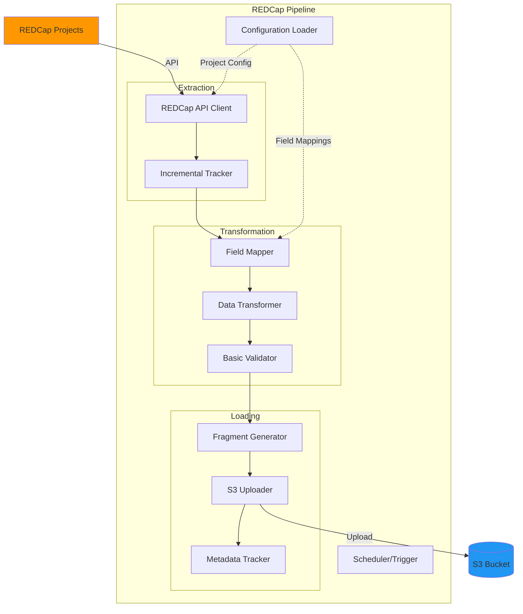

# REDCap Pipeline Documentation

## Overview

The REDCap Pipeline is an automated data extraction and transformation service that pulls data from multiple REDCap projects, transforms it according to configurable field mappings, and stages it in S3 for validation and loading.

## Architecture



## Features

-   **Multi-Project Support**: Extract from multiple REDCap projects
-   **Incremental Extraction**: Only fetch new/updated records
-   **Field Mapping**: Transform source fields to target schema
-   **Batch Processing**: Process records in configurable batches
-   **Error Handling**: Robust error handling and retry logic
-   **Audit Trail**: Complete logging of extraction and transformation

## Configuration

### Project Configuration

Projects are defined in `config/projects.json`:

```json
{
  "projects": {
    "gap": {
      "name": "GAP",
      "redcap_project_id": "16894",
      "api_token_env": "REDCAP_API_TOKEN_GAP",
      "field_mappings": "gap_field_mappings.json",
      "schedule": "continuous",
      "batch_size": 50,
      "enabled": true,
      "description": "Main biobank project",
      "tables": ["lcl", "dna", "rna"]
    },
    "uc_demarc": {
      "name": "UC DEMARC",
      "redcap_project_id": "12345",
      "api_token_env": "REDCAP_API_TOKEN_UC_DEMARC",
      "field_mappings": "uc_demarc_field_mappings.json",
      "schedule": "daily",
      "batch_size": 100,
      "enabled": true,
      "description": "UC DEMARC study data",
      "tables": ["specimen", "dna"]
    }
  }
}
```

**Configuration Fields**:

| Field               | Type    | Required | Description                                     |
| ------------------- | ------- | -------- | ----------------------------------------------- |
| `name`              | string  | Yes      | Human-readable project name                     |
| `redcap_project_id` | string  | Yes      | REDCap project ID                               |
| `api_token_env`     | string  | Yes      | Environment variable name for API token         |
| `field_mappings`    | string  | Yes      | Field mapping configuration file                |
| `schedule`          | string  | No       | Extraction schedule (continuous, daily, weekly) |
| `batch_size`        | integer | No       | Records per batch (default: 50)                 |
| `enabled`           | boolean | No       | Enable/disable project (default: true)          |
| `tables`            | array   | Yes      | Target tables for this project                  |

### Field Mapping Configuration

Field mappings define how source fields map to target schema:

```json
{
  "lcl": {
    "field_mapping": {
      "knumber": "k_number",
      "niddk_no": "niddk_number",
      "passage_number": "passage_num",
      "cell_line_status": "status",
      "freeze_date": "date_frozen",
      "storage_location": "location",
      "notes": "comments"
    },
    "subject_id_candidates": ["consortium_id", "subject_id"],
    "center_id_field": "center",
    "default_center_id": 1,
    "exclude_from_load": ["record_id", "redcap_event_name"],
    "transformations": {
      "freeze_date": "date",
      "passage_number": "integer"
    }
  },
  "dna": {
    "field_mapping": {
      "sample_id": "dna_sample_id",
      "sample_type": "dna_type",
      "concentration_ng_ul": "dna_concentration",
      "volume_ul": "dna_volume",
      "quality_score": "dna_260_280",
      "extraction_date": "dna_extraction_date",
      "extraction_method": "dna_method",
      "storage_location": "dna_location"
    },
    "subject_id_candidates": ["consortium_id"],
    "center_id_field": "center",
    "default_center_id": 1,
    "exclude_from_load": ["record_id"],
    "transformations": {
      "extraction_date": "date",
      "concentration_ng_ul": "float",
      "volume_ul": "float",
      "quality_score": "float"
    }
  }
}
```

**Mapping Fields**:

| Field                   | Type    | Description                             |
| ----------------------- | ------- | --------------------------------------- |
| `field_mapping`         | object  | Source → Target field mappings          |
| `subject_id_candidates` | array   | Fields to try for subject ID resolution |
| `center_id_field`       | string  | Field containing center ID              |
| `default_center_id`     | integer | Default center ID if not in data        |
| `exclude_from_load`     | array   | Fields to exclude from output           |
| `transformations`       | object  | Field type transformations              |

### Environment Variables

```bash
# REDCap Configuration
REDCAP_API_URL=https://redcap.example.edu/api/
REDCAP_API_TOKEN_GAP=your_gap_token_here
REDCAP_API_TOKEN_UC_DEMARC=your_uc_demarc_token_here

# Database Configuration
DB_HOST=idhub_db
DB_NAME=idhub
DB_USER=idhub_user
DB_PASSWORD=your_secure_password
DB_PORT=5432

# S3 Configuration
S3_BUCKET=idhub-curated-fragments
AWS_ACCESS_KEY_ID=your_access_key
AWS_SECRET_ACCESS_KEY=your_secret_key
AWS_REGION=us-east-1

# GSID Service
GSID_SERVICE_URL=https://api.idhub.ibdgc.org
GSID_API_KEY=your_gsid_api_key

# Pipeline Configuration
BATCH_SIZE=50
DRY_RUN=false
LOG_LEVEL=INFO
```

## Usage

### Command Line

```bash
# Run pipeline for all enabled projects
python main.py

# Run for specific project
python main.py --project gap

# Run with custom batch size
python main.py --project gap --batch-size 100

# Dry run (no S3 upload)
python main.py --project gap --dry-run

# Specify date range
python main.py --project gap --start-date 2024-01-01 --end-date 2024-01-31

# Force full extraction (ignore incremental)
python main.py --project gap --full

# Verbose logging
python main.py --project gap --verbose
```

### Programmatic Usage

```python
from services.pipeline import REDCapPipeline
from core.config import settings

# Initialize pipeline
pipeline = REDCapPipeline(
    project_config={
        "name": "GAP",
        "redcap_project_id": "16894",
        "api_token": "your_token",
        "field_mappings": "gap_field_mappings.json"
    }
)

# Run extraction
results = await pipeline.run(
    batch_size=50,
    dry_run=False
)

# Check results
print(f"Extracted: {results['records_extracted']}")
print(f"Transformed: {results['records_transformed']}")
print(f"Uploaded: {results['fragments_uploaded']}")
print(f"Errors: {results['errors']}")
```

### Docker Usage

```bash
# Build image
docker build -t redcap-pipeline:latest .

# Run container
docker run --rm \
  -e REDCAP_API_URL=https://redcap.example.edu/api/ \
  -e REDCAP_API_TOKEN_GAP=your_token \
  -e GSID_API_KEY=your_key \
  -e S3_BUCKET=idhub-curated-fragments \
  redcap-pipeline:latest \
  python main.py --project gap

# Run with docker-compose
docker-compose run --rm redcap-pipeline python main.py --project gap
```

## Pipeline Workflow

### 1. Initialization

```python
class REDCapPipeline:
    def __init__(self, project_config: dict):
        """Initialize pipeline with project configuration"""
        self.project_config = project_config
        self.redcap_client = REDCapClient(
            api_url=settings.REDCAP_API_URL,
            api_token=project_config['api_token']
        )
        self.s3_client = S3Client(bucket=settings.S3_BUCKET)
        self.gsid_client = GSIDClient(
            service_url=settings.GSID_SERVICE_URL,
            api_key=settings.GSID_API_KEY
        )
        self.field_mapper = FieldMapper(
            mapping_config=self.load_field_mappings()
        )
```

### 2. Incremental Extraction

```python
async def extract_records(self, start_date: Optional[str] = None) -> list:
    """
    Extract records from REDCap

    Args:
        start_date: Optional start date for incremental extraction

    Returns:
        List of extracted records
    """
    # Get last successful run
    if not start_date:
        last_run = await self.get_last_run_date()
        start_date = last_run.isoformat() if last_run else None

    # Build API parameters
    params = {
        'content': 'record',
        'format': 'json',
        'type': 'flat',
        'rawOrLabel': 'raw'
    }

    if start_date:
        params['dateRangeBegin'] = start_date
        logger.info(f"Extracting records modified since {start_date}")
    else:
        logger.info("Extracting all records (full extraction)")

    # Call REDCap API
    records = await self.redcap_client.export_records(params)

    logger.info(f"Extracted {len(records)} records from REDCap")

    return records
```

### 3. Field Mapping

```python
class FieldMapper:
    def __init__(self, mapping_config: dict):
        self.mapping_config = mapping_config

    def transform_record(self, record: dict, table_name: str) -> dict:
        """
        Transform record according to field mappings

        Args:
            record: Source record
            table_name: Target table name

        Returns:
            Transformed record
        """
        if table_name not in self.mapping_config:
            raise ValueError(f"No mapping config for table: {table_name}")

        table_config = self.mapping_config[table_name]
        transformed = {}

        # Apply field mappings
        for target_field, source_field in table_config['field_mapping'].items():
            if source_field in record:
                value = record[source_field]

                # Apply transformations
                if target_field in table_config.get('transformations', {}):
                    transform_type = table_config['transformations'][target_field]
                    value = self.apply_transformation(value, transform_type)

                transformed[target_field] = value

        # Exclude fields
        for field in table_config.get('exclude_from_load', []):
            transformed.pop(field, None)

        return transformed

    def apply_transformation(self, value: Any, transform_type: str) -> Any:
        """Apply type transformation"""
        if value is None or value == '':
            return None

        transformations = {
            'integer': lambda v: int(float(v)),
            'float': lambda v: float(v),
            'date': lambda v: self.parse_date(v),
            'datetime': lambda v: self.parse_datetime(v),
            'boolean': lambda v: str(v).lower() in ('true', '1', 'yes'),
            'string': lambda v: str(v).strip()
        }

        transform_func = transformations.get(transform_type)
        if transform_func:
            try:
                return transform_func(value)
            except (ValueError, TypeError) as e:
                logger.warning(f"Transformation failed for {value}: {e}")
                return None

        return value
```

### 4. Subject ID Resolution

```python
async def resolve_subject_id(self, record: dict, table_config: dict) -> Optional[str]:
    """
    Resolve subject ID from record

    Args:
        record: Source record
        table_config: Table configuration

    Returns:
        GSID if resolved, None otherwise
    """
    # Get center ID
    center_id = record.get(table_config.get('center_id_field'))
    if not center_id:
        center_id = table_config.get('default_center_id', 0)

    # Try each candidate field
    for candidate_field in table_config.get('subject_id_candidates', []):
        if candidate_field in record and record[candidate_field]:
            local_id = str(record[candidate_field]).strip()

            try:
                # Try to resolve existing GSID
                gsid = await self.gsid_client.resolve(
                    center_id=center_id,
                    local_subject_id=local_id
                )

                if gsid:
                    logger.debug(f"Resolved {local_id} -> {gsid}")
                    return gsid

            except Exception as e:
                logger.warning(f"Failed to resolve {local_id}: {e}")

    logger.warning(f"Could not resolve subject ID for record: {record}")
    return None
```

### 5. Fragment Generation

```python
async def generate_fragment(
    self,
    record: dict,
    table_name: str,
    gsid: str,
    batch_id: str
) -> dict:
    """
    Generate fragment from transformed record

    Args:
        record: Transformed record
        table_name: Target table
        gsid: Global subject ID
        batch_id: Batch identifier

    Returns:
        Fragment dictionary
    """
    fragment = {
        "fragment_id": f"frag_{ulid.create()}",
        "table_name": table_name,
        "source_system": "redcap",
        "project_name": self.project_config['name'],
        "project_id": self.project_config['redcap_project_id'],
        "batch_id": batch_id,
        "extracted_at": datetime.utcnow().isoformat(),
        "global_subject_id": gsid,
        "data": record
    }

    return fragment
```

### 6. S3 Upload

```python
async def upload_fragment(self, fragment: dict) -> str:
    """
    Upload fragment to S3

    Args:
        fragment: Fragment dictionary

    Returns:
        S3 key
    """
    # Generate S3 key
    s3_key = (
        f"staging/{fragment['batch_id']}/"
        f"{fragment['table_name']}/"
        f"{fragment['fragment_id']}.json"
    )

    # Upload to S3
    await self.s3_client.upload_json(
        key=s3_key,
        data=fragment
    )

    logger.debug(f"Uploaded fragment to s3://{settings.S3_BUCKET}/{s3_key}")

    return s3_key
```

### 7. Queue Entry

```python
async def create_queue_entry(self, fragment: dict, s3_key: str) -> int:
    """
    Create validation queue entry

    Args:
        fragment: Fragment dictionary
        s3_key: S3 key where fragment is stored

    Returns:
        Queue entry ID
    """
    query = """
        INSERT INTO validation_queue (
            batch_id,
            table_name,
            fragment_id,
            s3_key,
            source_system,
            project_name,
            status,
            created_at
        ) VALUES ($1, $2, $3, $4, $5, $6, 'pending', NOW())
        RETURNING id
    """

    queue_id = await self.db.fetchval(
        query,
        fragment['batch_id'],
        fragment['table_name'],
        fragment['fragment_id'],
        s3_key,
        fragment['source_system'],
        fragment['project_name']
    )

    return queue_id
```

### 8. Complete Pipeline

```python
async def run(
    self,
    batch_size: int = 50,
    dry_run: bool = False,
    start_date: Optional[str] = None
) -> dict:
    """
    Run complete pipeline

    Args:
        batch_size: Records per batch
        dry_run: If True, don't upload to S3
        start_date: Optional start date for extraction

    Returns:
        Pipeline execution results
    """
    start_time = time.time()
    batch_id = f"batch_{datetime.utcnow().strftime('%Y%m%d_%H%M%S')}"

    results = {
        'batch_id': batch_id,
        'records_extracted': 0,
        'records_transformed': 0,
        'fragments_uploaded': 0,
        'errors': 0,
        'duration_seconds': 0
    }

    try:
        # 1. Extract records
        logger.info(f"Starting extraction for project: {self.project_config['name']}")
        records = await self.extract_records(start_date)
        results['records_extracted'] = len(records)

        if not records:
            logger.info("No records to process")
            return results

        # 2. Process records by table
        for table_name in self.project_config['tables']:
            logger.info(f"Processing table: {table_name}")

            for i in range(0, len(records), batch_size):
                batch = records[i:i + batch_size]

                for record in batch:
                    try:
                        # Transform record
                        transformed = self.field_mapper.transform_record(
                            record,
                            table_name
                        )
                        results['records_transformed'] += 1

                        # Resolve subject ID
                        table_config = self.mapping_config[table_name]
                        gsid = await self.resolve_subject_id(record, table_config)

                        if not gsid:
                            logger.warning(f"Skipping record - no GSID: {record}")
                            results['errors'] += 1
                            continue

                        # Generate fragment
                        fragment = await self.generate_fragment(
                            transformed,
                            table_name,
                            gsid,
                            batch_id
                        )

                        if not dry_run:
                            # Upload to S3
                            s3_key = await self.upload_fragment(fragment)

                            # Create queue entry
                            await self.create_queue_entry(fragment, s3_key)

                            results['fragments_uploaded'] += 1

                    except Exception as e:
                        logger.error(f"Error processing record: {e}", exc_info=True)
                        results['errors'] += 1

        # 3. Update metadata
        if not dry_run:
            await self.update_last_run(datetime.utcnow())

        results['duration_seconds'] = time.time() - start_time

        logger.info(
            f"Pipeline complete: {results['fragments_uploaded']} fragments uploaded, "
            f"{results['errors']} errors in {results['duration_seconds']:.2f}s"
        )

    except Exception as e:
        logger.error(f"Pipeline failed: {e}", exc_info=True)
        raise

    return results
```

## REDCap API Integration

### API Client

```python
class REDCapClient:
    def __init__(self, api_url: str, api_token: str):
        self.api_url = api_url
        self.api_token = api_token
        self.session = aiohttp.ClientSession()

    async def export_records(
        self,
        params: Optional[dict] = None
    ) -> list:
        """
        Export records from REDCap

        Args:
            params: Optional API parameters

        Returns:
            List of records
        """
        default_params = {
            'token': self.api_token,
            'content': 'record',
            'format': 'json',
            'type': 'flat',
            'rawOrLabel': 'raw'
        }

        if params:
            default_params.update(params)

        try:
            async with self.session.post(
                self.api_url,
                data=default_params,
                timeout=aiohttp.ClientTimeout(total=300)
            ) as response:
                response.raise_for_status()
                records = await response.json()

                return records

        except aiohttp.ClientError as e:
            logger.error(f"REDCap API error: {e}")
            raise

    async def export_metadata(self) -> list:
        """Export project metadata (data dictionary)"""
        params = {
            'token': self.api_token,
            'content': 'metadata',
            'format': 'json'
        }

        async with self.session.post(self.api_url, data=params) as response:
            response.raise_for_status()
            return await response.json()

    async def export_instruments(self) -> list:
        """Export list of instruments"""
        params = {
            'token': self.api_token,
            'content': 'instrument',
            'format': 'json'
        }

        async with self.session.post(self.api_url, data=params) as response:
            response.raise_for_status()
            return await response.json()

    async def close(self):
        """Close HTTP session"""
        await self.session.close()
```

### Error Handling

```python
class REDCapAPIError(Exception):
    """REDCap API error"""
    pass

class REDCapAuthError(REDCapAPIError):
    """Authentication error"""
    pass

class REDCapRateLimitError(REDCapAPIError):
    """Rate limit exceeded"""
    pass

# Retry logic
async def export_records_with_retry(
    self,
    params: dict,
    max_retries: int = 3
) -> list:
    """Export records with retry logic"""
    for attempt in range(max_retries):
        try:
            return await self.export_records(params)

        except aiohttp.ClientResponseError as e:
            if e.status == 401:
                raise REDCapAuthError("Invalid API token")
            elif e.status == 429:
                wait_time = 2 ** attempt
                logger.warning(f"Rate limited, waiting {wait_time}s")
                await asyncio.sleep(wait_time)
            else:
                raise

        except aiohttp.ClientError as e:
            if attempt == max_retries - 1:
                raise REDCapAPIError(f"Failed after {max_retries} attempts: {e}")

            wait_time = 2 ** attempt
            logger.warning(f"Request failed, retrying in {wait_time}s")
            await asyncio.sleep(wait_time)

    raise REDCapAPIError("Max retries exceeded")
```

## Monitoring and Logging

### Structured Logging

```python
import structlog

logger = structlog.get_logger()

# Log with context
logger.info(
    "pipeline_started",
    project=project_name,
    batch_id=batch_id,
    batch_size=batch_size
)

logger.info(
    "records_extracted",
    project=project_name,
    count=len(records),
    duration_ms=duration
)

logger.error(
    "transformation_failed",
    project=project_name,
    record_id=record_id,
    error=str(e)
)
```

### Metrics Collection

```python
class PipelineMetrics:
    def __init__(self):
        self.metrics = {
            'records_extracted': 0,
            'records_transformed': 0,
            'fragments_uploaded': 0,
            'errors': 0,
            'api_calls': 0,
            'api_duration_ms': 0
        }

    def increment(self, metric: str, value: int = 1):
        """Increment metric"""
        self.metrics[metric] += value

    def record_duration(self, metric: str, duration_ms: float):
        """Record duration metric"""
        self.metrics[metric] = duration_ms

    def get_summary(self) -> dict:
        """Get metrics summary"""
        return {
            **self.metrics,
            'success_rate': (
                self.metrics['fragments_uploaded'] /
                self.metrics['records_extracted']
                if self.metrics['records_extracted'] > 0
                else 0
            )
        }
```

### Health Checks

```python
async def health_check() -> dict:
    """Check pipeline health"""
    checks = {
        'redcap_api': False,
        's3': False,
        'gsid_service': False,
        'database': False
    }

    # Check REDCap API
    try:
        await redcap_client.export_metadata()
        checks['redcap_api'] = True
    except Exception as e:
        logger.error(f"REDCap API check failed: {e}")

    # Check S3
    try:
        await s3_client.list_objects(prefix='staging/', max_keys=1)
        checks['s3'] = True
    except Exception as e:
        logger.error(f"S3 check failed: {e}")

    # Check GSID service
    try:
        await gsid_client.health_check()
        checks['gsid_service'] = True
    except Exception as e:
        logger.error(f"GSID service check failed: {e}")

    # Check database
    try:
        await db.fetchval("SELECT 1")
        checks['database'] = True
    except Exception as e:
        logger.error(f"Database check failed: {e}")

    return {
        'status': 'healthy' if all(checks.values()) else 'unhealthy',
        'checks': checks
    }
```

## Testing

### Unit Tests

```python
import pytest
from unittest.mock import Mock, AsyncMock

@pytest.mark.asyncio
async def test_extract_records():
    """Test record extraction"""
    # Mock REDCap client
    mock_client = AsyncMock()
    mock_client.export_records.return_value = [
        {'record_id': '1', 'field1': 'value1'},
        {'record_id': '2', 'field1': 'value2'}
    ]

    pipeline = REDCapPipeline(project_config)
    pipeline.redcap_client = mock_client

    records = await pipeline.extract_records()

    assert len(records) == 2
    assert records[0]['record_id'] == '1'

@pytest.mark.asyncio
async def test_field_mapping():
    """Test field mapping transformation"""
    mapper = FieldMapper(mapping_config)

    source_record = {
        'k_number': 'K001',
        'niddk_number': '12345',
        'passage_num': '8'
    }

    transformed = mapper.transform_record(source_record, 'lcl')

    assert transformed['knumber'] == 'K001'
    assert transformed['niddk_no'] == '12345'
    assert transformed['passage_number'] == 8  # Transformed to int

@pytest.mark.asyncio
async def test_subject_id_resolution():
    """Test subject ID resolution"""
    mock_gsid_client = AsyncMock()
    mock_gsid_client.resolve.return_value = '01HQXYZ123'

    pipeline = REDCapPipeline(project_config)
    pipeline.gsid_client = mock_gsid_client

    record = {'consortium_id': 'GAP-001', 'center_id': 1}
    table_config = {
        'subject_id_candidates': ['consortium_id'],
        'center_id_field': 'center_id'
    }

    gsid = await pipeline.resolve_subject_id(record, table_config)

    assert gsid == '01HQXYZ123'
    mock_gsid_client.resolve.assert_called_once_with(
        center_id=1,
        local_subject_id='GAP-001'
    )
```

### Integration Tests

```python
@pytest.mark.integration
@pytest.mark.asyncio
async def test_full_pipeline():
    """Test complete pipeline execution"""
    pipeline = REDCapPipeline(project_config)

    results = await pipeline.run(
        batch_size=10,
        dry_run=True
    )

    assert results['records_extracted'] > 0
    assert results['errors'] == 0
    assert results['duration_seconds'] > 0
```

## Troubleshooting

### Common Issues

#### 1. Authentication Failures

**Symptom**: `401 Unauthorized` from REDCap API

**Solution**:

```bash
# Verify API token
echo $REDCAP_API_TOKEN_GAP

# Test API access
curl -X POST https://redcap.example.edu/api/ \
  -d "token=$REDCAP_API_TOKEN_GAP" \
  -d "content=metadata" \
  -d "format=json"

# Check token permissions in REDCap
# User Rights > API Export
```

#### 2. Field Mapping Errors

**Symptom**: Missing fields in transformed records

**Solution**:

```python
# Validate field mappings
def validate_field_mappings(source_record, mapping_config):
    """Check if all mapped fields exist"""
    missing_fields = []

    for target_field, source_field in mapping_config['field_mapping'].items():
        if source_field not in source_record:
            missing_fields.append(source_field)

    if missing_fields:
        logger.warning(f"Missing source fields: {missing_fields}")

    return missing_fields

# Export REDCap data dictionary
metadata = await redcap_client.export_metadata()
field_names = [field['field_name'] for field in metadata]

# Compare with mapping config
for source_field in mapping_config['field_mapping'].values():
    if source_field not in field_names:
        logger.error(f"Field not in
```
