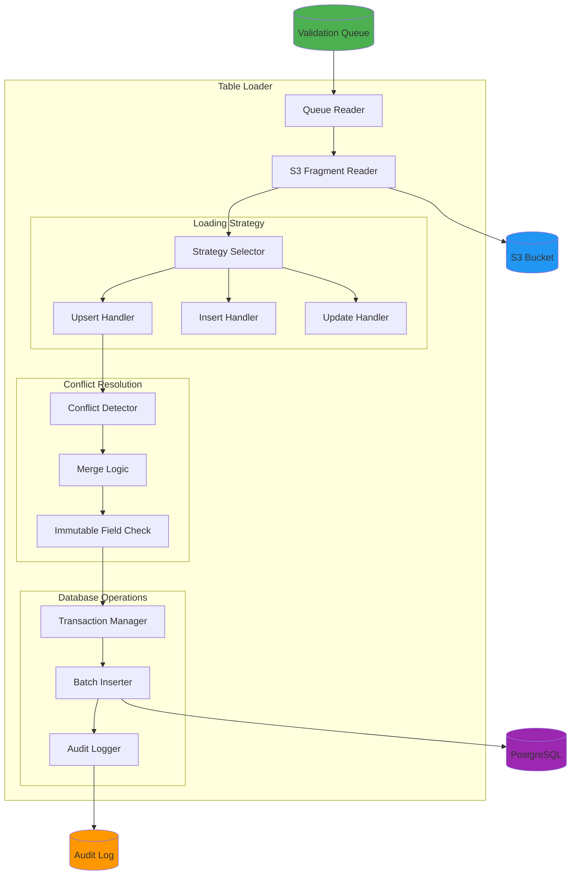

# Table Loader Documentation

## Overview

The Table Loader is the final stage service that loads validated data fragments from S3 into the PostgreSQL database. It handles upserts, conflict resolution, and maintains data integrity through transactional operations.

## Architecture



## Features

- **Batch Processing**: Load records in configurable batches
- **Upsert Support**: Insert or update based on natural keys
- **Conflict Resolution**: Handle duplicate records intelligently
- **Immutable Fields**: Protect fields from updates
- **Transaction Safety**: All-or-nothing batch commits
- **Audit Trail**: Complete logging of all changes
- **Dry Run Mode**: Preview changes without committing
- **Rollback Support**: Undo batch loads if needed

## Configuration

### Table Configuration

```json
{
  "lcl": {
    "natural_key": ["global_subject_id", "niddk_no"],
    "immutable_fields": ["created_at", "created_by"],
    "update_strategy": "upsert",
    "conflict_resolution": "merge",
    "audit_changes": true,
    "soft_delete": false
  },
  "dna": {
    "natural_key": ["global_subject_id", "sample_id"],
    "immutable_fields": ["created_at", "created_by"],
    "update_strategy": "upsert",
    "conflict_resolution": "merge",
    "audit_changes": true,
    "soft_delete": false
  },
  "specimen": {
    "natural_key": ["sample_id"],
    "immutable_fields": ["created_at"],
    "update_strategy": "upsert",
    "conflict_resolution": "replace",
    "audit_changes": true,
    "soft_delete": false
  }
}
```

**Configuration Fields**:

| Field                 | Type    | Description                                                       |
| --------------------- | ------- | ----------------------------------------------------------------- |
| `natural_key`         | array   | Fields that uniquely identify a record                            |
| `immutable_fields`    | array   | Fields that cannot be updated                                     |
| `update_strategy`     | string  | How to handle existing records (upsert, insert_only, update_only) |
| `conflict_resolution` | string  | How to resolve conflicts (merge, replace, skip)                   |
| `audit_changes`       | boolean | Whether to log changes to audit table                             |
| `soft_delete`         | boolean | Use soft deletes instead of hard deletes                          |

### Environment Variables

```bash
# Database Configuration
DB_HOST=idhub_db
DB_NAME=idhub
DB_USER=idhub_user
DB_PASSWORD=your_secure_password
DB_PORT=5432
DB_POOL_MIN=2
DB_POOL_MAX=10

# S3 Configuration
S3_BUCKET=idhub-curated-fragments
AWS_ACCESS_KEY_ID=your_access_key
AWS_SECRET_ACCESS_KEY=your_secret_key
AWS_REGION=us-east-1

# Loader Configuration
BATCH_SIZE=100
DRY_RUN=false
MAX_RETRIES=3
TRANSACTION_TIMEOUT=300
LOG_LEVEL=INFO

# Safety Settings
REQUIRE_APPROVAL=true
MAX_RECORDS_PER_BATCH=10000
```

## Usage

### Command Line

```bash
# Load specific batch
python main.py --batch-id batch_20240115_143022

# Load with dry run
python main.py --batch-id batch_20240115_143022 --dry-run

# Load specific table from batch
python main.py \
  --batch-id batch_20240115_143022 \
  --table-name lcl

# Load with custom batch size
python main.py \
  --batch-id batch_20240115_143022 \
  --batch-size 500

# Force load (skip confirmations)
python main.py \
  --batch-id batch_20240115_143022 \
  --force

# Load with specific strategy
python main.py \
  --batch-id batch_20240115_143022 \
  --strategy insert_only

# Rollback batch
python main.py \
  --batch-id batch_20240115_143022 \
  --rollback
```

### Programmatic Usage

```python
from services.loader import TableLoader
from core.database import get_db_pool
from services.s3_client import S3Client
import os

# Initialize database pool
db_pool = await get_db_pool()

# Initialize S3 client
s3_client = S3Client(bucket=os.getenv("S3_BUCKET"))

# Create loader
loader = TableLoader(
    db_pool=db_pool,
    s3_client=s3_client
)

# Load batch
results = await loader.load_batch(
    batch_id="batch_20240115_143022",
    dry_run=False
)

# Check results
print(f"Records loaded: {results['records_loaded']}")
print(f"Records updated: {results['records_updated']}")
print(f"Records skipped: {results['records_skipped']}")
print(f"Errors: {results['errors']}")
```

### Docker Usage

```bash
# Build image
docker build -t table-loader:latest .

# Run container
docker run --rm \
  -e DB_HOST=idhub_db \
  -e DB_PASSWORD=your_password \
  -e S3_BUCKET=idhub-curated-fragments \
  table-loader:latest \
  python main.py --batch-id batch_20240115_143022

# Run with docker-compose
docker-compose run --rm table-loader \
  python main.py --batch-id batch_20240115_143022 --dry-run
```

## Loading Workflow

### 1. Batch Discovery

```python
class BatchManager:
    def __init__(self, s3_client: S3Client, db_pool):
        self.s3_client = s3_client
        self.db_pool = db_pool

    async def get_batch_info(self, batch_id: str) -> dict:
        """
        Get information about a batch

        Args:
            batch_id: Batch identifier

        Returns:
            Batch information dictionary
        """
        # List fragments in S3
        prefix = f"staging/{batch_id}/"
        fragments = await self.s3_client.list_objects(prefix=prefix)

        # Group by table
        tables = {}
        for fragment_key in fragments:
            parts = fragment_key.split('/')
            if len(parts) >= 3:
                table_name = parts[2]
                if table_name not in tables:
                    tables[table_name] = []
                tables[table_name].append(fragment_key)

        # Get queue entries
        async with self.db_pool.acquire() as conn:
            queue_entries = await conn.fetch(
                """
                SELECT table_name, COUNT(*) as count, status
                FROM validation_queue
                WHERE batch_id = $1
                GROUP BY table_name, status
                """,
                batch_id
            )

        return {
            'batch_id': batch_id,
            'tables': tables,
            'total_fragments': len(fragments),
            'queue_status': [dict(row) for row in queue_entries]
        }

    async def validate_batch(self, batch_id: str) -> tuple[bool, list]:
        """
        Validate batch is ready for loading

        Args:
            batch_id: Batch identifier

        Returns:
            Tuple of (is_valid, errors)
        """
        errors = []

        # Check if batch exists in S3
        batch_info = await self.get_batch_info(batch_id)
        if batch_info['total_fragments'] == 0:
            errors.append(f"No fragments found for batch {batch_id}")

        # Check queue entries
        async with self.db_pool.acquire() as conn:
            pending_count = await conn.fetchval(
                """
                SELECT COUNT(*)
                FROM validation_queue
                WHERE batch_id = $1 AND status = 'pending'
                """,
                batch_id
            )

            if pending_count == 0:
                errors.append(f"No pending queue entries for batch {batch_id}")

        # Check for failed validations
        async with self.db_pool.acquire() as conn:
            failed_count = await conn.fetchval(
                """
                SELECT COUNT(*)
                FROM validation_queue
                WHERE batch_id = $1 AND status = 'failed'
                """,
                batch_id
            )

            if failed_count > 0:
                errors.append(
                    f"Batch has {failed_count} failed validations. "
                    "Review and fix before loading."
                )

        is_valid = len(errors) == 0
        return is_valid, errors
```

### 2. Fragment Loading

```python
class FragmentLoader:
    def __init__(self, s3_client: S3Client):
        self.s3_client = s3_client

    async def load_fragments(
        self,
        fragment_keys: list[str]
    ) -> list[dict]:
        """
        Load fragments from S3

        Args:
            fragment_keys: List of S3 keys

        Returns:
            List of fragment dictionaries
        """
        fragments = []

        for key in fragment_keys:
            try:
                fragment = await self.s3_client.get_json(key)
                fragments.append(fragment)
            except Exception as e:
                logger.error(f"Failed to load fragment {key}: {e}")
                raise

        return fragments

    async def load_fragments_batch(
        self,
        fragment_keys: list[str],
        batch_size: int = 100
    ) -> AsyncIterator[list[dict]]:
        """
        Load fragments in batches

        Args:
            fragment_keys: List of S3 keys
            batch_size: Number of fragments per batch

        Yields:
            Batches of fragment dictionaries
        """
        for i in range(0, len(fragment_keys), batch_size):
            batch_keys = fragment_keys[i:i + batch_size]
            fragments = await self.load_fragments(batch_keys)
            yield fragments
```

### 3. Conflict Detection

```python
class ConflictDetector:
    def __init__(self, db_pool, table_config: dict):
        self.db_pool = db_pool
        self.table_config = table_config

    async def check_conflicts(
        self,
        table_name: str,
        records: list[dict]
    ) -> dict:
        """
        Check for conflicts with existing records

        Args:
            table_name: Target table name
            records: Records to check

        Returns:
            Dictionary mapping natural keys to conflict info
        """
        natural_key_fields = self.table_config['natural_key']
        conflicts = {}

        # Build query to check for existing records
        natural_key_conditions = ' AND '.join(
            f"{field} = ${i+1}"
            for i, field in enumerate(natural_key_fields)
        )

        query = f"""
            SELECT *
            FROM {table_name}
            WHERE {natural_key_conditions}
        """

        async with self.db_pool.acquire() as conn:
            for record in records:
                # Extract natural key values
                natural_key_values = [
                    record.get(field) for field in natural_key_fields
                ]

                # Check if record exists
                existing = await conn.fetchrow(query, *natural_key_values)

                if existing:
                    natural_key = tuple(natural_key_values)
                    conflicts[natural_key] = {
                        'existing': dict(existing),
                        'new': record,
                        'action': None  # To be determined by resolution strategy
                    }

        return conflicts

    async def detect_immutable_changes(
        self,
        existing: dict,
        new: dict
    ) -> list[str]:
        """
        Detect changes to immutable fields

        Args:
            existing: Existing record
            new: New record

        Returns:
            List of immutable fields that would change
        """
        immutable_fields = self.table_config.get('immutable_fields', [])
        changed_immutable = []

        for field in immutable_fields:
            if field in new and field in existing:
                if new[field] != existing[field]:
                    changed_immutable.append(field)

        return changed_immutable
```

### 4. Conflict Resolution

```python
class ConflictResolver:
    def __init__(self, table_config: dict):
        self.table_config = table_config

    def resolve_conflict(
        self,
        existing: dict,
        new: dict,
        strategy: str = None
    ) -> tuple[str, dict]:
        """
        Resolve conflict between existing and new record

        Args:
            existing: Existing record
            new: New record
            strategy: Resolution strategy (override config)

        Returns:
            Tuple of (action, merged_record)
            Actions: 'update', 'skip', 'error'
        """
        if not strategy:
            strategy = self.table_config.get('conflict_resolution', 'merge')

        if strategy == 'skip':
            return 'skip', existing

        elif strategy == 'replace':
            # Replace all fields except immutable ones
            merged = new.copy()
            for field in self.table_config.get('immutable_fields', []):
                if field in existing:
                    merged[field] = existing[field]
            return 'update', merged

        elif strategy == 'merge':
            # Merge: new values override, but keep existing if new is null
            merged = existing.copy()
            for field, value in new.items():
                if value is not None:
                    # Check if field is immutable
                    if field in self.table_config.get('immutable_fields', []):
                        if existing.get(field) != value:
                            logger.warning(
                                f"Attempted to change immutable field '{field}': "
                                f"{existing.get(field)} -> {value}"
                            )
                            continue
                    merged[field] = value
            return 'update', merged

        else:
            raise ValueError(f"Unknown conflict resolution strategy: {strategy}")

    def validate_merge(self, existing: dict, merged: dict) -> tuple[bool, list]:
        """
        Validate merged record

        Args:
            existing: Original existing record
            merged: Merged record

        Returns:
            Tuple of (is_valid, errors)
        """
        errors = []

        # Check immutable fields haven't changed
        for field in self.table_config.get('immutable_fields', []):
            if field in existing and field in merged:
                if existing[field] != merged[field]:
                    errors.append(
                        f"Immutable field '{field}' changed: "
                        f"{existing[field]} -> {merged[field]}"
                    )

        is_valid = len(errors) == 0
        return is_valid, errors
```

### 5. Database Operations

```python
class DatabaseLoader:
    def __init__(self, db_pool, table_config: dict):
        self.db_pool = db_pool
        self.table_config = table_config

    async def upsert_records(
        self,
        table_name: str,
        records: list[dict],
        dry_run: bool = False
    ) -> dict:
        """
        Upsert records into table

        Args:
            table_name: Target table name
            records: Records to upsert
            dry_run: If True, don't commit changes

        Returns:
            Operation results
        """
        results = {
            'inserted': 0,
            'updated': 0,
            'skipped': 0,
            'errors': []
        }

        natural_key_fields = self.table_config['natural_key']

        async with self.db_pool.acquire() as conn:
            async with conn.transaction():
                for record in records:
                    try:
                        # Build upsert query
                        fields = list(record.keys())
                        placeholders = [f"${i+1}" for i in range(len(fields))]
                        values = [record[f] for f in fields]

                        # ON CONFLICT clause
                        conflict_fields = ', '.join(natural_key_fields)
                        update_clause = ', '.join(
                            f"{f} = EXCLUDED.{f}"
                            for f in fields
                            if f not in self.table_config.get('immutable_fields', [])
                            and f not in natural_key_fields
                        )

                        query = f"""
                            INSERT INTO {table_name} ({', '.join(fields)})
                            VALUES ({', '.join(placeholders)})
                            ON CONFLICT ({conflict_fields})
                            DO UPDATE SET
                                {update_clause},
                                updated_at = NOW()
                            RETURNING (xmax = 0) AS inserted
                        """

                        if not dry_run:
                            result = await conn.fetchrow(query, *values)
                            if result['inserted']:
                                results['inserted'] += 1
                            else:
                                results['updated'] += 1
                        else:
                            # In dry run, just check if record exists
                            natural_key_values = [
                                record[f] for f in natural_key_fields
                            ]
                            check_query = f"""
                                SELECT 1 FROM {table_name}
                                WHERE {' AND '.join(f"{f} = ${i+1}" for i, f in enumerate(natural_key_fields))}
                            """
                            exists = await conn.fetchval(
                                check_query, *natural_key_values
                            )
                            if exists:
                                results['updated'] += 1
                            else:
                                results['inserted'] += 1

                    except Exception as e:
                        logger.error(f"Error upserting record: {e}")
                        results['errors'].append({
                            'record': record,
                            'error': str(e)
                        })

                if dry_run:
                    # Rollback transaction in dry run
                    raise Exception("Dry run - rolling back")

        return results

    async def batch_insert(
        self,
        table_name: str,
        records: list[dict]
    ) -> int:
        """
        Batch insert records (faster for new records)

        Args:
            table_name: Target table name
            records: Records to insert

        Returns:
            Number of records inserted
        """
        if not records:
            return 0

        # Get field names from first record
        fields = list(records[0].keys())

        # Build bulk insert query
        placeholders = []
        values = []

        for i, record in enumerate(records):
            record_placeholders = [
                f"${len(values) + j + 1}"
                for j in range(len(fields))
            ]
            placeholders.append(f"({', '.join(record_placeholders)})")
            values.extend([record[f] for f in fields])

        query = f"""
            INSERT INTO {table_name} ({', '.join(fields)})
            VALUES {', '.join(placeholders)}
            ON CONFLICT DO NOTHING
        """

        async with self.db_pool.acquire() as conn:
            result = await conn.execute(query, *values)
            # Extract number of rows from result string "INSERT 0 N"
            return int(result.split()[-1])
```

### 6. Audit Logging

```python
class AuditLogger:
    def __init__(self, db_pool):
        self.db_pool = db_pool

    async def log_change(
        self,
        table_name: str,
        operation: str,
        record_id: Any,
        old_values: Optional[dict],
        new_values: dict,
        batch_id: str,
        user: str = 'system'
    ):
        """
        Log a change to the audit table

        Args:
            table_name: Table that was modified
            operation: Operation type (INSERT, UPDATE, DELETE)
            record_id: ID of the affected record
            old_values: Previous values (for UPDATE/DELETE)
            new_values: New values (for INSERT/UPDATE)
            batch_id: Batch identifier
            user: User who made the change
        """
        query = """
            INSERT INTO audit_log (
                table_name,
                operation,
                record_id,
                old_values,
                new_values,
                batch_id,
                changed_by,
                changed_at
            ) VALUES ($1, $2, $3, $4, $5, $6, $7, NOW())
        """

        async with self.db_pool.acquire() as conn:
            await conn.execute(
                query,
                table_name,
                operation,
                str(record_id),
                json.dumps(old_values) if old_values else None,
                json.dumps(new_values),
                batch_id,
                user
            )

    async def log_batch_operation(
        self,
        batch_id: str,
        operation: str,
        table_name: str,
        records_affected: int,
        status: str,
        error_message: Optional[str] = None
    ):
        """
        Log a batch operation

        Args:
            batch_id: Batch identifier
            operation: Operation type
            table_name: Target table
            records_affected: Number of records affected
            status: Operation status (success, failed, partial)
            error_message: Error message if failed
        """
        query = """
            INSERT INTO batch_load_log (
                batch_id,
                operation,
                table_name,
                records_affected,
                status,
                error_message,
                loaded_at
            ) VALUES ($1, $2, $3, $4, $5, $6, NOW())
        """

        async with self.db_pool.acquire() as conn:
            await conn.execute(
                query,
                batch_id,
                operation,
                table_name,
                records_affected,
                status,
                error_message
            )
```

### 7. Complete Loading Process

```python
class TableLoader:
    def __init__(
        self,
        db_pool,
        s3_client: S3Client
    ):
        self.db_pool = db_pool
        self.s3_client = s3_client
        self.batch_manager = BatchManager(s3_client, db_pool)
        self.fragment_loader = FragmentLoader(s3_client)
        self.audit_logger = AuditLogger(db_pool)

    async def load_batch(
        self,
        batch_id: str,
        table_name: Optional[str] = None,
        dry_run: bool = False,
        batch_size: int = 100
    ) -> dict:
        """
        Load a batch of validated fragments

        Args:
            batch_id: Batch identifier
            table_name: Optional specific table to load
            dry_run: If True, don't commit changes
            batch_size: Records per transaction

        Returns:
            Loading results
        """
        start_time = time.time()

        results = {
            'batch_id': batch_id,
            'tables': {},
            'total_records': 0,
            'records_loaded': 0,
            'records_updated': 0,
            'records_skipped': 0,
            'errors': 0,
            'duration_seconds': 0
        }

        try:
            # 1. Validate batch
            logger.info(f"Validating batch: {batch_id}")
            is_valid, errors = await self.batch_manager.validate_batch(batch_id)

            if not is_valid:
                logger.error(f"Batch validation failed: {errors}")
                raise ValueError(f"Invalid batch: {errors}")

            # 2. Get batch info
            batch_info = await self.batch_manager.get_batch_info(batch_id)
            tables_to_load = batch_info['tables']

            if table_name:
                if table_name not in tables_to_load:
                    raise ValueError(f"Table {table_name} not found in batch")
                tables_to_load = {table_name: tables_to_load[table_name]}

            logger.info(
                f"Loading batch {batch_id}: "
                f"{len(tables_to_load)} tables, "
                f"{batch_info['total_fragments']} fragments"
            )

            # 3. Load each table
            for table_name, fragment_keys in tables_to_load.items():
                logger.info(f"Loading table: {table_name} ({len(fragment_keys)} fragments)")

                table_results = await self.load_table(
                    batch_id=batch_id,
                    table_name=table_name,
                    fragment_keys=fragment_keys,
                    dry_run=dry_run,
                    batch_size=batch_size
                )

                results['tables'][table_name] = table_results
                results['total_records'] += table_results['total_records']
                results['records_loaded'] += table_results['records_loaded']
                results['records_updated'] += table_results['records_updated']
                results['records_skipped'] += table_results['records_skipped']
                results['errors'] += table_results['errors']

            # 4. Update queue status
            if not dry_run:
                await self.update_queue_status(batch_id, 'loaded')

            results['duration_seconds'] = time.time() - start_time

            logger.info(
                f"Batch load complete: "
                f"{results['records_loaded']} loaded, "
                f"{results['records_updated']} updated, "
                f"{results['errors']} errors "
                f"in {results['duration_seconds']:.2f}s"
            )

        except Exception as e:
            logger.error(f"Batch load failed: {e}", exc_info=True)

            if not dry_run:
                await self.audit_logger.log_batch_operation(
                    batch_id=batch_id,
                    operation='load',
                    table_name=table_name or 'all',
                    records_affected=0,
                    status='failed',
                    error_message=str(e)
                )

            raise

        return results

    async def load_table(
        self,
        batch_id: str,
        table_name: str,
        fragment_keys: list[str],
        dry_run: bool,
        batch_size: int
    ) -> dict:
        """
        Load fragments for a specific table

        Args:
            batch_id: Batch identifier
            table_name: Target table name
            fragment_keys: S3 keys for fragments
            dry_run: If True, don't commit changes
            batch_size: Records per transaction

        Returns:
            Table loading results
        """
        results = {
            'table_name': table_name,
            'total_records': 0,
            'records_loaded': 0,
            'records_updated': 0,
            'records_skipped': 0,
            'errors': 0
        }

        # Load table configuration
        table_config = Settings.load_table_config(table_name)

        # Initialize components
        conflict_detector = ConflictDetector(self.db_pool, table_config)
        conflict_resolver = ConflictResolver(table_config)
        db_loader = DatabaseLoader(self.db_pool, table_config)

        # Process fragments in batches
        async for fragments in self.fragment_loader.load_fragments_batch(
            fragment_keys, batch_size
        ):
            # Extract records from fragments
            records = [f['data'] for f in fragments]
            results['total_records'] += len(records)

            # Check for conflicts
            conflicts = await conflict_detector.check_conflicts(table_name, records)

            # Resolve conflicts
            records_to_load = []
            for record in records:
                natural_key = tuple(
                    record.get(f) for f in table_config['natural_key']
                )

                if natural_key in conflicts:
                    conflict_info = conflicts[natural_key]
                    action, merged_record = conflict_resolver.resolve_conflict(
                        conflict_info['existing'],
                        conflict_info['new']
                    )

                    if action == 'skip':
                        results['records_skipped'] += 1
                        continue
                    elif action == 'update':
                        # Validate merge
                        is_valid, errors = conflict_resolver.validate_merge(
                            conflict_info['existing'],
                            merged_record
                        )
                        if not is_valid:
                            logger.error(f"Invalid merge: {errors}")
                            results['errors'] += 1
                            continue

                        records_to_load.append(merged_record)
                else:
                    records_to_load.append(record)

            # Load records
            if records_to_load:
                try:
                    load_results = await db_loader.upsert_records(
                        table_name,
                        records_to_load,
                        dry_run
                    )

                    results['records_loaded'] += load_results['inserted']
                    results['records_updated'] += load_results['updated']
                    results['errors'] += len(load_results['errors'])

                except Exception as e:
                    logger.error(f"Error loading batch: {e}", exc_info=True)
                    results['errors'] += len(records_to_load)

        # Log batch operation
        if not dry_run:
            await self.audit_logger.log_batch_operation(
                batch_id=batch_id,
                operation='load',
                table_name=table_name,
                records_affected=results['records_loaded'] + results['records_updated'],
                status='success' if results['errors'] == 0 else 'partial'
            )

        return results

    async def update_queue_status(self, batch_id: str, status: str):
        """Update validation queue status for batch"""
        query = """
            UPDATE validation_queue
            SET status = $2, loaded_

```
