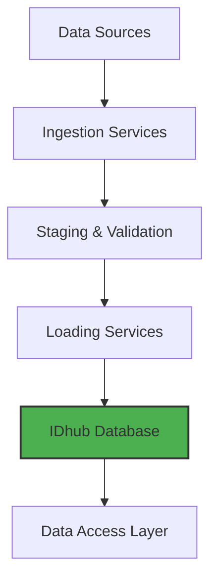

# System Overview

IDhub uses a microservices architecture to create a staged data pipeline, ensuring that data is validated and processed correctly at each step before being loaded into the central database.

- **Data Sources**: REDCap, LabKey, and manual file uploads.
- **Ingestion & Validation**: Data is extracted, transformed, and validated against schema and business rules. Subject IDs are resolved to Global Subject IDs (GSIDs).
- **Loading**: Validated data is loaded into the database using an intelligent "upsert" strategy.
- **Data Access**: Users and applications can access data through the NocoDB web interface or the GSID REST API.
